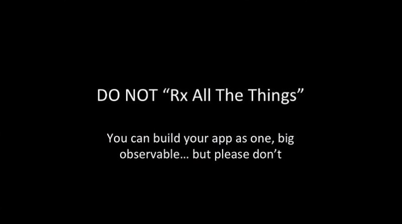
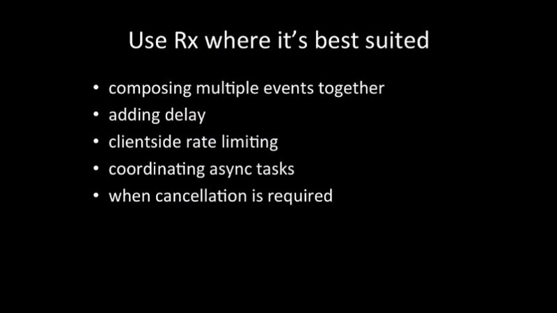

RxJS เป็น Reactive Extension Library โดยจุดเด่นที่สำคัญคือช่วยจัดการเรื่อง Asynchronous สำหรับคนที่ใช้ Angular น่าจะคุ้นเคยกันมาบ้างแล้ว บทความนี้ก็จะมาเล่าถึง 5 เรื่องที่ควรรู้เมื่อใช้ RxJS ครับ

### สารบัญ

-   [อย่าใช้ RxJS กับทุกอย่าง](#4d7d)
-   [ใช้วิธี Import แบบใหม่](#ea8c)
-   [ใช้ Pipeable Operators](#f0ea)
-   [อย่าลืม Unsubscribe](#c762)
-   [อย่า Subscribe ซ้อน](#a502)
-   [สรุป](#3bdb)

### อย่าใช้ RxJS กับทุกอย่าง

ตอนที่เราเรียน RxJS ใหม่ๆ อาจจะรู้สึกว่า RxJS มันวิเศษมากและอยากจะใช้ RxJS กับทุกอย่าง แต่ถ้าเราทำอะไรง่ายๆ อาจจะไม่จำเป็นต้องใช้ RxJS ทั้งหมดก็ได้ เช่น Event คลิกปุ่มง่ายๆ , Form ง่ายๆ , หรือแอพที่ไม่ซับซ้อนอะไรมากอย่างเช่น Hello World เป็นต้น

ให้ใช้ RxJS เฉพาะเมื่อจำเป็นต้องใช้เท่านั้น เช่น การรวม Event หลายอย่างเข้าด้วยกัน หรือต้องการเพิ่มดีเลย์เข้าไปในบาง Event, การจัดการ Event หรือ Task ที่เป็น Asynchronous หรือต้องการทำให้ Event บางอย่างถูกยกเลิกได้ เป็นต้น

### ใช้วิธี Import แบบใหม่

ใน RxJS 5.4 และก่อนหน้าเราใช้วิธีการ Import แบบนี้

ใน RxJS 5.5 เรา Import กันแบบนี้

ใน RxJS 6 เหลือเพียงแค่นี้ครับ

จะเห็นได้ว่าวิธีการ Import นั้นสั้นลงมาก โดย RxJS 6 ลดการ Import เหลือเพียงแค่ 5 กลุ่มเท่านั้น (จากนับไม่ถ้วน) ตามด้านล่างนี้เลยครับ

-   `rxjs`จะเป็นพวก Type เช่น `Observable`, `Subject`, `BehaviorSubject` หรือพวก Creation Method เช่น `fromEvent`, `timer`, `interval`, `delay`, `concat`
-   `rxjs/operators` จะเป็นพวก Operators ทั้งหลายเช่น `map`, `mergeMap`, `switchMap`, `takeUntil`, `scan` เป็นต้น
-   `rxjs/testing` จะเป็นสิ่งที่ใช้สำหรับเขียนเทส RxJS ครับ
-   `rxjs/webSocket` จะรวมสิ่งที่ใช้กับ Web Socket
-   `rxjs/ajax` อันนี้ก็เป็นพวกที่ใช้กับ Ajax ครับ

จะเห็นได้ว่ามีการจัดหมวดหมู่ให้เหลือเพียง 5 กลุ่มทำให้ไม่สับสน และเข้าใจง่ายกว่าเดิมเยอะเลย

### ใช้ Pipeable Operators

สมัยก่อนเราสามารถใช้การ Patching เพื่อนำ Operators หลายๆตัวมาต่อกัน แต่การทำ Patching นั้นมีข้อเสียคือ ทำ Tree Shaking ไม่ได้ และอาจมีปัญหาเวลาทำ Custom Operators

ตั้งแต่ RxJS 5.5 ได้เพิ่มวิธีการจัดการ Operators โดยใช้ `pipe` หรือเรียกอีกอย่างว่า Pipeable Operators โดยข้อดีของ Pipeable Operators คือ ทำ Tree Shaking ได้ และยังทำ Custom Operators ได้ง่ายกว่า และปัญหาน้อยกว่า Patching อีกด้วย สรุปคือมาใช้ Pipeable Operators กันเถอะ

วิธีใช้ก็ง่ายๆ จากเดิมที่เรา .(dot) ต่อจาก Observable เลยก็เปลี่ยนไปใช้ `pipe` แทน โดยภายใน `pipe` นี่เองเราสามารถใส่ Operators ต่างๆ ได้ (ทำการ Import Operators จาก `'rxjs/operators'` ) และเปลี่ยนจากการ .(dot) มาคั่นด้วย ,(comma) แทนแบบตัวอย่างด้านล่างนี้ครับ

ตัวอย่างการใช้ Pipeable Operators

### อย่าลืม Unsubscribe

ปกติเวลาเราทำการ Subscribe Observable ถ้าเราไม่ได้ทำการ Unsubscribe อาจทำให้เกิด Memory Leak ได้ ดังนั้นเราควรทำการ Unsubscribe ทุกครั้งเมื่อไม่ต้องการใช้งาน Observable นั้นๆแล้ว โดยวิธีการ Unsubscribe นั้นมีหลายวิธีดังนี้ครับ

#### Unsubscribe ทีละตัว

วิธีนี้ก็ตรงไปตรงมาครับ คือให้เราเก็บการ Subscribe ไว้ที่ตัวแปรใดตัวแปรนึง เมื่อไม่ใช่แล้วให้ทำการ Unsubscribe จากตัวแปรนั้น

#### Unsubscribe โดยวนลูป

วิธีนี้คล้ายๆกับวิธีบนคือเก็บการ Subscribe ไว้ในตัวแปร แต่ครั้งนี้จะเก็บเป็น Array แทน เหมาะกับเวลาที่เรา Subscribe ไว้หลายๆตัว เมื่อไม่ต้องการใช้ Observable เหล่านั้นแล้วก็วนลูปตัวแปรที่เป็น Array เพื่อ Unsubscribe

#### Unsubscribe โดย Operators

วิธีนี้เป็นวิธีการที่ Declarative คือเราไม่ต้องทำการ Unsubscribe เอง แต่จะใช้ Operators ที่จะทำให้ตัว Observable นั้น Complete หรือ Unsubscribe ให้เราแทน เช่น `take`, `takeUntil` หรือ `switchMap`โดยวิธีนี้เป็นวิธีที่แนะนำครับ

ตัวอย่างการใช้ takeUntil

#### สำหรับคนที่ใช้ Angular

ถ้าเราแค่ต้องการโชว์ข้อมูลใน Template ใน Angular มี Pipe ที่ชื่อว่า Async Pipe ซึ่งสามารถนำค่าจากใน Observable มาโชว์ง่ายๆ แค่นี้

ตัวอย่างการใช้ Async Pipe

#### ข้อดีของ Async Pipe

-   Subscribe ให้อัตโนมัติ
-   Unsubscribe ให้อัตโนมัติ (ตอน Component ถูก Destroy)
-   อัพเดทข้อมูลเมื่อมีข้อมูลใหม่มาให้อัตโนมัติ

แต่การใช้ Async Pipe ถ้าไม่ระวังอาจจะทำให้เกิดการ Subscribe หลายรอบได้ สามารถอ่านรายละเอียดและวิธีแก้ได้ตามบล็อกด้านล่างนี้ครับ

[**DIY Subscription Handling Directive in Angular**  
_In this article, we’ll learn how to manage subscriptions in the template with a bit more elegance. We’ll see the…_netbasal.com](https://netbasal.com/diy-subscription-handling-directive-in-angular-c8f6e762697f "https://netbasal.com/diy-subscription-handling-directive-in-angular-c8f6e762697f")

### อย่า Subscribe ซ้อน

การ Subscribe ซ้อนจะทำให้เกิดความซับซ้อน Code อ่านยาก และอาจทำให้เกิด Side Effect ได้ ลองดูตัวอย่างด้านล่างนี้ครับ

การ Subscribe ซ้อน

จากโค้ดด้านบนจะเห็นว่าภายใน subscribe ของ route param มีการ subscribe เกิดขึ้นอีกครั้งนึง ( `this.userService.fetchById(id).subscribe()`) การทำแบบนี้นอกจากจะทำให้โค้ดอ่านยากแล้ว ยังทำให้เราต้องมาจัดการกับ Subscription ที่อยู่ด้านในเองด้วย (ถ้าไม่ Unsubscribe จะทำให้เกิด Memory Leak)

วิธีแก้คือใช้ Operators ที่ Return เป็น Observable (Higher Order Observable) อย่างพวก `mergeMap`, `switchMap`, `concatMap` การทำแบบนี้จะทำให้เราจัดการกับ Observable ข้างในได้ดีกว่า และ Code ก็อ่านง่ายกว่าด้วย

ยกตัวอย่างเช่น ถ้าเราใช้ `switchMap` เมื่อมีค่าใหม่มา จะทำการ Unsubscribe ตัวเก่าแล้วไป Subscribe ตัวใหม่ให้เราโดยที่เราไม่ต้องเขียนโค้ดเพิ่มเพื่อมาจัดการเลย

Code อ่านง่ายขึ้นเมื่อใช้ switchMap

---

### สรุป

-   ใช้ RxJS เฉพาะที่จำเป็น เช่น ใช้กับ Async Task , ใช้จัดการเมื่อนำ Event หลายตัวมารวมกัน หรือเมื่อต้องการให้ Event นั้นยกเลิกได้เป็นต้น
-   ตั้งแต่ RxJS 6 เป็นต้นมาได้เปลี่ยนวิธี Import ให้เหลือน้อยลง และเข้าใจง่ายขึ้น เพราะงั้นมาใช้วิธี Import แบบใหม่กันเถอะ
-   ใช้ Pipeable Operators เพราะทำ Tree Shaking ได้ และทำ Custom Operators ง่ายกว่าเยอะ
-   อย่าลืม Unsubscribe เพื่อป้องกัน Memory Leak การ Unsubscribe ทำได้หลายวิธีเช่น Unsubscribe ทีละตัว Unsubscribe โดยวนลูปจาก Subscription Array หรือจะ Unsubscribe แบบ Declarative โดยใช้ Operator เช่น `take`, `takeUntil`, `switchMap`
-   อย่า Subscribe ซ้อน เพราะโค้ดจะอ่านยาก และจัดการ Observable ที่อยู่ข้างในได้ยากกว่า ให้ใช้ Operators พวก `concatMap`, `mergeMap`, `switchMap` แทน

---

ก็จบไปแล้วนะครับสำหรับบทความนี้ สำหรับใครที่ชอบบทความช่วยกด Clap หรือ Share เพื่อเป็นกำลังใจให้เจ้าของบทความด้วยนะครับ นอกจากนี้ยังสามารถติดตามจากเพจด้านล่างนี้ได้เลยครับ

[**DevNote**  
_DevNote. 351 likes · 135 talking about this. Blogger_www.facebook.com](https://www.facebook.com/devnoteio/ "https://www.facebook.com/devnoteio/")

---

### อ้างอิง

[**RxJS best practices in Angular**  
_This article is all about the do's and don'ts when it comes to writing reactive applications with RxJS in Angular…_blog.strongbrew.io](https://blog.strongbrew.io/rxjs-best-practices-in-angular/ "https://blog.strongbrew.io/rxjs-best-practices-in-angular/")

[**RxJS: Don’t Unsubscribe**  
_Well… okay, just don’t unsubscribe quite so much._medium.com](https://medium.com/@benlesh/rxjs-dont-unsubscribe-6753ed4fda87 "https://medium.com/@benlesh/rxjs-dont-unsubscribe-6753ed4fda87")
