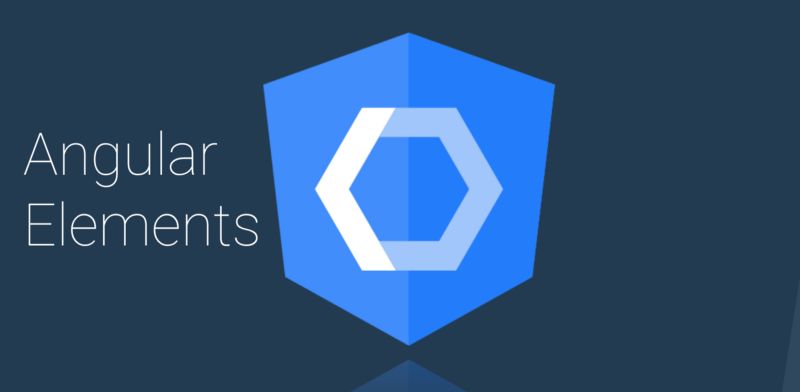

ได้ฤกษ์เปิดตัวซะทีสำหรับ Angular เวอร์ชั่น 6 เราไปดูกันดีกว่าว่ามีอะไรใหม่ใน Angular 6 บ้าง

### เปลี่ยนเลข Version เป็น 6


จะด้วยเลข 6 เป็นเลขนำโชค หรือ ป้องกันความสับสนก็ตาม ทีม Angular ได้เปลี่ยนเลข Version ทั้งตัว Angular framework เอง ตัว Angular Material รวมไปถึง Angular CLI ให้เป็น Version 6 เหมือนกันหมด

_\*จะด้วยความบังเอิญหรือตั้งใจก็แล้วแต่ RxJS ก็เป็น Version 6 เช่นกัน_

### Angular CLI 6


พระเอกของงานเห็นจะเป็นใครไปไม่ได้นอกงาน Angular CLI สุดเทพของเหล่า Angular Developer นอกจากความสามารถเดิมๆ อย่าง `ng new` และ `ng generate` แล้ว Angular CLI เวอร์ชั่น 6 ได้เพิ่มความสามารถเทพๆอีกมากมายดังนี้

#### 1\. ng update


ความสามารถสุดเทพอย่างแรกก็คือ `ng update` โดยคำสั่งนี้จะไปทำการตรวจสอบไฟล์ `package.json` และอัพเดท dependency ให้เราโดยอัตโนมัติ นอกจากนั้นแล้วยังไปอัพเดท code เฉพาะส่วนที่จำเป็นให้เราโดยอัตโนมัติอีกด้วย

เรายังสามารถอัพเดทเฉพาะ package ได้ด้วยคำสั่ง `ng update <package>` เช่น `ng update @angular/core` จะทำการอัพเดทเฉพาะตัว Angular framework หรือ `ng update @angular/cli` จะเป็นการอัพเดท Angular CLI

ทั้งนี้เวลาเราอัพเดทจาก Angular 5 เป็น Angular 6 เราก็ใช้คำสั่ง `ng update` เพื่อช่วยให้การอัพเดทเวอร์ชั่น Angular เป็นไปอย่างสะดวกสบาย

**2\. ng add**


ความสามารถสุดเทพอย่างที่สองคือ เราสามารถเพิ่ม Angular Library เข้าไปใน Angular App ง่ายๆ ด้วยคำสั่ง `ng add` เช่น ถ้าเราอยากทำให้ Angular App เป็น Progressive Web App ก็สามารถใช้คำสั่ง `ng add @angular/pwa` ซึ่งจะทำการเพิ่ม App Manifest และ Service Worker ให้กับ Angular App หรือถ้าอยากใช้ Angular Material ก็[ไม่ต้องไปเสียเวลาลงให้ยุ่งยาก](https://material.angular.io/guide/getting-started) แค่ใช้คำสั่ง `ng add @angular/material` คำสั่งเดียวอยู่


สำหรับ library ที่สามารถใช้กับ `ng add` ได้ ณ ตอนนี้ มีดังนี้ครับ


**3\. CLI Workspace**

โดยปกติ ถ้าเราสร้าง Angular App ด้วย Angular CLI เวอร์ชั่นก่อนๆ ใน Angular App จะมีแค่ Project เดียวเท่านั้น แต่ด้วย Angular CLI 6 สิ่งที่เราได้จากคำสั่ง `ng new`จะเป็น Workspace แทน โดย 1 Workspace จะมีได้หลาย Project ด้วยกัน นอกจากนั้นแล้ว ไฟล์ `.angular-cli.json` ถูกเปลี่ยนเป็น `angular.json` แทน ซึ่งจะมีหน้าตาประมาณนี้

สำหรับรายละเอียดสามารถดูเพิ่มที่ [https://github.com/angular/angular-cli/wiki/angular-workspace](https://github.com/angular/angular-cli/wiki/angular-workspace)

**4\. Library support**


ความสามารถสุดเทพอีกอย่างของ Angular CLI 6 คือ เราสามารถสร้าง Library ด้วย Angular CLi ได้แล้วโดยใช้คำสั่ง `ng generate library` แล้วตามด้วยชื่อ Library ที่ต้องการ

สามารถดูเพิ่มเติมได้ที่ [https://github.com/angular/angular-cli/wiki/stories-create-library](https://github.com/angular/angular-cli/wiki/stories-create-library)

### Angular Elements



อยากสร้าง Web Component ด้วย Angular ใช่มั้ย ? Angular Elements คือคำตอบ เราสามารถนำ Angular Component ที่เราสร้างด้วย Angular Elements ไปใช้ภายนอก Angular App ที่ไหนก็ได้ ไม่ว่าจะเป็น HTML ธรรมดาๆ หรือใน Library อื่นๆ เช่น React หรือ Vue


ศึกษาเพิ่มเติมเกี่ยวกับ Angular Elements ได้ที่ [https://angular.io/guide/elements](https://angular.io/guide/elements)

### Angular Material + CDK


Angular Material มาพร้อม Component ใหม่อย่าง [Tree](https://material.angular.io/components/tree/overview) , [Badge](https://material.angular.io/components/badge/overview) และ [Bottom Sheet](https://material.angular.io/components/bottom-sheet/overview) ส่วนตัว CDK เอง `@angular/cdk/overlay` มาพร้อมกับ `[PositionStrategy](https://material.angular.io/cdk/overlay/overview)` [แบบใหม่](https://material.angular.io/cdk/overlay/overview) ที่จะมาช่วยจัด position ของ popup ให้ดูดีทุกสถานการณ์

นอกจากนั้นแล้ว ถ้าเราใช้คำสั่ง `ng add @angular/material` เราจะสามารถสร้าง Starter Component ที่ Angular Material เตรียมไว้ให้ได้ทันที 3 แบบด้วยกันคือ

1.  **Material Sidenav**


สามารถสร้าง Component ได้ด้วยคำสั่ง

```
ng generate @angular/material:material-nav --name=my-nav
```

**2\. Material Dashboard**


สามารถสร้าง Component ได้ด้วยคำสั่ง

```
ng generate @angular/material:material-dashboard --name=my-dashboard
```

**3\. Material Data Table**


สามารถสร้าง Component ได้ด้วยคำสั่ง

```
ng generate @angular/material:material-table --name=my-table
```

### Tree Shakable Providers


Tree Shaking หรือการเขย่าต้นไม้ ก็คือ กระบวนการ Build Optimization โดยจะไม่นำ Code ส่วนที่ไม่ได้ใช้ ไป Build ลงในไฟล์ Bundle เมื่อ Code ที่ถูก Build มีจำนวนน้อยลง ก็จะทำให้ขนาดไฟล์ App Bundle น้อยลงตามไปด้วยนั่นเอง

ใน Angular ก่อนเวอร์ชั่น 6 ถ้าอยากใช้ Service ที่ไหนเราต้องไปประกาศ Service ที่ Module นั้น ดังตัวอย่างด้านล่างนี้

แต่ตั้งแต่ Angular 6 เป็นต้นไป เราสามารถประกาศในตัว Service ได้เลยว่าอยากให้ใช้ Service นี้ได้ที่ไหนบ้าง ดังตัวอย่างข้างล่างนี้

จากตัวอย่างด้านบนจะเห็นว่าใน `@Injectable` เราใส่ Parameter เป็น Object ที่มี Property `providedIn: 'root'` เพื่อเป็นการบอกว่าเราต้องการให้ Service ใช้ได้ใน root level หรือก็คือใช้ได้ทั้ง App ของเรานั่นเอง

แต่ถ้าเราอยาก Service ใช้ได้เฉพาะใน Module สามารถทำได้โดยเปลี่ยนเป็น `providedIn: MyModule` แทน ก็จะเป็นการประกาศว่า Service สามารถเรียกใช้ได้ภายใน `MyModule` เท่านั้น

โดยการทำแบบนี้มีข้อดีคือสนับสนุนการทำ Tree Shaking นั่นเอง

สามารถศึกษาเกี่ยวกับ Dependency Injection เพิ่มเติมได้ที่ [https://angular.io/guide/dependency-injection](https://angular.io/guide/dependency-injection)

### เพิ่มประสิทธิภาพ Animation

ใน Angular 6 ได้เปลี่ยนวิธี Implement Animation ใหม่หมด ทำให้ไม่จำเป็นต้องใช้ Web Animations Polyfill อีก โดยการนำ Polyfill ออก สามารถลดขนาด Bundle ไปได้ถึง 47KB พร้อมทั้งเพิ่มประสิทธิภาพ Animation ใน Safari ด้วย

### RxJS 6

Angular 6 มาพร้อม RxJS 6 ซึ่งเป็น Backward Compatibility หรือก็คือเราสามารถอัพเดทจาก RxJS 5 ไปเป็น RxJS 6 ได้ง่ายๆ โดยใช้คำสั่ง `ng update` หรือสามารถใช้ package `rxjs-compat` ในการช่วยอัพเดท สามารถดูรายละเอียดการอัพเดท RxJS เพิ่มเติมได้ที่ [https://github.com/ReactiveX/rxjs/blob/master/MIGRATION.md](https://github.com/ReactiveX/rxjs/blob/master/MIGRATION.md)

RxJS 6 มาพร้อมกับวิธีการ Import แบบใหม่ และ Pipeable Operators ซึ่งทั้งหมดทั้งมวลนี้ทำไปก็เพื่อสนับสนุนการทำ Tree Shaking ให้มากขึ้นนั่นเอง

สามารถดูรายละเอียดเพิ่มเติมเกี่ยวกับ RxJS 6 ในคลิปด้านล่างครับ

ศาสดา Ben Lesh มาแนะนำ RxJS 6 ด้วยตัวเอง

### เพิ่ม Long Term Support


ในทีแรก ทีม Angular จะมี Long Term Support แค่ Angular 4 และ 6 แต่ต่อจากนี้ไป ทุกๆ Major Release จะได้รับ Long Term Support นั่นหมายถึง Angular 5 ก็จะได้รับ Long Term Support ไปด้วย โดย Long Term Support จะมีระยะเวลาทั้งสิ้น 18 เดือนด้วยกัน โดยจะแบ่งเป็นระยะเวลา Active Development 6 เดือน และ Critical Bug Fix + Security Patch อีก 12 เดือนครับ

### วิธีอัพเดทเป็น Angular 6

ไปที่ [https://update.angular.io/](https://update.angular.io/) แล้วทำตามวิธีในนั้น โดยขั้นตอนง่ายๆมีดังนี้

1.  อัพเดท Angular CLI โดยลง Angular CLI Version ล่าสุดก่อนแล้วใช้คำสั่ง `ng update @angular/cli`
2.  อัพเดท ตัว Angular Framework ด้วยคำสั่ง `ng update @angular/core`
3.  อัพเดท dependency ตัวอื่นๆ

### แล้ว Ivy ล่ะ ?


หลายๆคนที่ตามข่าวมาคงพอจะรู้จักกับ Ivy ซึ่งเป็น Render Engine ตัวใหม่ของ Angular โดย Ivy นั้นถูกออกแบบมาเพื่อเน้นเรื่องการทำ Tree Shaking มาตั้งแต่แรก ทำให้ Angular App มีขนาด App ที่เล็กลงและมีประสิทธิภาพที่ดีขึ้น นอกจากนั้นแล้ว Stack trace ก็ถูกปรับปรุงให้ดีกว่า Version เดิม เพื่อให้ง่ายกับ Angular Developer แบบเราๆท่านๆ ในการ Debug


แต่ Ivy จะยังไม่มาพร้อมกับ Angular 6 ครับ ยังคงต้องร้องเพลงรอต่อไป ส่วนใครอยากดูความคืบหน้าของ Ivy สามารถดูได้ที่

[**Is Angular Ivy Ready**  
_Edit description_is-angular-ivy-ready.firebaseapp.com](https://is-angular-ivy-ready.firebaseapp.com/#/status "https://is-angular-ivy-ready.firebaseapp.com/#/status")[](https://is-angular-ivy-ready.firebaseapp.com/#/status)

---

### สรุปสิ่งใหม่ๆใน Angular 6

-   เปลี่ยนเลข Version ของ Angular , Angular Material , Angular CLI เป็น 6 เหมือนกันหมด
-   Angular CLI เพิ่มคำสั่ง `ng add` , `ng update` , สามารถสร้าง Library ด้วย `ng generate library` และเปลี่ยนเป็น Workspace ที่มีได้หลาย Project แทน
-   สามารถสร้าง Web Component ด้วย Angular Elements
-   Angular Material เพิ่ม Component ใหม่อย่าง Tree, Badge และ Bottom Sheet ส่วนตัว CDK ตัว overlay เพิ่ม positionStrategy แบบใหม่
-   Provider แบบใหม่ที่สนับสนุนการทำ Tree Shaking เพื่อช่วยในการลดขนาด Bundle
-   เพิ่มประสิทธิภาพ Animation
-   มาพร้อมกับ RxJS 6
-   มี Long Term Support ให้กับทุก Major Release
-   อัพเดทเป็น Angular 6 ง่ายๆ โดยทำตามขั้นตอนใน [https://update.angular.io/](https://update.angular.io/)
-   Ivy ยังไม่มา

ก็จบไปแล้วนะครับ สำหรับการแนะนำสิ่งใหม่ๆใน Angular 6 บทความนี้ดีไม่ดียังไงติชมกันมาได้ครับ ถ้าชอบช่วยกด clap หรือแชร์ก็ได้ครับ จะเป็นพระคุณอย่างสูง แล้วพบกันใหม่บทความหน้า สวัสดีครับ \_/|\\\_

---

### ช่วงขายของ

ฝากเพจน้อยๆ ของ dev ตัวน้อยๆ ไว้ในอ้อมอกอ้อมใจ dev ทุกคนด้วยครับ ใครอยากอัพเดทไวก่อนใคร กดไลค์เพจไว้ได้เลย

[**DevNote**  
_DevNote. 1 talking about this. Blogger_www.facebook.com](https://www.facebook.com/DevNote-158479824842502/ "https://www.facebook.com/DevNote-158479824842502/")[](https://www.facebook.com/DevNote-158479824842502/)

---

### References

[**Version 6 of Angular Now Available**  
_The 6.0.0 release of Angular is here! This is a major release focused less on the underlying framework, and more on the…_blog.angular.io](https://blog.angular.io/version-6-of-angular-now-available-cc56b0efa7a4 "https://blog.angular.io/version-6-of-angular-now-available-cc56b0efa7a4")[](https://blog.angular.io/version-6-of-angular-now-available-cc56b0efa7a4)
