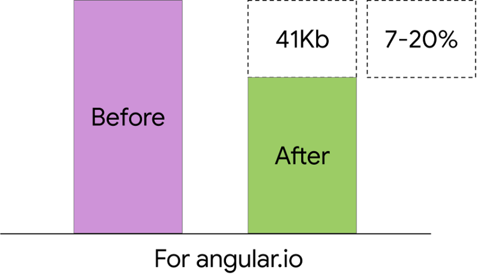

 on [Unsplash](https://unsplash.com/search/photos/eight?utm_source=unsplash&utm_medium=referral&utm_content=creditCopyText)](./asset-1.jpeg)

เดินทางมาถึงเวอร์ชั่นที่ 8 _(\*อัพเดทล่าสุดถึง Angular 8.3)_ แล้วสำหรับ Angular เรามาดูกันดีกว่าว่าในเวอร์ชั่นที่ 8 นี้มีอะไรน่าสนใจกันบ้างครับ

### สารบัญ

-   Differential Loading
-   Lazy Loading ด้วย Dynamic Import
-   Builder API
-   Web Worker Support
-   Ivy opt-in
-   Bazel opt-in
-   Other updates
-   Breaking change

---

### Differential Loading

ปกติเวลา build Angular App เราจะได้ bundle file มาพร้อมกับ polyfill เพื่อทำให้บาง feature สามารถทำงานได้ในทุกๆ browser แต่ browser รุ่นใหม่ส่วนใหญ่จะซัพพอร์ตฟีเจอร์บางอย่างอยู่แล้ว (เช่น ES6) ทำให้ polyfill ที่ได้มาเกินความจำเป็น


ตั้งแต่ Angular 8 จะมีความสามารถใหม่ที่ชื่อว่า Differential Loading ซึ่งจะทำการ build polyfill bundle สองแบบคือ Full polyfill ที่จะเป็น polyfill bundle แบบเดิม ที่เป็น syntax แบบเก่า (ES5) ซึ่งมีขนาดใหญ่ และ Minimal polyfill ซึ่งเป็น polyfill bundle ที่เป็น syntax แบบใหม่ (ES2015) และมีขนาดเล็กลง

วิธีการทำงานของ Differential Loading คือเมื่อเราสร้าง Angular App ใหม่ ด้วย Angular CLI เวอร์ชั่น 8 ขึ้นไป Angular CLI จะทำการสร้างไฟล์ที่ชื่อว่า `browserlist` ขึ้นมา และเวลา build Angular CLI จะดูจากไฟล์นี้ว่าต้องซัพพอร์ต browser รุ่นเก่าหรือไม่ และยังดู property ที่ชื่อว่า `target` ใน tsconfig ว่าเป็น `es2015` หรือไม่ ถ้าต้องซัพพอร์ต browser รุ่นเก่าและ target เป็น `es2015` Angular CLI จะทำการ build bundle มาสองแบบดังนี้


จะเห็นได้ว่าตัว main bundle ขนาดลดลงจาก 153kB เหลือ 133kB ส่วนตัว polyfills ลดลงจาก 111kB เหลือเพียง 36.4kB เท่านั้นเองครับ

วิธีการทำงานของ Differential Loading คือ เวลา Build Angular App ด้วย Angular CLI จะได้ไฟล์ index.html มาหน้าตาประมาณนี้

ให้สังเกตตรง `type="module"` browser รุ่นใหม่จะเข้าใจ syntax นี้และจะโหลด bundle ตรงนี้ไป ส่วน `nomodule` browser รุ่นใหม่จะไม่โหลดตรงนี้ไป แต่ถ้าเป็น browser รุ่นเก่าจะไม่เข้าใจ syntax `type="module"` เลยจะไม่โหลดตรงนี้ จะไปโหลดในส่วนของ `nomodule` แทนครับ



ตัวอย่างการนำ Differential Loading ไปใช้ในเว็บ angular.io สามารถลด bundle size ไปถึง 41Kb เลยทีเดียว ส่วนเว็บอื่นๆสามารถลดขนาด bundle ได้ราวๆ 7–20% ครับ

---

### Lazy Loading ด้วย Dynamic Imports

ก่อน Angular 8 เราจะทำการ Lazy Load ใน Route โดยใช้ string แบบนี้

```
{path: '/admin', loadChildren: './admin/admin.module#AdminModule'}
```

ตั้งแต่ Angular 8 เราจะทำการ Lazy Load ด้วย Dynamic Import แทนแบบนี้

```
{path: `/admin`, loadChildren: () => import(`./admin/admin.module`).then(m => m.AdminModule)}
```

การใช้ Dynamic Imports มีข้อดีคือเป็นมาตรฐานเดียวกันกับที่ Framework อื่นๆใช้ และใน IDE จะขึ้น autocomplete ทำให้เราไม่พิมพ์ชื่อ module ผิดอีกด้วย

---

### Builder API

Angular 8 มาพร้อม API ใหม่ที่ชื่อว่า Builder API (Architect API) ซึ่งทำให้เราสามารถ custom กระบวนการ lint, build, test ของ Angular CLI ได้ (คล้ายๆ Schematics ซึ่งทำให้เรา custom `ng new` `ng generate` `ng add` `ng update`ด้วย Angular CLI )

ถ้าเราไปดูไฟล์ `angular.json` จะมีหน้าตาประมาณนี้

จะเห็นว่าใน `"builder"` ตรงนี้จะเป็น builder default ของ Angular ซึ่งเราสามารถ custom ตัว builder ตรงนี้ได้ เช่น ถ้าเราดู `angular.json` ในโปรเจค Nx(Tool ที่ช่วยจัดการ Monorepo อ่านรายละเอียดเพิ่มเติมได้[ที่นี่](https://nx.dev/)) จะมีหน้าตาประมาณนี้

ให้สังเกตตรง `"builder"` ตรงนี้จะเป็นตัว Custom Builder ของ Nx เอง เพราะในโปรเจค Nx จะใช้ `Jest` และ `Cypress` ในการรัน Unit Test และ e2e test 

นอกจากกระบวนการ build และ test แล้ว เรายังสามารถ custom กระบวนการ deploy ได้ด้วย เช่น ถ้าใครใช้ Firebase hosting เราจะสามารถเซ็ตให้ Deploy ไปที่ Firebase ได้ด้วยคำสั่งนี้

```
ng add @angular/fire
```

เมื่อรันคำสั่งด้านบนเสร็จ ตัว CLI จะทำการเพิ่มไปใน `angular.json` ดังนี้

ถ้าเราอยาก Deploy ไปยัง Firebase hosting ก็แค่ใช้คำสั่ง

```
ng run my-app:deploy
```

_\*ตั้งแต่ Angular CLI 8.3 เป็นต้นไป เราสามารถใช้คำสั่งสั้นลงเหลือเพียงแค่นี้_

```
ng deploy
```

  

---

### Web Worker Support

Web Worker เปลี่ยนเสมือนอีก thread นึงบน JavaScript หรือจะเรียก Background Thread ก็ได้ เพราะงานที่ทำบน Web Worker จะไม่ block การทำงานของ UI เพราะฉะนั้นเราสามารถเอาการคำนวณหนักๆมาใส่ใน Web Worker แล้วส่งผลกลับมาเพื่อแสดงผลบน UI ได้ครับ

ใน Angular 8 เราสามารถเพิ่ม Web Worker จาก Angular CLI ได้ด้วยคำสั่งนี้

```
ng generate web-worker my-worker
```

ด้วยคำสั่งด้านบน Angular CLI จะทำการ configure โปรเจคเราให้สามารถใช้ Web Worker ได้ และเพิ่มไฟล์ `my-worker.worker.ts` เพื่อให้เราใส่โค้ดเพื่อใช้ทำงานใน Web Worker

เราสามารถเอา logic ที่ใช้การคำนวณเยอะๆเอามาใส่ในไฟล์ดังกล่าวได้เลย ส่วนวิธีใช้ก็ง่ายๆแบบโค้ดด้านล่างนี้

---

### Ivy Opt-in

ใครยังไม่รู้จัก Ivy สามารถอ่านได้ที่บทความนี้

[**รู้จัก Ivy อนาคตใหม่ของชาว Angular**  
_ก่อนจะเข้าสู่บทความ ขอเล่าถึงงานที่เพิ่งจบไปอย่าง Google I/O 2018 โดยในงานส่วนใหญ่จะเน้นไปที่ Android, Flutter, AI และ…_medium.com](https://medium.com/@leelorz6/%E0%B8%A3%E0%B8%B9%E0%B9%89%E0%B8%88%E0%B8%B1%E0%B8%81-ivy-%E0%B8%AD%E0%B8%99%E0%B8%B2%E0%B8%84%E0%B8%95%E0%B9%83%E0%B8%AB%E0%B8%A1%E0%B9%88%E0%B8%82%E0%B8%AD%E0%B8%87%E0%B8%8A%E0%B8%B2%E0%B8%A7-angular-e65934326130 "https://medium.com/@leelorz6/%E0%B8%A3%E0%B8%B9%E0%B9%89%E0%B8%88%E0%B8%B1%E0%B8%81-ivy-%E0%B8%AD%E0%B8%99%E0%B8%B2%E0%B8%84%E0%B8%95%E0%B9%83%E0%B8%AB%E0%B8%A1%E0%B9%88%E0%B8%82%E0%B8%AD%E0%B8%87%E0%B8%8A%E0%B8%B2%E0%B8%A7-angular-e65934326130")[](https://medium.com/@leelorz6/%E0%B8%A3%E0%B8%B9%E0%B9%89%E0%B8%88%E0%B8%B1%E0%B8%81-ivy-%E0%B8%AD%E0%B8%99%E0%B8%B2%E0%B8%84%E0%B8%95%E0%B9%83%E0%B8%AB%E0%B8%A1%E0%B9%88%E0%B8%82%E0%B8%AD%E0%B8%87%E0%B8%8A%E0%B8%B2%E0%B8%A7-angular-e65934326130)

ใน Angular 8 ทางทีม Angular ได้ใส่ Ivy mode มาให้เราได้ลองใช้งานกัน วิธีทดลองใช้ก็ง่ายมากแค่

```
ng new ng8-ivy --enable-ivy
```

แค่นี้ก็จะได้ Angular App ที่เปิดโหมด Ivy มาเรียบร้อย หรือจะเปิดเองโดยเพิ่ม option ด้านล่างไปในไฟล์ `tsconfing.app.json` 

```
"angularCompilerOptions": {
  "enableIvy": true
}
```

สำหรับตอนนี้คนที่ลองใช้ Ivy และ Build แล้วจะสังเกตได้ว่า Bundle Size ไม่ค่อยลดลงมากนักเพราะในเวอร์ชั่น 8 นี้ทีมงานจะเน้นไปที่ Backward Compatibility และ แก้บัคก่อน ส่วนเรื่องลดขนาด Bundle Size น่าจะเริ่มเห็นตั้งแต่เวอร์ชั่น 9 เป็นต้นไปครับ

เนื่องจาก Ivy ใน Angular 8 ยังเป็นตัวทดลองฟีเจอร์ทั้งหมดใน Ivy จึงยังมาไม่ครบ สิ่งที่จะมาจากการเปิดโหมด Ivy ใน Angular 8 มีดังนี้


-   Debug ง่ายขึ้น
-   Backwards compatible
-   ใช้ memory น้อยลง


-   รัน Test ได้เร็วขึ้น


-   แก้บัคที่มีมานานบางตัวได้

ส่วนที่เราต้องรอใน Angular 9 มีดังนี้


-   ขนาด App ที่เล็กลง
-   Compile เร็วขึ้น
-   Type checking ที่ดีขึ้น (โดยเฉพาะกับ Template)


  

---

### Bazel Opt-in

ใครยังไม่รู้จัก Bazel สามารถอ่านเพิ่มเติมจากบทความด้านล่างได้เลย

[**มาทำความรู้จัก Angular, Bazel With CLI**  
_โดย Bazel นั้นเป็น build Tool ตัวหนึ่งที่ Google เป็นคนคิดและพัฒนาเพื่อใช้ภายในองค์กรของ Google เอง…_medium.com](https://medium.com/@vortj/%E0%B8%A1%E0%B8%B2%E0%B8%97%E0%B8%B3%E0%B8%84%E0%B8%A7%E0%B8%B2%E0%B8%A1%E0%B8%A3%E0%B8%B9%E0%B9%89%E0%B8%88%E0%B8%B1%E0%B8%81-angular-bazel-with-cli-7ea069421701 "https://medium.com/@vortj/%E0%B8%A1%E0%B8%B2%E0%B8%97%E0%B8%B3%E0%B8%84%E0%B8%A7%E0%B8%B2%E0%B8%A1%E0%B8%A3%E0%B8%B9%E0%B9%89%E0%B8%88%E0%B8%B1%E0%B8%81-angular-bazel-with-cli-7ea069421701")[](https://medium.com/@vortj/%E0%B8%A1%E0%B8%B2%E0%B8%97%E0%B8%B3%E0%B8%84%E0%B8%A7%E0%B8%B2%E0%B8%A1%E0%B8%A3%E0%B8%B9%E0%B9%89%E0%B8%88%E0%B8%B1%E0%B8%81-angular-bazel-with-cli-7ea069421701)

สรุปสั้นๆก็คือ Bazel เป็น tool จาก Google ที่ช่วยให้ build และ test ได้เร็วขึ้น เนื่องจากเป็น Incremental Build (ไม่ build ซ้ำของเก่า) นอกจากนั้นแล้ว Bazel ยังสร้าง Dependency Graph เพื่อใช้ดูว่าส่วนใดบ้างที่เกี่ยวข้องกัน ทำให้ส่วนที่ไม่เกี่ยวข้องกันสามารถ build แบบ parallel

โดยใน Angular 8 นี้ เราก็สามารถลองใช้ Bazel กับ Angular ได้แล้วด้วย โดยวิธีใช้ง่ายๆก็แค่ใช้คำสั่งด้านล่างนี้กับ App ที่มีอยู่แล้ว

```
ng add @angular/bazel
```

หรือจะสร้าง App ใหม่และใช้ Bazel เลยก็ทำได้แบบนี้

```
npm install -g @angular/bazel
ng new --collection=@angular/bazel
```

  

  

---

### Other updates

นอกจากด้านบนแล้วยังมีสิ่งที่เพิ่มมาใหม่ใน Angular 8 อีกคือ

-   **AngularJS Location Service** เป็นการเพิ่ม Location Service ขึ้นมาเพื่อช่วยในการ migrate จาก AngularJS เป็น Angular
-   **TypeScript 3.4** อันนี้ก็ตรงตัวคือ Angular ซัพพอร์ต TypeScript ถึงเวอร์ชั่น 3.4 แล้วนะครับ (\* _Angular 8.2 ซัพพอร์ตถึง TypeScript 3.5 แล้ว_)
-   **Workspace API** เป็น API เพื่อใช้จัดการกับ workspace ใน Angular project อ่านรายละเอียดเพิ่มเติมได้[ที่นี่](https://github.com/angular/angular-cli/blob/master/packages/angular_devkit/core/README.md#workspaces)
-   _\*ตั้งแต่ Angular CLI 8.3 เวลาเราสร้าง Angular App ใหม่ด้วยคำสั่ง_ `_ng new_` _จะได้ Default App หน้าตาใหม่ประมาณนี้_


  

---

### Breaking change

-   ViewChild และ ContentChild ต้องใส่ static option แบบนี้ทุกครั้ง

---

### สรุป

  

  

---

### References

[**Version 8 of Angular — Smaller bundles, CLI APIs, and alignment with the ecosystem**  
_The 8.0.0 release of Angular is here! This is a major release spanning the entire platform, including the core…_blog.angular.io](https://blog.angular.io/version-8-of-angular-smaller-bundles-cli-apis-and-alignment-with-the-ecosystem-af0261112a27 "https://blog.angular.io/version-8-of-angular-smaller-bundles-cli-apis-and-alignment-with-the-ecosystem-af0261112a27")[](https://blog.angular.io/version-8-of-angular-smaller-bundles-cli-apis-and-alignment-with-the-ecosystem-af0261112a27)

[**Brace yourself. Angular 8 is coming**  
_In this blog, let’s see what we should expect from the Angular 8 release. This post will cover some hot topics covered…_blog.angularindepth.com](https://blog.angularindepth.com/embrace-yourself-angular-8-is-coming-1bf187c8f0bf "https://blog.angularindepth.com/embrace-yourself-angular-8-is-coming-1bf187c8f0bf")[](https://blog.angularindepth.com/embrace-yourself-angular-8-is-coming-1bf187c8f0bf)

[**What's new in Angular 8.0?**  
_Angular 8.0.0 is here! A personal announcement first: I'm now officially part of the Angular team as a collaborator, in…_blog.ninja-squad.com](https://blog.ninja-squad.com/2019/05/29/what-is-new-angular-8.0/ "https://blog.ninja-squad.com/2019/05/29/what-is-new-angular-8.0/")[](https://blog.ninja-squad.com/2019/05/29/what-is-new-angular-8.0/)

[**A Guide to Angular 8's Differential Loading**  
_Angular 8 now sends separate bundles to legacy browsers by default. Learn more about this new Angular feature…_auth0.com](https://auth0.com/blog/angular-8-differential-loading/ "https://auth0.com/blog/angular-8-differential-loading/")[](https://auth0.com/blog/angular-8-differential-loading/)

[**Update to Angular Version 8 now!**  
_Let's dive into the latest Angular version 8 that just got released. We'll quickly explore what's new, why you should…_juristr.com](https://juristr.com/blog/2019/06/angular-v8/#stay-up-to-date-evergreen-angular "https://juristr.com/blog/2019/06/angular-v8/#stay-up-to-date-evergreen-angular")[](https://juristr.com/blog/2019/06/angular-v8/#stay-up-to-date-evergreen-angular)

[**Angular 8 and the Future - NGConf 2019 Roundup**  
_I'm not at NGConf 2019 (unfortunately). But I'm following along very closely with the Angular community (and as an…_juristr.com](https://juristr.com/blog/2019/05/Angular-8-and-the-Future-NGConf-2019-Roundup/#bazel-opt-in-preview-is-here "https://juristr.com/blog/2019/05/Angular-8-and-the-Future-NGConf-2019-Roundup/#bazel-opt-in-preview-is-here")[](https://juristr.com/blog/2019/05/Angular-8-and-the-Future-NGConf-2019-Roundup/#bazel-opt-in-preview-is-here)
