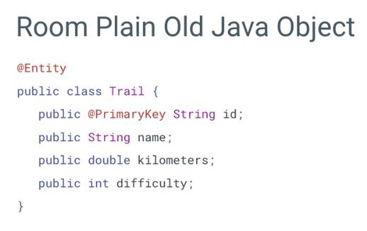
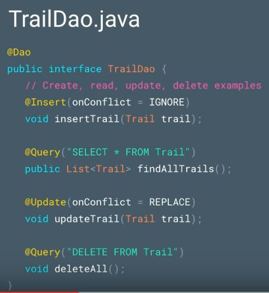
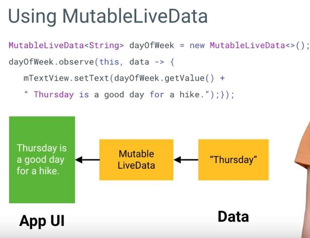
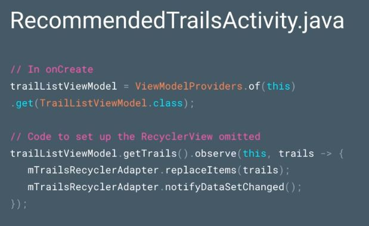

ท่ามกลางกระแสชื่นชมที่ Kotlin [ได้ถูกบรรจุเป็นภาษาทางการของ Android](https://developer.android.com/kotlin/index.html) มีอีกเรื่องหนึ่งที่น่าสนใจไม่แพ้กันนั่นก็คือ Architecture Components สิ่งที่จะมาช่วยให้การเขียน app Android ของคุณง่ายขึ้น

### Architecture Component คืออะไร ?

Architecture Components คือกลุ่มก้อน Library ใหม่จาก Google ซึ่งประกอบไปด้วย Room, LiveData, Lifecycle และ ViewModel ซึ่ง Library ต่างๆเหล่านี้จะช่วยจัดการเรื่อง Lifecycle ให้คุณ ช่วยจัดการเรื่องการเชื่อมต่อกับ Database ให้ง่ายขึ้น ช่วยแยก app ของคุณให้เป็นสัดส่วน ง่ายต่อการ test ช่วยจัดการ error ที่เกิดขึ้นบ่อยๆ และช่วยลด code ที่ต้องเขียนซ้ำๆเยอะๆ ที่เราเรียกว่า boilerplate code

เรามาเริ่มต้นที่ **Room** Library  ที่ช่วยให้คุณจัดการกับ Database ได้ง่ายขึ้น

### Room — ลด boilerplate code เวลาติดต่อ Database

เคยไหม เวลาเขียนโปรแกรมในส่วนติดต่อกับ Database แล้วต้องเจอกับ boilerplate code เยอะๆ จนคุณต้องหนีไปหา Library ที่มาช่วยจัดการเรื่อง Database พวก ORM (Object-Relational Mapping) เช่น [greenDAO](http://greenrobot.org/greendao/) (ตัวนี้ผมใช้อยู่) [Sugar](http://satyan.github.io/sugar/) เป็นต้น แต่วันนี้ เราไม่ต้องไปสรรหา Library นอกมาใช้เองเพราะ Google ทำมาให้เราแล้ว Library นั้นก็คือ **Room** นั่นเอง ไปดูตัวอย่างการใช้งานเลยครับ

สมมติว่าเราอยากได้ Table ที่ชื่อว่า Trail โดยใน Trail จะประกอบด้วย field id, name, kilometers และ difficulty เราจะสามารถสร้างไฟล์ POJO (Plain Old Java Object) ได้ดังนี้

เราสามารถใช้ Room มาช่วยจัดการโดยการใส่ @ annotation `@Entity` ตรงด้านบนของ class POJO ของเราเพื่อบอก Room ว่าเราจะใช้ class นี้เป็น table และถ้าต้องการบอกว่า field ไหน เป็น primary key ก็สามารถใส่ `@PrimaryKey` หน้า field นั้น ดังรูปด้านล่าง

จากนั้นเราก็ต้องสร้างไฟล์ DAO (Data Access Object) เพื่อใช้จัดการเกี่ยวกับการติดต่อ Database ขึ้นมาดังนี้

แต่ละ annotation ก็จะแสดงถึงการกระทำที่เราทำกับ Database อันได้แก่ `@Insert` (ใช้สำหรับใส่ข้อมูลลงไปใน Database), `@Update` (ใช้สำหรับอัพเดทข้อมูลใน Database), `@Delete` (ใช้สำหรับลบข้อมูลใน Database) ส่วน `@Query` จะเป็นการใส่ query ที่เราอยากเขียนขึ้นมาเอง

สิ่งที่พิเศษอย่างนึงของ Room คือ Room จะรู้วิธีจัดการกับ POJO ของเราเช่น

เวลา Insert ข้อมูล Room ก็จะรู้ Type ของ POJO ที่เราต้องการ(ในที่นี้คือ Trail) ถ้าเราสั่ง select \* from ก็จะได้ข้อมูลกลับคืนมาเป็น List(ในที่นี้คือ List ของ Trail) ซึ่งทั้งหมดนี้ Room เป็นคนจัดการให้เราทั้งหมด

ถ้าเรา Select field ที่ไม่มีใน Database ล่ะ

Room ก็จะรู้ได้ทันที และแสดง error แบบนี้มาให้เรา

ต่อไปเรามารู้จักตัวช่วยที่ช่วยให้เรารู้ถึงการเปลี่ยนแปลงของข้อมูลใน Database นั่นก็คือ **LiveData**

### LiveData — รับรู้ถึงการเปลี่ยนแปลงของข้อมูลและ Lifecycle

LiveData จะเป็นตัวสังเกต (observe) การเปลี่ยนแปลงของข้อมูลนั้นๆ เมื่อมีการเปลี่ยนแปลงของข้อมูล เราก็จะสามารถนำข้อมูลที่เปลี่ยนแปลงนั้นไปแสดงผลที่ UI (User Interface) ได้

เราสามารถใช้ class MutableLiveData (LiveData ที่สามารถเซตค่าได้) เพื่อคอยสังเกตการเปลี่ยนแปลงของข้อมูลได้ดังนี้

เมื่อเราเซตค่าใหม่ให้ตัวแปร dayOfWeek ซึ่งเป็นตัวแปรประเภท MutableLiveData ก็จะอัพเดทค่าให้ UI โดยอัตโนมัติดังรูป

เราสามารถเปลี่ยน DAO ข้างบนเป็น LiveData ได้ดังรูป

เมื่อมีการอัพเดทค่าของ Trail เราก็จะสามารถอัพเดท UI ได้อัตโนมัติ ซึ่งสามารถเขียน code ได้ดังรูป

นอกจากนั้นแล้ว LiveData ยังรับรู้ถึงการเปลี่ยนแปลงของ Lifecycle ด้วย (Lifecycle Aware Component) นั่นหมายความว่า ตัว LiveData จะรู้ว่า UI อยู่บนหน้าจอหรือไม่ หรือโดนทำลายไปแล้ว ซึ่ง LiveData ก็จะไม่ส่งข้อมูลให้กับหน้า UI ที่ไม่ได้ active อยู่

ซึ่งจะนำไปสู่หัวข้อถัดไปของ Architecture Components นั่นก็คือ **Lifecycle**

### Lifecycle — ตัวช่วยที่จะทำให้จัดการ Lifecycle ได้ง่ายขึ้น

Component ใหม่ที่ทำหน้าที่จัดการเกี่ยวกับ Lifecycle มี 2 ประเภทคือ **Lifecycle Owners** และ **Lifecycle Observer**

**Lifecycle Owners** จะหมายถึง object ที่มี Lifecycle นั่นเอง ได้แก่ Activity และ Fragment

**Lifecycle Observers** จะหมายถึง object ที่คอยสังเกต Lifecycle Owners และจะถูกแจ้งเมื่อมีการเปลี่ยนแปลง Lifecycle จาก Lifecycle Owners ตัวอย่างของ Lifecycle Observers ได้แก่ LiveData

LiveData นั้น implement interface LifecycleObserver ไว้ จึงสามารถรับรู้การเปลี่ยนแปลง LifeCycle จาก method startup() ซึ่งรับรู้ OnStart() ของ Lifecycle Owner และ cleanup() ซึ่งรับรู้ OnStop() ของ Lifecycle Owner

Observing Flow ก็จะเป็นดังในรูปคือ UI จะคอยสังเกต LiveData ซึ่ง LiveData ก็จะคอยสังเกต Lifecycle Owners(Activity/Fragment) อีกที

และเรายังสามารถสร้าง Lifecycle Observer ของเราเองแบบ LiveData ได้ดังรูป

แต่เรายังมีปัญหาอีกอย่างหนึ่งที่ต้องแก้คือ เวลาตอนที่มี Configuration Change (เช่นตอนหมุนจอ) ตัว LiveData ของเราจะถูกเรียกใหม่ทุกๆรอบ ซึ่งจะทำให้เกิดการ query database ซ้ำๆ โดยเราไม่อยากให้เป็นแบบนั้น เราจึงต้องมี object ใหม่ที่อยู่รอดจาก Configuration Change สิ่งนั้นก็คือ **ViewModel**

### ViewModel — จัดการข้อมูลและอยู่รอดจาก Configuration Change

ViewModel นั้นถูกสร้างขึ้นเพื่อทำหน้าที่จัดการเกี่ยวกับ Model หรือข้อมูลโดยเฉพาะ สิ่งที่พิเศษอย่างนึงของ ViewModel คือ อยู่รอดจาก Configuration Change ทำให้ข้อมูลที่เราเก็บไว้ใน ViewModel จะไม่หายไปและสามารถเรียกข้อมูลที่เก็บไว้มาใช้ได้เมื่อต้องการ โดยที่ไม่ต้อง query หรือดึงจาก api อีกรอบ

ในการสร้าง ViewModel เราสามารถสร้างโดย extend class AndroidViewModel และใส่ส่วนของการดึงข้อมูลจาก database ลงไป (LiveData ที่ feed ข้อมูลจาก Database) โดยเราจะเก็บข้อมูลไว้ใน ViewModel นี้ เพื่อที่จะได้ไม่ต้อง query ข้อมูลจาก Database อีกรอบ

เมื่อ Activity หรือ Fragment ถูกสร้างขึ้นใหม่จาก Configuration Change เราสามารถดึงข้อมูลจาก ViewModel ได้ดังรูป

ในครั้งแรกที่เราทำการเรียก ViewModel จากใน Activity ViewModel จะถูกสร้างขึ้น เมื่อเกิด Configuration Change จะทำให้มีการเรียก ViewModel อีกรอบ ในครั้งนี้ ViewModel จะไม่ได้ถูกสร้างใหม่ แต่จะเรียก ViewModel ตัวเดิม ทำให้เราได้ข้อมูลที่เก็บไว้มา โดยไม่ต้องทำการ query ข้อมูลจาก Database อีกรอบ

โดยสรุปแล้ว เราพูดถึง **Room** ที่เป็น Object Mapping Library สำหรับ SQLite ที่ช่วยลด boilerplate code ในการติดต่อกับ Database, **LiveData** ที่รับรู้ถึงการเปลี่ยนแปลงของข้อมูล และสามารถส่งข้อมูลไปอัพเดทที่ UI ได้ทันที, เราพูดถึง **Lifecycle Owner** และ **Lifecycle Observer** ที่ทำให้ object ที่ไม่ใช่ UI(Activity/Fragment) รับรู้ได้ถึง Lifecycle และสุดท้าย เราพูดถึง **ViewModel** ที่คอยจัดหาข้อมูลและอยู่รอดจาก Configuration Change โดยทั้งหมดทั้งมวลนี้รวมกันเป็น **Architecture Components** ซึ่งจะช่วยให้เราเขียน app Android ได้ง่ายขึ้นเยอะ !!

จบแล้วครับสำหรับการแนะนำ Architecture Components ให้ได้รู้จักกันเบื้องต้น ซึ่งสามารถนำไปขึ้นโครงโปรเจคใหม่ได้เลยครับ หรือใครมีโปรเจคเก่าแล้วอยากลองเอาไปใช้ดูก็ไม่ว่ากัน ไว้พบกันบทความหน้าครับ ขอบคุณครับ

### Reference

[**Android Architecture Components | Android Developers**  
_A new collection of libraries that help you design robust, testable, and maintainable apps._developer.android.com](https://developer.android.com/topic/libraries/architecture/index.html "https://developer.android.com/topic/libraries/architecture/index.html")
