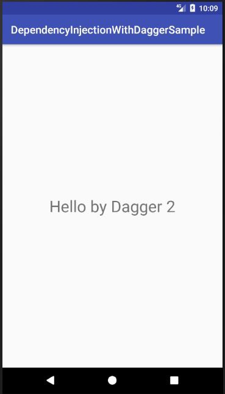

หลังจากบทความที่แล้วว่ากันเรื่อง [Dependency Injection](https://medium.com/@leelorz6/dependency-injection-%E0%B8%84%E0%B8%B7%E0%B8%AD%E0%B8%AD%E0%B8%B0%E0%B9%84%E0%B8%A3-6a1a8a2996be) ไปแล้ว วันนี้จะมาต่อยอดเรื่อง Dependency Injection นี่แหละครับ ว่าถ้าเราใช้ Dependency Injection แล้วจะได้ประโยชน์อะไร

(ใครที่ยังไม่รู้ว่า Dependency Injection คืออะไร จิ้มที่ link ด้านล่างได้เลยครับ)

[**Dependency Injection คืออะไร**  
_ตอนผมเขียนโปรแกรมใหม่ๆ เจอศัพท์คำว่า Dependency Injection แล้วค่อนข้างงงกับคำๆนี้ เลยจะลองเขียนสรุปง่ายๆตามที่เข้าใจดู…_medium.com](https://medium.com/@leelorz6/dependency-injection-%E0%B8%84%E0%B8%B7%E0%B8%AD%E0%B8%AD%E0%B8%B0%E0%B9%84%E0%B8%A3-6a1a8a2996be "https://medium.com/@leelorz6/dependency-injection-%E0%B8%84%E0%B8%B7%E0%B8%AD%E0%B8%AD%E0%B8%B0%E0%B9%84%E0%B8%A3-6a1a8a2996be")[](https://medium.com/@leelorz6/dependency-injection-%E0%B8%84%E0%B8%B7%E0%B8%AD%E0%B8%AD%E0%B8%B0%E0%B9%84%E0%B8%A3-6a1a8a2996be)

เอาเป็นว่ามาถึงตรงนี้ ผมจะคิดว่าทุกคนรู้จัก Dependency Injection แล้วนะครับ สำหรับบทความนี้ผมจะแนะนำให้รู้จักกับ Dagger 2 ตัวช่วยในการทำ Dependency Injection บน Android กันครับ

---

### ทำความเข้าใจกับ MVP

ในการสร้าง application android โดยต้องการให้ application ของเราแยกเป็นสัดส่วนนั้น มี architecture หลายแบบให้เราเลือกใช้ โดยที่นิยมที่สุดคงหนีไม่พ้น MVP (Model-View-Presenter) ส่วนใครที่ยังไม่รู้จัก MVP ลองอ่านดูจากลิ้งด้านล่างนี้ครับ

[**\[Android Code\] ลองพัฒนา Android Application แบบ MVP กันดูมั้ย? ตอนที่ 1**  
_เจ้าของบล็อกได้อ่านบทความ Android Code That Scales, With MVP ของทีม Rewind ซึ่งได้มีการเล่าให้ฟังเกี่ยวกับการจัดการกับ…_www.akexorcist.com](http://www.akexorcist.com/2015/12/android-development-with-mvp-part-1.html "http://www.akexorcist.com/2015/12/android-development-with-mvp-part-1.html")[](http://www.akexorcist.com/2015/12/android-development-with-mvp-part-1.html)

[**MVP คืออะไร แล้วเกี่ยวอะไรกับ Android**  
_พร้อมตัวอย่างทีละขั้นตอน_blacklenspub.com](https://blacklenspub.com/mvp-%E0%B8%84%E0%B8%B7%E0%B8%AD%E0%B8%AD%E0%B8%B0%E0%B9%84%E0%B8%A3-%E0%B9%81%E0%B8%A5%E0%B9%89%E0%B8%A7%E0%B9%80%E0%B8%81%E0%B8%B5%E0%B9%88%E0%B8%A2%E0%B8%A7%E0%B8%81%E0%B8%B0%E0%B9%84%E0%B8%A3%E0%B8%81%E0%B8%B1%E0%B8%9A-android-7a0460d7cd49 "https://blacklenspub.com/mvp-%E0%B8%84%E0%B8%B7%E0%B8%AD%E0%B8%AD%E0%B8%B0%E0%B9%84%E0%B8%A3-%E0%B9%81%E0%B8%A5%E0%B9%89%E0%B8%A7%E0%B9%80%E0%B8%81%E0%B8%B5%E0%B9%88%E0%B8%A2%E0%B8%A7%E0%B8%81%E0%B8%B0%E0%B9%84%E0%B8%A3%E0%B8%81%E0%B8%B1%E0%B8%9A-android-7a0460d7cd49")[](https://blacklenspub.com/mvp-%E0%B8%84%E0%B8%B7%E0%B8%AD%E0%B8%AD%E0%B8%B0%E0%B9%84%E0%B8%A3-%E0%B9%81%E0%B8%A5%E0%B9%89%E0%B8%A7%E0%B9%80%E0%B8%81%E0%B8%B5%E0%B9%88%E0%B8%A2%E0%B8%A7%E0%B8%81%E0%B8%B0%E0%B9%84%E0%B8%A3%E0%B8%81%E0%B8%B1%E0%B8%9A-android-7a0460d7cd49)

ข้อดีของ MVP คือการแยก application ให้เป็นสัดส่วน ในที่นี้คือแยกเป็น Model View และ Presenter จะทำให้ code ของเรา decouple ต่อกัน และสามารถแยกส่วนกันเพื่อเขียน test ได้ ตัวอย่างเช่น ถ้าเราต้องการ test ส่วนของ Presenter เราก็สามารถ mock ในส่วนของ Model และ View เพื่อโฟกัสแค่การ test เฉพาะ Presenter อย่างเดียวได้

---

### มาลองเขียน Dependency Injection กัน!

สมมติว่าเรามี class MainPresenter แบบนี้

```
public class MainPresenter {
    
    private DataManager dataManager;

    public MainPresenter(DataManager dataManager) {
        this.dataManager = dataManager;
    }
}
```

ใน MainActivity จะประกาศแบบนี้

```
public class MainActivity extends AppCompatActivity {

    MainPresenter mainPresenter;

    @Override
    protected void onCreate(Bundle savedInstanceState) {
        ...

        mainPresenter = new MainPresenter(new DataManager());
    }
}
```

จะเห็นว่าเราทำ Dependency Injection โดยการ Inject ตัว DataManager ผ่าน constructor ของตัว MainPresenter โดยประกาศใน onCreate ของ MainActivity ได้

**แต่ถ้าเราต้องการ Inject ตัว Presenter เข้าไปใน View ล่ะ ?**

สมมติว่าเราประกาศให้สามารถ Inject ตัว Presenter ผ่าน constructor ได้แบบนี้

```
public class MainActivity extends AppCompatActivity {
   
    private MainPresenter mainPresenter;

    public MainActivity(MainPresenter mainPresenter) {
        this.mainPresenter = mainPresenter
    }
}
```

แต่ถ้าเราจะประกาศตัวแปรล่ะ ?

```
mainActivity = new MainActivity(new MainPresenter);
```

จะเห็นได้ว่าเราไม่สามารถประกาศแบบด้านบน เพื่อจะ Inject Presenter เข้าไปใน View ของเราได้อยู่ดี จึงเป็นที่มาของพระเอกของเรา **Dagger 2** นั่นเองครับ

---

### รู้จักกับ Dagger 2

Dagger เป็น framework ที่สร้างโดย Square โดยใช้ทำ Dependency Injection ใน Java และ Android ตอนนี้ออกมาเป็นเวอร์ชั่นที่ 2 แล้ว รายละเอียดเพิ่มเติมสามารถจิ้มที่ลิ้งด้านล่างได้เลยครับ

[**Dagger ‡ _A fast dependency injector for Android and Java._**  
A fast dependency injector for Android and Java.google.github.io](https://google.github.io/dagger/ "https://google.github.io/dagger/")[](https://google.github.io/dagger/)

ในบทความนี้จะอธิบายเรื่อง Dagger 2 และวิธีใช้แบบคร่าวๆครับ ไปดูกันเลย !

### ทำความเข้าใจกับ Dagger 2

ใน Dagger 2 จะมี ตัวช่วยอยู่ 2 ตัวด้วยกัน คือ Component และ Module ครับ โดยที่ Component จะเป็น interface ที่จะบอกให้ตัว Dagger รู้ว่าจะต้อง inject ไปที่ตัวไหนครับ ส่วนตัว Module จะเป็นตัว function ที่ใช้สร้างสิ่งที่เราจะนำไป inject นั่นเอง

ยกตัวอย่างนำปัญหาด้านบนมา คือ เราต้องการจะ inject ตัว MainPresenter เข้าไปใน MainActivity ดังนั้น Component ของเราจะหน้าตาประมาณนี้

```
@Component
public interface AppComponent {
    void inject(MainActivity mainActivity);
}
```

โดยเราจะใส่ annotation ‘@Component’ เพื่อบอกให้ Dagger รู้ว่านี่ class นี้คือ component ส่วน function inject ด้านในใช้เพื่อบอกให้ Dagger รู้ว่าจะต้อง inject ไปที่ MainActivity

ส่วนของ Module ก็จะมีหน้าตาประมาณนี้

```
@Module
public class AppModule {
    @Provides
    public MainPresenter providesMainPresenter() {
        return new MainPresenter();
    }
}
```

annotation ‘@Module’ ใช้เพื่อบอก Dagger ว่า class นี้คือ module ส่วน annotation ‘@Provides’ คือใช้บอก Dagger ว่าเราจะเอาสิ่งๆนี้ไปให้ Dagger inject นะ ตามในตัวอย่างก็คือจะเอา MainPresenter ไปให้ Dagger inject นั่นเอง

อธิบายมาเยอะแล้ว ลองไปดูตัวอย่างใช้ Dagger ของจริงเลยดีกว่า !

---

### มาลองใช้ Dagger 2 กันเถอะ

เปิด Android Studio แล้ว New Project ขึ้นมาเลยครับ ตั้งชื่อตามใจชอบ พอเสร็จแล้วให้ใส่ dependency ด้านล่างเข้าไปในไฟล์ build.gradle แล้วกด sync เบาๆ หนึ่งทีครับ

```
dependencies {
    ...
    compile "com.google.dagger:dagger:2.9"
    annotationProcessor "com.google.dagger:dagger-compiler:2.9"
    provided 'javax.annotation:jsr250-api:1.0'
    ...
}
```

ในตัวอย่างนี้ผมจะใช้ Architecture แบบ MVP(Model-View-Presenter) โดยให้ class DataManager เป็นตัวแทนของ Model, class MainActivity เป็นตัวแทนของ View และ class MainPresenter เป็นตัวแทนของ Presenter


โดย Application ตัวนี้ก็จะไม่มีอะไรมากครับ พอเปิด Application มาตัว activity ก็จะไปโหลดข้อมูลจาก model ผ่านทาง presenter เพื่อมาโชว์ที่หน้าจอครับ

**Model (DataManager) ของเราจะเป็นประมาณนี้**

```
public class DataManager {

    public String getGreetingText() {
        return "Hello by Dagger 2";
    }
}
```

ไม่มีอะไรมากสำหรับ model ของเรา ใช้ return greeting text กลับไปเท่านั้น

**View (MainActivity) ของเราก็จะเป็นประมาณนี้**

```
public class MainActivity extends AppCompatActivity {

    MainPresenter mainPresenter;
    TextView tvHello;

    @Override
    protected void onCreate(Bundle savedInstanceState) {
        ...

        tvHello = (TextView) findViewById(R.id.tvHello);
        
        mainPresenter.attach(this);
        mainPresenter.loadGreetingMessage();
    }

    ...

    public void showGreetingMessage(String greetingMessage) {
        tvHello.setText(greetingMessage);
    }
}
```

ตัว view ของเราก็จะทำหน้าที่ในการแสดงผลข้อมูล โดยจะเรียกข้อมูล text ที่ใช้แสดงผลผ่านทาง MainPresenter โดยใช้ function loadGreetingMessage() และจะแสดงผลข้อมูลผ่านทาง function showGreetingMessage() ครับ

จะเห็นได้ว่าเรายังไม่ได้มีการ inject ตัว presenter เข้ามา เพราะเราจะ implement กันทีหลังครับ

**Presenter(MainPresenter) ของเราก็จะหน้าตาประมาณนี้**

```
public class MainPresenter {

    DataManager model;
    MainActivity view;

    ...

    public void loadGreetingMessage() {
        String greetingMessage = model.getGreetingText();
        view.showGreetingMessage(greetingMessage);
    }
}
```

โดย presenter ของเราจะมี function loadGreetingMessage() ไว้ใช้โหลด text ที่ใช้แสดงผลผ่านทาง model DataManager โดยจะใช้ function getGreetingText() เพื่อเรียกข้อมูลมาแสดงผล

ใน class presenter นี้ เราก็จะยังไม่ได้ inject dependency เช่นเดิมครับ

**สร้าง Module กันเถอะ !**

เราจะสร้างไฟล์ module สำหรับ Dagger โดยใช้ชื่อว่า AppModule ซึ่งมีหน้าตาประมาณนี้

```
@Module
public class AppModule {
    
    @Provides
    public DataManager providesDataManager() {
        return new DataManager();
    }
}
```

จะเห็นว่ามีเพียง method เดียว สำหรับใช้สร้างตัว dependency ของ Model(DataManager) ของเรา แต่เดี๋ยวก่อน presenter ล่ะ ไม่ต้องสร้าง dependency ในนี้เหรอ ? ไว้เดี๋ยวเราจะมาเฉลยทีหลังครับ ไปต่อกันเลย

**สร้าง Component กันเถอะ!**

ต่อไปก็จะเป็นไฟล์ component โดยเราจะตั้งชื่อว่า AppComponent ซึ่งมีหน้าตาประมาณนี้

```
@Component (modules = AppModule.class)
public interface AppComponent {
    void inject(MainActivity activity);
}
```

โดยหลัง ‘@Component’ จะมีวงเล็บให้ใส่ module เพิ่มเข้าไป ให้เราใส่ชื่อ class AppModule ที่เราเพิ่งสร้างไป

ตัว component นี้จะเป็น interface ที่ใช้บอกว่าให้ Dagger ไป inject ที่ไหน

มาถึงขั้นนี้ลองกด build หนึ่งที ถ้าไม่เกิด error อะไร แสดงว่า**คุณได้ไปต่อครับ** !

**ต่อไปก็จะเป็นการสร้าง Application class ที่ใช้เรียก component ของ Dagger**

โดยให้สร้าง class ชื่อ App หน้าตาประมาณนี้ครับ

```
public class App extends Application {
    
    private AppComponent appComponent;
    
    @Override
    public void onCreate() {
        super.onCreate();
        appComponent = DaggerAppComponent.create();
    }
    
    public AppComponent getAppComponent() {
        return appComponent;
    }
}
```

จะเห็นได้ว่า ตรง DaggerAppComponent.create() นั้นเราไม่ได้สร้างขึ้นมาเอง ทำไมไม่ error ล่ะ ! คำตอบอยู่ที่ ตอนเราสร้าง AppComponent เสร็จแล้วกด build ตัว Dagger จะไปสร้าง DaggerAppComponent ให้เราโดยอัตโนมัตินั่นเองครับ

และอย่าลืมใส่ชื่อไฟล์ App ลงใน AndroidManifest.xml ด้วยนะครับ

```
<application
    …
    android:name=”.App”>
```

จากนั้นให้เพิ่มบรรทัดด้านล่างลงใน onCreate ของ MainActivity ของเราครับ

```
((App) getApplication()).getAppComponent().inject(this);
```

บรรทัดนี้จะเป็นการบอก Dagger ให้ Inject Dependency ที่นี่ครับ

ต่อไปให้ใส่ ‘@Inject’ ใน MainActivity

```
public class MainActivity extends AppCompatActivity {

    @Inject
    MainPresenter mainPresenter;

    ...
}
```

และใน MainPresenter

```
public class MainPresenter {

    @Inject
    DataManager model;

    ...

    @Inject
    public MainPresenter(DataManager dataManager) {
        this.model = dataManager;
    }

    ...
}
```

เพื่อเป็นการบอกว่า เราจะ inject dependency มาที่ตัวแปรดังกล่าวครับ

แต่ให้สังเกตบรรทัดข้างล่างครับ ที่เราใส่ ‘@Inject’ ตรง Constructor ของ MainPresenter ตรงนี้ไม่ได้บอกให้ Inject dependency มาที่นี่นะครับ แต่เป็นการบอก Dagger ว่า ให้เอา ตัวนี้ไป inject ใส่ใน MainActivity นั่นเอง (นี่คือเหตุผลที่เราไม่ได้ใส่ไว้ใน AppModule นั่นเอง มาเฉลยตรงนี้ครับ)

กด build เบาๆหนึ่งที ถ้าไม่มีปัญหาอะไรแสดงว่า **เสร็จแล้วครับ !**

ลองกดรันดูก็จะได้ผลลัพธ์ประมาณนี้



_ตัวอย่าง code บน github จิ้มเบาๆ ได้เลย!_

[**devlorz/DependencyInjectionWithDaggerSample**  
_DependencyInjectionWithDaggerSample - Simple Dependency Injection with Dagger 2 Project_github.com](https://github.com/devlorz/DependencyInjectionWithDaggerSample "https://github.com/devlorz/DependencyInjectionWithDaggerSample")[](https://github.com/devlorz/DependencyInjectionWithDaggerSample)

---

ก็จบไปแล้วนะครับสำหรับ Dependency Injection ด้วย Dagger 2 หวังว่าจะได้ประโยชน์กันไม่มากก็น้อยนะครับ

_น้อมรับทุกคำติชมครับ เจอกันใหม่บทความหน้า สวัสดีครับ_

### _References_

[**Dagger ‡ _A fast dependency injector for Android and Java._**  
A fast dependency injector for Android and Java.google.github.io](https://google.github.io/dagger/ "https://google.github.io/dagger/")[](https://google.github.io/dagger/)

[**codepath/android\_guides**  
_android\_guides - Extensive Open-Source Guides for Android Developers_github.com](https://github.com/codepath/android_guides/wiki/Dependency-Injection-with-Dagger-2 "https://github.com/codepath/android_guides/wiki/Dependency-Injection-with-Dagger-2")[](https://github.com/codepath/android_guides/wiki/Dependency-Injection-with-Dagger-2)

[**Understanding Dagger 2**  
_I’ve found that most of the tutorials out there explaining how Dagger works are over-complicated, even the original…_medium.com](https://medium.com/@Miqubel/understanding-dagger-2-367ff1bd184f "https://medium.com/@Miqubel/understanding-dagger-2-367ff1bd184f")[](https://medium.com/@Miqubel/understanding-dagger-2-367ff1bd184f)

[**Refactoring to MVP with Dagger (Part 2)**  
_Part 2 of my articles Refactoring to MVP and Refactoring to MVVM._medium.com](https://medium.com/@Miqubel/refactoring-to-mvp-with-dagger-part-2-838c6e089a1 "https://medium.com/@Miqubel/refactoring-to-mvp-with-dagger-part-2-838c6e089a1")[](https://medium.com/@Miqubel/refactoring-to-mvp-with-dagger-part-2-838c6e089a1)
