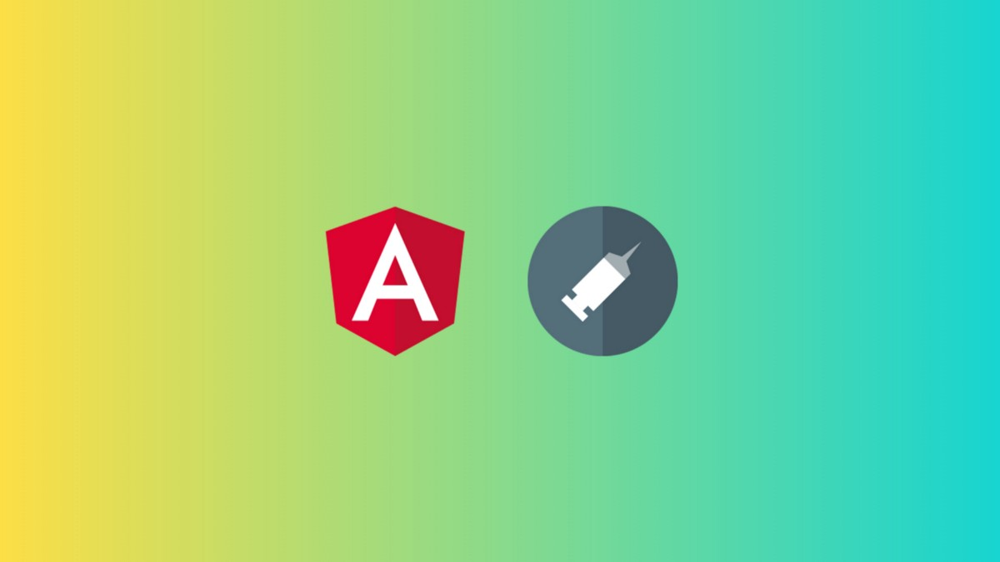
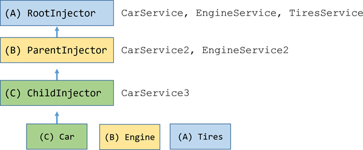
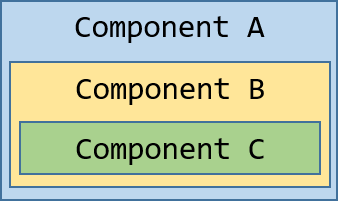

วันนี้จะมาเขียนถึง Dependency Injection ใน Angular กัน ใครยังไม่รู้จัก Dependency Injection ตามไปอ่านในบทความด้านล่างได้เลยครับ

[**Dependency Injection คืออะไร**  
_ตอนผมเขียนโปรแกรมใหม่ๆ เจอศัพท์คำว่า Dependency Injection แล้วค่อนข้างงงกับคำๆนี้…_medium.com](https://medium.com/@leelorz6/dependency-injection-%E0%B8%84%E0%B8%B7%E0%B8%AD%E0%B8%AD%E0%B8%B0%E0%B9%84%E0%B8%A3-6a1a8a2996be "https://medium.com/@leelorz6/dependency-injection-%E0%B8%84%E0%B8%B7%E0%B8%AD%E0%B8%AD%E0%B8%B0%E0%B9%84%E0%B8%A3-6a1a8a2996be")[](https://medium.com/@leelorz6/dependency-injection-%E0%B8%84%E0%B8%B7%E0%B8%AD%E0%B8%AD%E0%B8%B0%E0%B9%84%E0%B8%A3-6a1a8a2996be)

---

### สารบัญ

-   [ทำไมถึงต้องใช้ Dependency Injection ?](#d59a)
-   [Dependency Injection ใน Angular](#3bbb)
-   [Injector & Provider](#e5aa)
-   [@Injectable provider](#ef7b)
-   [@NgModule provider](#1a67)
-   [@Component provider](#0fce)
-   [เจาะลึก Provider](#b7ec)
-   [ถ้า Class Provider มี Dependency](#17b3)
-   [Aliased Class Provider](#0f8f)
-   [Value Provider](#b126)
-   [Factory Provider](#f43f)
-   [Tree-shakable Provider](#8b20)
-   [Dependency Injection Token](#f1e2)
-   [Singleton Service](#f6ff)
-   [Component Child Injector](#62d7)
-   [เขียน Test Component ที่มี Dependency Injection](#45f8)
-   [สรุป](#f535)

---

### **ทำไมถึงต้องใช้ Dependency Injection ?**

สมมุติว่าเรามี Class ที่ชื่อว่า Car ดังนี้

จากโค้ดด้านบน ลองสังเกตใน Constructor เราจะเห็นได้ว่ามี Dependency อยู่ 2 ตัวก็คือ Engine และ Tires อยู่ ลองจินตนาการตามนะครับ ถ้าวันดีคืนดี Constructor ของ Class Engine หรือ Tires มีการแก้ไข มีการเพิ่ม Parameter ขึ้นมา เราก็จะต้องมาแก้ Class Car ของเราด้วยทุกครั้งที่มีการแก้ไข Class Engine หรือ Tires

นอกจากนั้นแล้ว ถ้าเกิดเราอยากให้มีการแชร์ข้อมูลของ Engine หรือ Tires ก็จะทำได้ยากเช่นกันเพราะ ทุกครั้งที่มีการสร้าง Instance ของ Car ขึ้นมาใหม่ จะทำให้เกิด Instance ใหม่ของ Engine และ Tires ด้วย ดังนั้นแต่ละ Car จะใช้ข้อมูลจาก Engine และ Tires คนละตัวกัน

การเขียน Test ของ Class Car ยังทำได้ลำบาก เพราะเราต้องมาเขียน Test ที่ขึ้นอยู่กับ Class Engine และ Tires ด้วย ซึ่งอาจจะทำได้แต่ไม่ง่าย

ปัญหาเหล่านี้สามารถแก้ไขได้ด้วย Dependency Injection ครับ เราไปดูกันดีกว่าว่า Dependency Injection จะมาแก้ปัญหาเหล่านี้ยังไง

จากโค้ดด้านบนจะเห็นว่า ใน Class Car เราเปลี่ยน Constructor ให้รับตัวแปรจากภายนอกแทนที่จะสร้าง Engine และ Tires ขึ้นมาใหม่ใน Constructor ทำให้เวลาเขียน Test เราสามารถสร้างตัวแปรแบบ Mock ของ class Engine และ Tires แล้วนำไปใส่ใน Constructor ของ Class Car ได้เลย

แต่การที่เราจะมาเขียนแบบ `new Dependency()` ใส่ใน Constructor ทุกครั้งก็คงจะลำบาก ดังนั้นถ้ามี Class ที่ไว้ใช้จัดการการสร้างทั้ง Car , Engine และ Tires ให้เราทั้งหมดก็คงจะดี ดังเช่นตัวอย่างด้านล่างนี้

แต่การจะมาเขียนแบบด้านบนด้วยตัวเองทั้งหมดนั้นก็คงจะลำบาก นั่นจึงเป็นที่มาของ Dependency Injection Framework ครับ ข่าวดีก็คือใน Angular มี Dependency Injection Framework มาให้พร้อมอยู่แล้วครับ เราไม่ต้องไปเขียนเองให้เมื่อยมือ

### Dependency Injection ใน Angular

ใน Angular นั้นซัพพอร์ตการทำ Dependency Injection อยู่แล้ว เราสามารถทำ Dependency Injection ได้ง่ายๆ โดยประกาศ Service หรือ Class ที่เป็น Dependency ภายใน Constructor ดังนี้

จากตัวอย่างด้านบนจะเห็นได้ว่า HeroService ถูก Inject เข้าไปใน HeroListComponent ผ่านทาง Constructor ครับ ง่ายๆแค่นี้ เราก็สามารถนำ HeroService มาใช้ใน HeroListComponent ได้แล้วครับ

> ถ้าจะ Inject Dependency เข้าไปใน Service ต้องใช้ `@Injectable()` เพื่อให้สามารถ Inject Dependency เข้าไปได้นะครับ

### Injector & Provider

ตัวละครสำคัญที่ทำให้ Dependency Injection ใน Angular เกิดขึ้นได้นั้นมีอยู่ 2 ตัว ก็คือ Injector และ Provider

Injector ทำหน้าที่สร้าง Dependency และจัดการหา Dependency ให้กับ Component หรือ Service ใดๆ ก็ตามที่ร้องขอมา ส่วน Provider ทำหน้าที่จัดหาข้อมูลที่เกี่ยวกับการสร้าง Dependency ให้กับ Injector ถ้าเรา Inject Dependency ใดๆ โดยไม่ประกาศไว้ใน Provider แล้ว Injector ก็จะไม่สามารถสร้าง Dependency ได้ จะทำให้เกิด Error ประมาณนี้

```
ERROR Error: No provider for LoggerService!
```

Provider หลักๆที่ใช้ก็มีอยู่ 3 แบบก็คือ @Injectable Provider, @Component Provider และ @NgModule Provider

### @Injectable Provider

การใช้ Decorator `@Injectable` นั้น เป็นการบอก Injector ว่า Class นี้สามารถถูก Inject ได้ (ใช้ Dependency Injection ได้นั้นเอง) โดยปกติ Service จะถูกแนะนำให้ใช้ `@Injectable` เป็นปกติอยู่แล้ว และตั้งแต่ Angular 6 เป็นต้นมา เราสามารถใส่ property `providedIn` ลงไปใน `@Injectable` เพื่อเป็นการบอกว่า Service นั้นๆจะสามารถใช้ได้ที่ไหนบ้าง ลองไปดูตัวอย่างกันครับ

จากโค้ดด้านบนเราใส่ property `providedIn: 'root'` เพื่อเวลา Injector มาเจอจะได้รู้ว่าควรจะทำให้ Service ตัวนี้ใช้ได้ใน Root Level หรือใช้ได้ทั้ง Application นั่นเอง โดย Service ที่เราสร้างโดย Angular CLI(> 6.0) จะถูกใส่ `providedIn: 'root'` ให้มาเป็น Default อยู่แล้ว

แต่ถ้าเราอยากให้ Service ใช้ได้เพียงแค่ใน Module ใด Module หนึ่ง สามารถทำได้ดังนี้ครับ

จะเห็นว่าใน `providedIn` เราเปลี่ยนจาก `'root'` เป็น `HeroModule` เพื่อให้ HeroService ใช้ได้แค่ใน HeroModule นั่นเอง

### @NgModule Provider

เป็นวิธีการที่เราใช้กับมานานครับ นั่นก็คือประกาศตัว Service ไว้ที่ Module ที่เราอยากให้ Service นั้นถูกใช้ได้ เช่น ถ้าอยากให้ใช้ได้ทั้ง App ก็ประกาศไว้ที่ AppModule หรือถ้าอยากให้ใช้ได้แค่ HeroModule ก็ประกาศใน HeroModule โดยสามารถประกาศใน Decorator `@NgModule` ภายใน `providers` ดังนี้

### @Component Provider

เรายังสามารถประกาศ Service ให้ใช้ได้เฉพาะภายใน Component โดยการประกาศตัว Service ใน Decorator `@Component` ภายใน`providers` ดังนี้

#### แล้วจะใช้อะไรดีระหว่าง @Injectable @NgModule หรือ @Component

ถ้าเป็นไปได้แนะนำให้ใช้ `@Injectable`เพราะทำ Tree Shaking ได้ครับ ส่วนถ้าอยากให้ใช้ได้เฉพาะ Component ใด Component หนึ่ง ก็ให้ประกาศใน `@Component` .

### เจาะลึก Provider

ด้านบนพูดถึง Provider แบบพอหอมปากหอมคอไปแล้ว ทีนี้เรามาเจาะลึกเกี่ยวกับ Provider กันดีกว่า

Provider นั้นเป็นตัวบอกให้ Injector รู้ว่าจะควรจะสร้าง Instance ของ Service (Dependency) ยังไง เพื่อที่จะ Inject ไปใน Component , Directive, Pipe หรือ Service

วิธีสร้าง Provider ง่ายๆ ถ้าดูจาก NgModule Provider หรือ Component Provider ด้านบนจะเห็นว่าเราสามารถสร้าง Provider ได้ดังนี้

```
providers: [HeroService]
```

โดยการเขียนแบบนี้จะเป็นการสร้าง Provider เพื่อบอกให้ Injector สร้าง Instance จาก Class HeroService

การประกาศ Provider แบบด้านบนนั้นเป็นแบบย่อครับ เราสามารถประกาศ Provider แบบเต็มๆได้ดังนี้

```
providers: [{ provide: HeroService, useClass: HeroService}]
```

โดยใน `provide` จะเป็นการใส่ Token (ในตัวอย่างคือ Class HeroService) เพื่อใช้เป็น Key ในการหา Dependency ของ Injector ยกตัวอย่างเช่น เวลาเราประกาศใน Constructor ว่า `constructor(private heroService: HeroService)` ตัว Injector ก็จะไปหา Dependency ที่มี Token ที่ชื่อว่า HeroService

ส่วน `useClass` จะเป็นการบอกว่าให้ใช้ Class ไหนในการสร้าง Instance ของ Dependency จากตัวอย่างด้านบนก็คือ Class HeroService ครับ

เราสามารถเปลี่ยนไปใช้ Class อื่นแทน Class HeroService ได้ดังนี้

```
providers: [{ provide: HeroService, useClass: BetterHeroService}]
```

การทำแบบนี้จะทำให้เมื่อมีการร้องขอ HeroService แทนที่ Injector จะให้ Instance ที่สร้างจาก Class HeroService ธรรมดา ก็เปลี่ยนเป็น Instance ที่สร้างจาก Class BetterHeroService แทน

#### ถ้า Class Provider มี Dependency

ถ้าเกิดภายใน Class ที่จะใช้ใน Provider เกิดมี Dependency ขึ้นมา เราก็ต้องประกาศ Dependency ของ Class นั้นไว้ใน Provider ด้วยเช่น สมมุติเรามี Class EvenBetterLogger ดังนี้

จะเห็นได้ว่าใน Class มี Dependency อีกตัวคือ UserService ถ้าเราอยากเรียกใช้งาน EvenBetterLogger เราต้องประกาศใน Provider ดังนี้

```
[ UserService,
  { provide: Logger, useClass: EvenBetterLogger }]
```

#### Aliased Class Provider

สมมุติว่า Component ของเรามี Dependency ตัวนึงที่ชื่อว่า OldLogger แต่วันดีคืนดีเราอยากจะแก้ OldLogger ซะใหม่ ปัญหาก็คือถ้าเราไม่สามารถแก้ที่ Component ให้ไปใช้ Dependency ตัวใหม่ได้ เราจึงต้องสร้าง NewLogger ขึ้นมาใหม่โดยที่ Interface เหมือน OldLogger ทีนี้ถ้าเราอยากจะให้ Injector เปลี่ยนไปใช้ตัว NewLogger ใหม่ แทน OldLogger ต้องทำยังไง ? เราสามารถประกาศใน Provider แบบนี้

```
[ NewLogger,
{ provide: OldLogger, useClass: NewLogger}]
```

แต่การประกาศแบบด้านบนจะทำให้เราได้ NewLogger มา 2 Instance วิธีแก้ปัญหาก็คือใช้ useExisting ครับ

```
[ NewLogger,
{ provide: OldLogger, useExisting: NewLogger}]
```

ด้วยวิธีนี้เวลา Component ร้องขอ OldLogger มา แทนที่ Injector จะไปสร้าง NewLogger ขึ้นมาใหม่ ก็จะไปใช้ Instance ของ NewLogger ที่มีอยู่แล้วนั่นเอง

#### Value Provider

เราสามารถประกาศ Dependency โดยที่ไม่ใช่ Class ก็ได้ครับ

สมมุติว่าเรามีตัวแปร silentLogger ซึ่งมี Interface แบบเดียวกับ Logger Class ดังนี้

เราสามารถให้ Injector ใช้ตัวแปร silentLogger ได้ โดยประกาศใน Provider โดยใช้ useValue ดังนี้

```
[{ provide: Logger, useValue: silentLogger }]
```

ทีนี้เวลามีการร้องขอ Logger ตัว Injector ก็จะให้ silentLogger ไปแทนครับ

#### Factory Provider

สมมุติว่าเรามี Class HeroService ซึ่ง HeroService นั้นจะโชว์ Hero ให้เฉพาะ User ที่ Authorized เท่านั้น ปัญหาก็คือ HeroService จะรู้ได้ยังไงว่า User นั้น Authorized หรือไม่ เราสามารถทำการ Inject ตัว UserService เข้าไปใน HeroService ก็ได้ครับ แต่ว่าการทำแบบนี้จะเป็นการเปิดเผย UserService ให้กับ HeroService มากเกินไป สิ่งที่ HeroService ต้องการรู้ก็เพียงแค่ว่า User นั้น Authorized รึเปล่า ถ้าเราไม่สามารถ Inject UserService ไปตรงๆได้จะทำยังไง ? คำตอบก็คือ ใช้ Factory Provider ครับ

สังเกตโค้ดด้านบนจะเห็นว่าเราสร้าง HeroService ขึ้นมาโดยใช้ UserService ซึ่งการทำแบบนี้ตัว HeroService จะไม่รู้เกี่ยวกับ UserService เลย มีเพียงแค่ตัว Factory เท่านั้นที่รู้ ให้สังเกตตรง heroServiceProvider ด้านล่าง ตรง `provide` ให้ใส่ Class HeroService ตามปกติไป ส่วนตรง `useFactory` เราจะใช้ Factory Function ที่สร้างขึ้นมาแทน (ในที่นี้คือ heroServiceFactory) ส่วนตรง `deps` เราจะใส่ Dependency ของ Factory Functions ซึ่งก็คือ UserService นั่นเอง

เวลาเอามาใช้ก็มาประกาศที่ Provider ง่ายๆ แค่นี้ครับ

```
providers: [ heroServiceProvider ]
```

#### Tree-shakable Provider

ตั้งแต่ Angular 6 เป็นต้นมา ได้เพิ่มความสามารถให้ Provider สามารถทำ Tree Shaking ได้แล้วครับ พูดง่ายๆก็คือ Service บางตัวที่เราไม่ได้ใช้ ก็จะไม่ถูก Build ลงไปในไฟล์ Bundle ทำให้ไฟล์ Bundle ที่ได้มีขนาดเล็กลงครับ

การทำ Tree-shakable provider นั่นทำไม่ยาก โดยใช้ @Injectable Provider นั่นเองวิธีการก็คือใส่ `providedIn` ลงไปใน `@Injectable` ดังนี้

```
@Injectable({   
  providedIn: 'root', 
})
```

การประกาศแบบนี้จะเป็นการบอกว่า Service ตัวนี้จะถูก Inject ลงไปที่ Root Level โดยถ้า Service ตัวนี้ไม่ถูกเรียกใช้ก็จะไม่ถูกเอาไป Build ลงไปในไฟล์ Bundle (Tree-shakable)

แต่ถ้าเราอยากให้ Service ใช้ได้เพียงแค่เฉพาะใน Module เราสามารถทำได้ดังนี้ครับ

```
@Injectable({   
  providedIn: HeroModule, 
})
```

จะเห็นว่าใน `providedIn` เราเปลี่ยนจาก `'root'` เป็น `HeroModule` เพื่อให้ HeroService ใช้ได้แค่ใน HeroModule ครับ

#### Dependency Injection Token

ใน [Value Provider](#b126) ด้านบนนั้นเราใช้ Token ที่เป็น Instance ของ Class แต่เรายังสามารถสร้าง Token แบบที่ไม่ใช่ Instance ของ Class ได้ โดยใช้ [InjectionToken](https://angular.io/api/core/InjectionToken) ครับ เราสามารถสร้าง InjectionToken ได้ง่ายๆแบบนี้

ใน Provider เราสามารถประกาศโดยใช้ Token ที่สร้างขึ้นมาได้แบบนี้

```
providers: [{ provide: TOKEN, useValue: silentLogger }]
```

ส่วนตอน Inject นั้นเราสามารถ Inject ได้โดยใช้ `@Inject`แบบนี้ครับ

```
constructor(@Inject(TOKEN) private silent) { }
```

นอกจากนั้นแล้วยังสามารถประกาศ Provider ในตอนสร้าง Token ได้เลยแบบนี้ครับ

```
export const TOKEN = 
  new InjectionToken('desc', { providedIn: 'root', factory: () => new AppConfig() })
```

สังเกตว่าจะคล้ายๆ @Injectable Provider แต่ตรงด้านหลังจะเป็น `factory` ซึ่งใช้ประกาศ Factory Function ที่จะ Return ค่าเพื่อเอามาใช้เป็น Dependency ครับ

### Singleton Service

โดยปกติถ้าเราประกาศ Service ใน Provider Service ที่ได้จะเป็น Singleton อยู่แล้ว (Service ที่ได้จะเป็น Instance ตัวเดียวกัน) แต่จะเป็น Singleton ถ้าเราไม่ประกาศซ้ำใน Module หรือ Component อื่นเท่านั้นครับ

> Dependency Injection ของ Angular เป็นระบบ Hierarchical Injection หรือจะเรียกว่าเป็นการ Inject เป็นชั้นๆ อธิบายง่ายๆก็คือ เวลา Component ใดๆ ร้องขอ Dependency ตัว Injector จะไปค้นหาจาก Provider ใน Component ก่อนถ้าไม่เจอก็จะไปหาจาก Parent Component และหาไปเรื่อยๆจนถึงชั้นบนสุด (Root Level) ถ้าไม่เจออีกก็จะ Throw Error ออกมา



ถ้าเราประกาศ Service ไว้หลายที่ เวลา Component ร้องขอ Service ตัว Injector จะนำ Instance ของ Service ชั้นที่ใกล้สุดมาให้ ลองดูตัวอย่างด้านล่างนี้ครับ



จากรูปด้านบนเรามี Component A, B และ C โดย Component A มี Component ลูกคือ Component B และ Component B มี Component ลูกคือ C

สมมุติว่าเราประกาศ Service ไว้ที่ AppModule และ Component C Instance ของ Service ที่ได้ภายใน Component C จะคนละตัวกับ Instance ที่ได้ภายใน Component A และ B ครับ

### Component Child Injector

ถ้าเราประกาศ Provider ไว้ภายใน Component (@Component Provider) จะทำให้เราได้ Component Child Injector ซึ่งจะทำหน้าที่สร้าง Dependency เฉพาะของ Component นั้นๆ เมื่อ Component นั้นถูกทำลายไป ตัว Component Child Injector และ Dependency ที่ Child Injector สร้างขึ้นมาก็จะถูกทำลายไปด้วย

### เขียน Test Component ที่มี Dependency Injection

เราสามารถเขียน Test Component ที่มี Dependency ได้ง่ายๆ ด้วยการสร้างตัวแปร Mock ขึ้นมา จากนั้นเอา Mock ไปใส่ใน Constructor เวลาสร้าง Component ดังตัวอย่างด้านล่างนี้ครับ

---

### สรุป

-   Dependency Injection ทำให้โค้ดดูแลง่าย สร้าง Singleton Service ง่าย และยังทำให้เขียน Test ง่าย
-   ใน Angular มี Dependency Injection Framework มาให้อยู่แล้ว โดยสามารถ Inject Dependency ผ่านทาง Constructor ได้แล้ว
-   การทำ Dependency Injection ใน Angular ต้องอาศัย Injector โดย Injector ต้องอาศัย Provider อีกทีนึงเพื่อที่สร้าง Dependency และ Inject ได้ถูก โดย Provider มี 3 แบบด้วยกันคือ @Injectable Provider, @NgModule Provider และ @Component Provider
-   การประกาศ Provider นั้นหลักๆมี 2 ส่วนก็คือ `provide` ไว้ใส่ Token เพื่อใช้เวลา Injector ค้นหา Dependency ตรงนี้ให้ใส่เป็น Class หรือ Token ที่สร้างจาก InjectionToken ครับ อีกส่วนนึงก็คือไว้บอก Injector เวลาจะสร้าง Instance ของ Dependency โดยเราสามารถใช้ `useClass` เพื่อสร้าง Instance จาก Class ใช้ `useValue` เพื่อใช้ค่าจากตัวแปร ใช้ `useExisting` เพื่อใช้ Instance ที่มีอยู่แล้ว ใช้ `useFactory` เพื่อสร้างจาก Factory Function
-   ตั้งแต่ Angular 6 สามารถสร้าง Dependency แบบที่ทำ Tree Shaking โดยประกาศแบบ @Injectable Provider
-   โดยส่วนใหญ่เวลาประกาศ Service ใน Angular จะเป็น Singleton อยู่แล้ว ถ้าเราไม่ประกาศซ้ำที่อื่น ถ้าเราประกาศ Service หลายที่ Instance ของ Service ที่ได้จะเป็น Instance จากชั้นที่ใกล้ที่สุด
-   เขียน Test ง่ายๆ โดยสร้าง Mock ของ Dependency ขึ้นมา แล้วนำ Mock ที่ได้ไปใส่ใน Constructor เวลาสร้างตัวแปร Component หรือ Service ที่ต้องการ Test

---

ก็จบไปแล้วนะครับสำหรับเรื่อง Dependency Injection ใน Angular หวังว่าจะได้ความรู้ไม่มากก็น้อยนะครับ ถ้าเห็นว่าบทความนี้มีประโยชน์ช่วยกด Clap หรือแชร์ด้วยนะครับ สำหรับใครที่มีข้อติชมก็สามารถติชมได้ในนี้ หรือผ่าน Facebook Page ด้านล่างนี้เลย  
[https://www.facebook.com/devnoteio/](https://www.facebook.com/devnoteio/)

แล้วเจอกันใหม่บทความหน้านะครับ สวัสดีครับ \_/|\\\_

### Reference

[**Angular Docs**  
_Edit description_angular.io](https://angular.io/guide/dependency-injection "https://angular.io/guide/dependency-injection")[](https://angular.io/guide/dependency-injection)
