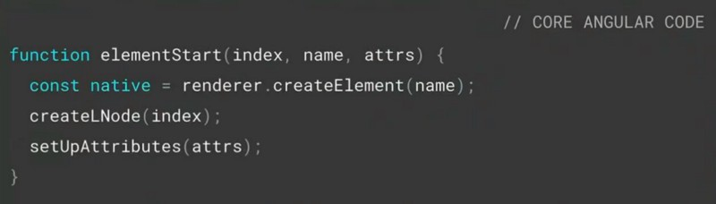
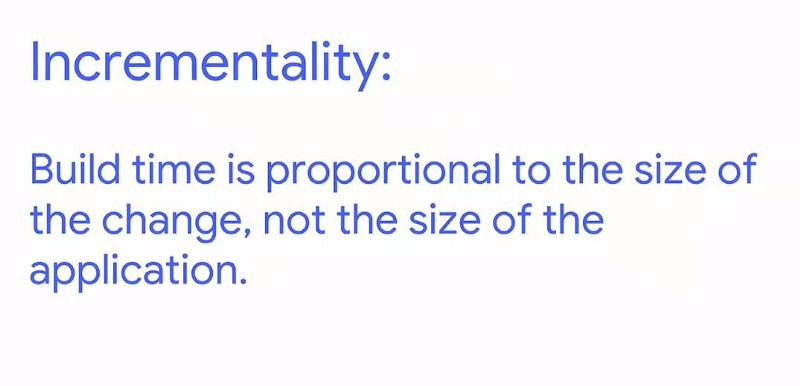

ก่อนจะเข้าสู่บทความ ขอเล่าถึงงานที่เพิ่งจบไปอย่าง [Google I/O 2018](https://www.youtube.com/playlist?list=PLOU2XLYxmsIInFRc3M44HUTQc3b_YJ4-Y) โดยในงานส่วนใหญ่จะเน้นไปที่ Android, Flutter, AI และ Machine Learning ซะเป็นส่วนใหญ่ ส่วนทางฝั่งเว็บเองก็จะมีที่น่าสนใจอย่าง [Web Performance](https://www.youtube.com/watch?v=Mv-l3-tJgGk) ([Guess.js](https://github.com/guess-js/guess)) , [สิ่งใหม่ๆใน Chrome Dev Tool ](https://www.youtube.com/watch?v=mfuE53x4b3k), [WebAssembly](https://www.youtube.com/watch?v=BnYq7JapeDA) (AutoCAD บนเว็บ!), [Polymer 3.0](https://www.youtube.com/watch?v=7CUO7PyD5zA&t=2s) เป็นต้น

ส่วนทางฝั่ง Angular มีทั้งสิ้น เอ่อ… 1 Session ด้วยกันครับ เพราะเพิ่งจัดหนักไปในงาน [NgConf 2018](https://www.youtube.com/user/ngconfvideos/videos) นั่นเอง โดยใน Session ของ Angular เริ่มด้วยคุณ [Stephen Fluin](https://twitter.com/stephenfluin) ได้มาเล่าถึงโมเมนตัมของ Angular และสถานการณ์ปัจจุบันของ Angular ครับ นอกจากนั้นแล้วยังได้เล่าถึงสิ่งใหม่ๆใน Angular 6 อีกด้วย _สำหรับใครยังไม่รู้ว่ามีอะไรใหม่ใน Angular 6 บ้างอ่านต่อในบทความด้านล่างได้เลยจ้า_

[**มีอะไรใหม่ใน Angular 6**  
_ได้ฤกษ์เปิดตัวซะทีสำหรับ Angular เวอร์ชั่น 6 เราไปดูกันดีกว่าว่ามีอะไรใหม่ใน Angular 6 บ้าง_medium.com](https://medium.com/@leelorz6/%E0%B8%A1%E0%B8%B5%E0%B8%AD%E0%B8%B0%E0%B9%84%E0%B8%A3%E0%B9%83%E0%B8%AB%E0%B8%A1%E0%B9%88%E0%B9%83%E0%B8%99-angular-6-ef854b2d72a7 "https://medium.com/@leelorz6/%E0%B8%A1%E0%B8%B5%E0%B8%AD%E0%B8%B0%E0%B9%84%E0%B8%A3%E0%B9%83%E0%B8%AB%E0%B8%A1%E0%B9%88%E0%B9%83%E0%B8%99-angular-6-ef854b2d72a7")

หลังจากพูด 2 หัวข้อแรกจบแล้ว ก็เป็นเรื่องของอนาคตของ Angular โดยคุณ [Kara Erickson](https://twitter.com/karaforthewin) ได้มาเล่าถึง Render Engine ตัวใหม่ของ Angular ที่มีชื่อว่า Ivy และเบื้องหลังการทำงานของ Ivy ว่าแตกต่างกับ Angular เวอร์ชั่นปัจจุบันอย่างไร โดยเนื้อหาก็จะคล้ายๆ ใน NgConf ผมก็เลยจะมาสรุปรวมกันในบทความนี้ครับ

### สารบัญ

-   [Ivy คืออะไร ?](#be1a)
-   [ขอสามคำเกี่ยวกับ Ivy](#543a) ?
-   [เจาะลึก Feature สำคัญของ Ivy](#b0f9)
-   [สบายใจเพราะ Backwards-compatible](#53f7)
-   [เหนือกว่าด้วย Tree Shaking](#d9c4)
-   [เร็วขึ้นด้วย Locality](#34a7)
-   [สรุป](#554a)

### Ivy คืออะไร ?

Ivy เป็นชื่อเรียก Render Engine (Gen 3) ตัวใหม่ที่ทางทีม Angular ซุ่มพัฒนามาได้ซักระยะนึงแล้วครับ ซึ่ง Ivy นั้นเป็นการเขียนใหม่หมด(Complete Rewritten) แต่ไม่ต้องกลัวนะครับว่าจะใช้กับ Code ที่ถูกเขียนด้วย Angular เวอร์ชั่นเก่าไม่ได้ เพราะ Ivy นั้นเป็น Backwards-compatible ซึ่งก็คือสามารถใช้กับ Code เก่าของเราได้แน่นอน นอกจากนั้นแล้ว Ivy ยังถูกออกแบบโดยเน้นในเรื่องของ Tree Shaking มาตั้งแต่แรกเลย เพื่อที่จะทำให้ได้ Angular App ที่มีขนาดเล็กลง และประสิทธิภาพที่ดีขึ้น **_แต่ Ivy ยังไม่มาใน Angular 6 นะครับ ยังคงต้องรอกันต่อไป_**

### ขอสามคำเกี่ยวกับ Ivy ?

ถ้าจะให้พูดถึง Ivy ด้วย 3 คำก็คงจะเป็น **_เล็ก เร็ว ง่าย (Smaller Faster Simpler)_** โดยเล็กก็คือขนาด App ที่เล็กลง เร็วก็คือโหลด App ได้เร็วขึ้น ง่ายก็คือ ง่ายกับ Developer ครับ ถ้าบอกแค่นี้อาจจะงงๆกัน ลองมาดูทีละหัวข้อกันดีกว่าว่าเป็นยังไงกันบ้าง

#### เล็ก (Smaller)

Ivy นั้นถูกสร้างโดยเน้นเรื่อง Tree Shaking ทำให้ไฟล์ Bundle ที่ได้มีขนาดเล็กลงมาก โดย Angular Hello World App ที่สร้างด้วย Ivy นั้นจะมีขนาดเล็กลงกว่าของเดิมถึง 93% เลยครับ

#### เร็ว (Faster)

เมื่อ App ขนาดเล็กลงแล้ว ส่งผลให้โหลดได้เร็วขึ้น โดย Angular App เวอร์ชั่น Ivy จะลดเวลาโหลดลงถึง 45% นอกจากนั้นแล้วคำว่าเร็วยังหมายถึงเวลาในการ Build App นั้นเร็วขึ้นกว่าเวอร์ชั่นเก่าด้วย Feature ที่ชื่อว่า Locality ครับ

#### ง่าย (Simpler)

คำว่าง่ายในที่นี้หมายถึงเข้าใจง่ายและเป็นมิตรกับ Developer มากขึ้น

โดย Ivy จะมากับ Generated Code ที่เข้าใจง่ายมากขึ้นครับ ดูตัวอย่างด้านล่างแล้วจะเห็นได้ว่าในเวอร์ชั่นปัจจุบัน (ฝั่งซ้าย) จะค่อนข้างเยอะ และทำความเข้าใจยาก แต่พอเป็น Ivy จะกระชับและเข้าใจง่ายมากขึ้นครับ

นอกจากนั้นแล้ว Ivy ยังมีการแก้ไขให้ Debug ง่ายขึ้นอีกด้วย

ยกตัวอย่างใน Demo ปกติ Error แบบในรูปด้านบนเราจะไม่รู้ว่า Error ตรงไหนใน Template แต่ถ้าเป็น Ivy จะสามารถจิ้มที่ลิ้งใน Stack Trace เพื่อไปยังบรรทัดที่ Error ใน Template ได้เลย

### เจาะลึก Feature สำคัญของ Ivy

Feature สำคัญของ Ivy นั้นอย่างที่กล่าวไปแล้วคือ **_1\. เป็น Backwards-compatible 2. ออกแบบโดยเน้นเรื่อง Tree Shaking_** และ **_3. Locality_** โดยเราจะมาเจาะลึกกันทีละหัวข้อกันนะครับ

### สบายใจด้วย Backwards-compatible

Ivy นั้นเป็น Backwards-compatible ซึ่งก็คือเราสามารถอัพเกรดเป็น Ivy ได้ง่ายๆโดยที่ไม่ต้องแก้ Code ที่สร้างด้วย Angular เวอร์ชั่นก่อนเลย อาจจะใช้เพียงแค่คำสั่ง `ng update` เพื่ออัพเดทตัว Angular Framework เท่านั้น

และก็ไม่ต้องห่วงนะครับว่าอัพเกรดแล้วจะมีปัญหา เพราะภายใน Google เองมีการใช้ Angular มากกว่า 600 กว่า App โดยทุกๆอัพเดทของ Angular นั้น จะมีการทดสอบกับ App ภายใน Google ก่อน ถ้าไม่มีปัญหาก็จะปล่อยให้เราได้ใช้นั่นเอง

### เหนือกว่าด้วย Tree Shaking

> Tree Shaking แปลตรงตัวก็คือเขย่าต้นไม้ แต่ในที่นี้หมายถึงกระบวนการ Build Optimization โดยจะ “เขย่า” หรือเอาส่วนที่ไม่จำเป็นหรือไม่ได้ใช้งานใน Codeออก เพื่อที่ Code ส่วนที่ไม่ได้ใช้จะไม่ถูกนำมา Build ส่งผลให้ขนาดไฟล์ Bundle เล็กลงนั่นเอง

อย่างที่บอกไปตั้งแต่ตอนแรกนะครับว่า Ivy ถูกออกแบบมาเพื่อให้ทำ Tree Shaking ได้ดีขึ้นตั้งแต่แรก ก่อนที่จะไปเจาะลึกการทำ Tree Shaking ของ Ivy เรามาดูตัวอย่างทั่วๆไปกันก่อนครับ

Tree Shaking Tool ทั่วไปนั้นส่วนใหญ่จะตรวจจับ Code ที่ไม่ถูกใช้งานโดยใช้ Static Analysis ซึ่งหมายถึงจะไม่มีการรันโค้ดจริงๆ ลองดูตัวอย่างด้านล่างกันครับ

ในเคสแรกจากรูปด้านบนจะเห็นว่าเรามีการ Import เข้ามา 2 Function คือ someFn และ unusedFn โดยในเคสนี้จะเห็นว่า unusedFn ไม่ได้ถูกเรียกใช้ ทำให้ Tree Shaking Tool ปกติดักจับได้ และไม่นำเอา unusedFn ไป Build ลงในไฟล์ Bundle

ในเคสที่สองก็มีการ Import someFn และ unusedFn เข้ามาเหมือนเดิม แต่ในเคสนี้จะมีการเรียกใช้ unusedFn ถ้าเงื่อนไข x เป็นจริงเท่านั้น ถ้าเป็น Tree Shaking Tool ทั่วๆไปหลังจากทำ Static Analysis แล้ว เพื่อให้แน่ใจว่าไฟล์ Bundle จะสามารถทำงานได้โดยไม่มีปัญหา ก็จะนำ unusedFn ไป Build ลงในไฟล์ Bundle ด้วย เพราะตัว Tree Shaking Tool ไม่รู้ว่า unusedFn นั้นถูกใช้หรือไม่(เพราะไม่ได้รันโค้ดจริงๆ) จึงต้องเอา unusedFn มา “เผื่อ” เอาไว้นั่นเอง

ในเคสแบบที่สองนี่แหละครับ เป็นกรณีที่เกิดกับ Angular เวอร์ชั่นปัจจุบัน ทางทีม Angular เลยต้องหาทางแก้ไข แต่ก่อนจะไปดูว่าทีม Angular แก้ไขยังไง มาดูการทำงานของ Render Pipeline เวอร์ชั่นปัจจุบันกันก่อนดีกว่า

ใน Angular เวอร์ชั่น 4–6 นั้น เวลา Build ตัว HTML Template จะถูก Angular ทำการแปลงให้เป็น Template Data ก่อน โดยมีหน้าตาเหมือนรูปด้านล่างนี้

จากนั้น Template Data ดังกล่าวจะถูกส่งต่อให้กับ Angular Interpreter ซึ่งมีหน้าตาประมาณนี้

เมื่อ Template Data ถูกส่งมา Angular Interpreter ก็จะทำการเช็คเงื่อนไข แล้วก็จะทำการแปลง Template Data ให้เป็น DOM Node ในท้ายที่สุดนั่นเอง

จะสังเกตได้ว่าใน Angular Interpreter นั้นเป็นแค่การเช็คเงื่อนไขเท่านั้น ตัว Angular จะไม่รู้เลยว่า มี Code ส่วนไหนถูกใช้หรือไม่ถูกใช้บ้าง โดย Angular เวอร์ชั่นปัจจุบัน จะนำตัว Angular Interpreter ซึ่งมี Function ทั้งหมดโดยไม่สนว่าจะถูกใช้หรือไม่ เอามา Build ลงไฟล์ Bundle ทำให้ได้ไฟล์ Bundle ที่มีขนาดใหญ่

ต่อไปจะเป็นการอธิบายวิธีแก้ไขของทางทีม Angular เพื่อให้สามารถทำ Tree Shaking ได้ครับ

ใน Ivy ขั้นตอนที่ส่ง Template Data ให้ Angular Interpreter จะถูกยุบรวมกันและเปลี่ยนเป็นการสร้าง Template Instructions แทน พูดง่ายๆก็คือ แทนที่จะสร้าง Data Structure(Template Data) ใหม่ ก็เปลี่ยนเป็นสร้าง Function(Template Instruction) ของสิ่งๆนั้นแทน ดังตัวอย่างข้างล่างนี้

โดยข้างในของแต่ละ Instructions(Functions) ก็จะทำหน้าที่สร้าง DOM Node ของใครของมันเองเลยเสร็จสรรพภายใน Function

ด้วยวิธีนี้จะมีแค่ Template เฉพาะส่วนที่ใช้จริงเท่านั้นที่จะถูกนำมาสร้าง Template Instructions ส่วนที่ไม่ได้ใช้ก็จะไม่ถูกเอามาสร้าง Template Instructions อยู่แล้ว ทำให้ไฟล์ Bundle ที่ได้มีแค่ส่วนที่เราใช้จริงเท่านั้น

ด้านล่างเป็น Feature ที่สามารถเอาออกได้ถ้าเราไม่ได้ใช้ครับ

นอกจากนั้นแล้ว ในการทำ Code Splitting ยังได้ผลพลอยได้ไปด้วยก็คือ ในแต่ละ Route จะมีแค่ Code เฉพาะที่จำเป็นที่ต้องใช้ในแต่ละ Route เท่านั้น ไม่ไปรวมกันใน Main Chunk แบบเมื่อก่อน

### เร็วขึ้นด้วย Locality

Locality แปลง่ายๆก็คือเวลา Angular จะทำการคอมไพล์ Component ใดๆนั้น จะใช้ข้อมูลเฉพาะที่อยู่ภายใน Component เท่านั้นไม่ยุ่งกับข้อมูลอื่นๆภายนอก Component ทำให้เวลาแก้ไขไฟล์ Component ใดๆก็ตาม Angular จะทำการ Rebuild เฉพาะ Component ที่มีการเปลี่ยนแปลงเท่านั้น

ในเวอร์ชั่นปัจจุบันเวลา Angular จะคอมไพล์ จะต้องทำการ Analysis ทั้ง App ทำให้กระบวนการคอมไพล์เป็นไปอย่างเชื่องช้า แต่ใน Ivy จะคอมไพล์เฉพาะ Component ที่มีการเปลี่ยนแปลงเท่านั้นไม่จำเป็นต้องคอมไพล์ใหม่หมดทั้ง App จึงทำให้สามารถ Rebuild App ได้เร็วขึ้น

นอกจาก Rebuild App ได้เร็วขึ้นแล้ว Locality ยังมีข้อดีอีกมากมายดังนี้

1.  สามารถสร้าง Angular Library บน NPM ด้วยการ Build แบบ AoT ได้เลย
2.  สามารถใช้ AoT รวมกับ JiT ได้
3.  ไม่ต้องใช้ไฟล์ metadata.json อีกต่อไป
4.  สามารถทำ Meta-programming หรือก็คือสร้าง Component , Directive ตอนรันไทม์ได้ ตัวอย่างของ Meta-programming ก็เช่น Higher Order Component

### สรุป

-   Ivy เป็น Render Engine Gen ที่ 3 ของ Angular โดย ณ ตอนนี้(Angular 6)ยังใช้ไม่ได้
-   Ivy จะเน้นเรื่องขนาดที่เล็กลง, เวลาโหลดที่เร็วขึ้น และความง่ายต่อ Developer
-   Ivy เป็น Backwards-compatible ทำให้เราสามารถอัพเกรดเป็น Ivy โดยไม่ต้องแก้ Code ที่สร้างด้วย Angular เวอร์ชั่นก่อนหน้า
-   Ivy ถูกออกแบบโดยเน้นเรื่อง Tree Shaking มาตั้งแต่กำเนิดทำให้สามารถนำหลายๆส่วนที่ไม่ถูกใช้ออกไปจาก Angular App ได้ ซึ่งส่งผลให้ขนาดไฟล์ Bundle เล็กลงอย่างเห็นได้ชัด
-   Ivy ยังเป็น Locality ซึ่งก็คือเวลาคอมไพล์จะใช้ข้อมูลภายใน Component เท่านั้นทำให้ไม่ต้องไปยุ่งกับ Component อื่น เมื่อ Rebuild เฉพาะไฟล์ที่แก้ไขได้ จึงทำให้เวลาในการ Build เร็วขึ้นกว่าเวอร์ชั่นเดิม นอกจากนั้นยังเปิดทางให้ทำ Meta-programming (เช่น Higher Order Component) ได้

---

ก็จบไปแล้วนะครับสำหรับบทความนี้ สำหรับใครมีข้อเสนอะแนะ หรือคำติชมอะไรบอกได้เลยนะครับ ถ้าอยากให้กำลังใจคนเขียน กด Clap หรือแชร์บทความก็ได้ครับ ^^ แล้วเจอกันบทความหน้าครับ -/|\\-

_สำหรับใครที่อยากอัพเดทไวก่อนใคร กดไลค์เพจด้านล่างได้เลยจ้า_

[**DevNote**  
_DevNote. 11 likes · 16 talking about this. Blogger_www.facebook.com](https://www.facebook.com/DevNote-158479824842502/ "https://www.facebook.com/DevNote-158479824842502/")

---

### อ้างอิง

[**What to Expect in Angular 6 and Beyond**  
_Having recently attended ng-conf 2018, where the Angular core team announced that Angular 6 is "dangerously close to…_blog.rangle.io](http://blog.rangle.io/dangerously-close-to-release-what-to-expect-in-angular-6-and-beyond/ "http://blog.rangle.io/dangerously-close-to-release-what-to-expect-in-angular-6-and-beyond/")
