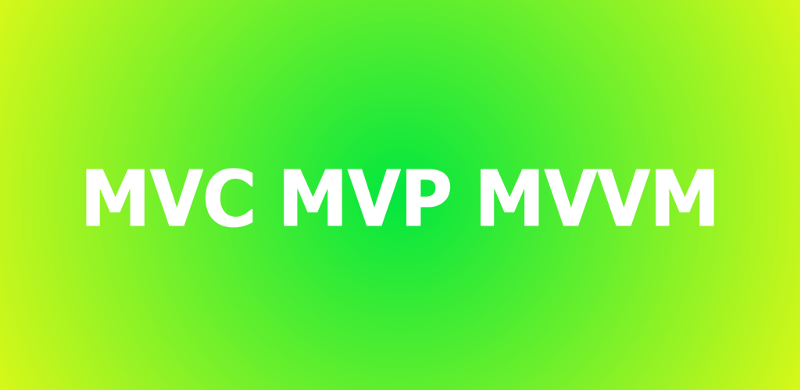
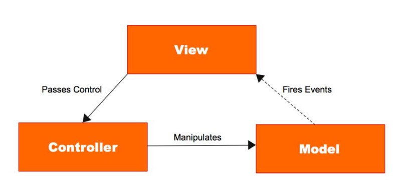
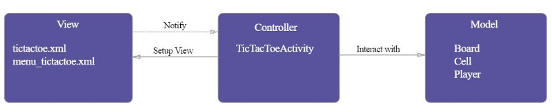
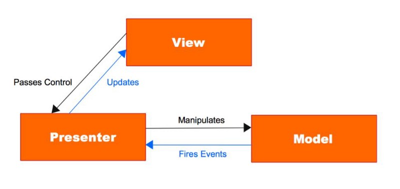
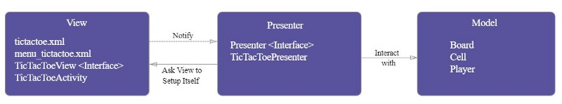
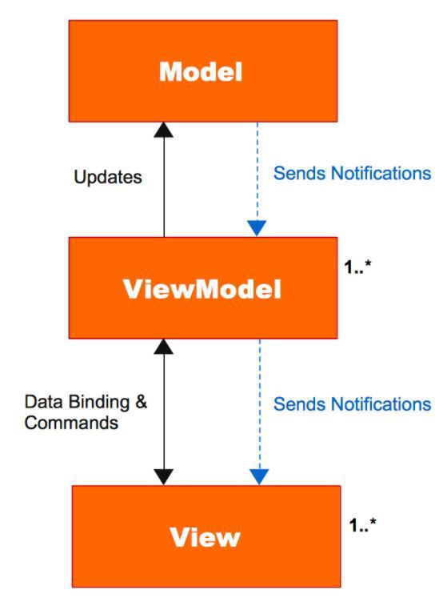
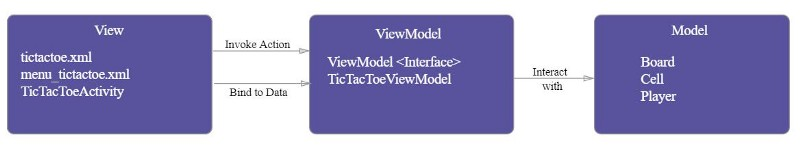

สวัสดีครับ วันนี้เราจะมาว่ากันถึงเรื่องของ Application Structure/Application Pattern หรือ Design Pattern แล้วแต่จะเรียกกันนะครับ ซึ่งที่ใช้กันอยู่ก็จะมี MVC MVP และ MVVM แต่ก่อนจะตัดสินใจว่าเราจะใช้ Pattern อะไรดี เรามาทำความเข้าใจถึงตัว Model และตัว View กันก่อน จากนั้นเราจะมารู้จักกับ Separation of concerns ซึ่งเป็นจุดประสงค์ของการแบ่งเป็น Pattern ต่างๆ แล้วจากนั้นค่อยไปทำความรู้จักกับแต่ละ Pattern กันครับ

_หมายเหตุ: เนื่องจากผมถนัดด้าน Android ดังนั้นเลยจะขอยกตัวอย่างโดยใช้ Android เป็นหลักนะครับ_

### Model

Model คือส่วนที่เก็บข้อมูลของ Application เรา ยกตัวอย่างเช่น Entity Class หรือไฟล์ [POJO](https://en.wikipedia.org/wiki/Plain_old_Java_object)(_Plain Old Java Object_) ของเรานั่นเอง โดยเราจะนิยามความสัมพันธ์ระหว่างข้อมูลของเราใน Layer นี้

### View

View คือ Layer ที่เป็นหน้าตา Application ของเรา เป็นส่วนที่ไว้ใช้แสดงผลข้อมูลให้กับ User และยังทำหน้าที่ติดต่อกับ User อีกด้วย

### Separation of Concerns

ก่อนที่เราจะไปพูดถึงแต่ละ Pattern เรามาว่ากันเรื่องทำไมเราถึงต้องมี Pattern ต่างๆ สาเหตุนั้นก็คือ Separation of Concern นั่นเอง

[Separation of Concerns](https://en.wikipedia.org/wiki/Separation_of_concerns) เป็น Design Principle แบบหนึ่งที่ว่าด้วยเรื่องการแบ่งแต่ละส่วนของโปรแกรมหรือ Concerns (Concerns — _a set of information that affects the code of a computer program.)_ ที่มีผลต่อ Program ให้แยกออกจากกัน หรือให้รู้ถึงการทำงานของกันและกันให้น้อยที่สุด ซึ่ง Concerns ในที่นี้ก็จะหมายถึง Model และ View นั่นเอง

จุดมุ่งหมายหลักของเราในการแบ่งแต่ละ Pattern ก็คือ เราต้องการแยกส่วนของ Model และส่วนของ View ให้ออกจากกัน โดยแต่ละ Pattern ก็จะมีตัวกลางมาช่วยแตกต่างกันไป ซึ่งจะอธิบายในส่วนถัดไปครับ

### MVC (Model View Controller)

MVC นั้นเป็น Pattern ในยุคเริ่มแรกของความพยายามที่จะแยกส่วนของ Model และ View ออกจากกัน โดยใน MVC นั้น นอกจาก Model และ View แล้ว จะมี Controller เพิ่มขึ้นมาเป็นตัวกลาง โดยหน้าที่ของ Controller ก็คือการจัดการกับ Model โดยขึ้นอยู่กับการกระทำที่ได้จาก View และยังทำหน้าที่สรรหาข้อมูลจาก Model เพื่อนำไปแสดงผลที่ View อีกด้วย ใน Pattern แบบ MVC นั้น View อาจจะสามารถรับรู้ถึงการเปลี่ยนแปลงของข้อมูลผ่าน Model ได้โดยตรง

ตัวอย่าง MVC Pattern ใน Android นั้น Model ก็จะเป็นพวก Entity class ส่วน View ก็จะเป็นพวก Layout XML เช่น activity\_main.xml ส่วน Controller ก็จะเป็นพวก Activity หรือ Fragment

ข้อเสียของ Controller คือ 1. Test ได้ยาก เช่นใน Android ตัว Controller จะเทียบได้กับ Activity หรือ Fragment ซึ่งมีการใช้ Android API ทำให้เขียน Test ยาก 2. Controller ยึดติดกับส่วนของ View มากเกินไป เช่นใน Android ตัว Activity หรือ Fragment จะยึดติดกับส่วนของ Layout XML 3. Maintenance ยาก เมื่อเวลาผ่านไป จะมี Code เพิ่มขึ้นในตัว Controller มากขึ้นเรื่อยๆ ทำให้ดูแลลำบาก

### MVP (Model View Presenter)

MVP Pattern เป็นความพยายามต่อมาที่จะแยก View กับ Model ออกจากกัน โดยมุ่งแก้ไขปัญหาที่มีใน MVC คือ View กับ Controller ยึดติดกันมากเกินไป และ View กับ Model ไม่ได้แยกขาดกันอย่างแท้จริง (ใน MVC View อาจจะสามารถเรียกข้อมูลจาก Model โดยตรงได้) โดย MVP นั้นจะมี Presenter เพิ่มขึ้นมา ซึ่ง Presenter จะทำหน้าที่เหมือนตัวกลางระหว่าง View และ Model คล้ายกับ Controller ใน MVC แต่ว่า การกระทำทุกอย่างที่ผ่าน View จะต้องถูกส่งผ่าน Presenter และ ทุกการเปลี่ยนแปลงของ Model ก็จะต้องถูกส่งผ่าน Presenter เช่นกัน โดยที่ Model กับ View จะไม่สามารถติดต่อกันได้โดยตรง

ความสัมพันธ์ระหว่าง View กับ Presenter จะเป็น One-to-one โดย Presenter จะทำหน้าที่รับ Event ที่ได้มาจาก View และ Presenter จะทำหน้าที่อัพเดท View โดยขึ้นอยู่กับการกระทำที่ได้จาก View ซึ่ง Presenter จะไปดึงข้อมูลมาจาก Model อีกทีนึง โดย View จะไม่รับรู้ถึงการมีอยู่ของ Model เลย

ตัวอย่าง MVP Pattern ใน Android นั้น Model จะเหมือนกับ Model ใน MVC แต่ในส่วนของ View นั้น ใน Android เราจะหมายรวมถึง View ที่เป็น Layout XML กับ Activity/Fragment โดยปกติเราจะเขียนเป็น Interface อีกชั้นนึง เวลา Presenter เรียกใช้ View ก็จะเรียกผ่าน Interface ของ View ในส่วนของ Presenter นั้นจะคล้ายกับ Controller ใน MVC ยกเว้นแต่จะไม่มีส่วนของ Android API อยู่ โดย Presenter นั้นจะถูก Implement ด้วย Interface เช่นกัน และ Presenter นี้จะสามารถเขียน Test ได้ง่าย เพราะไม่มีส่วนของ Android API อยู่

ข้อเสียของ MVP ก็จะคล้ายกับ MVC ในเรื่องของการ Maintenance เพราะเมื่อมี Requirement ใหม่ๆเข้ามา พวก Business Logic ก็จะเพิ่มใน Presenter มากขึ้นเรื่อยๆ จนยากแก่การดูแลรักษา Code นอกจากนั้นแล้ว MVP ยังมีข้อเสียตรงที่จำนวน Code ที่มากกว่าแบบอื่นๆ เพราะต้องเขียนรองรับทุกการกระทำที่เกิดจาก View และยังต้องเขียน Code รองรับการกระทำที่เกิดขึ้นเพื่อส่งข้อมูลกลับไปแสดงยัง View อีกรอบด้วย

### MVVM (Model View ViewModel)

MVVM Pattern เป็นอีกความพยายามในการจะแยก View และ Model ออกจากกันโดย MVVM นั้นจะมี ViewModel เพิ่มขึ้นมา ซึ่ง ViewModel จะทำหน้าที่เก็บข้อมูลทั้งหมดที่ View ต้องการ โดยระหว่าง View กับ ViewModel จะถูก Implement โดยสิ่งที่เราเรียกว่า Data-binding ซึ่ง ถ้า View มีการเปลี่ยนแปลงก็จะส่งผลต่อ ViewModel ด้วย ในทางกลับกัน การเปลี่ยนแปลงของ ViewModel ก็จะส่งผลถึง View เช่นกัน ใน MVVM View จะไม่รู้อะไรเลยนอกจากการแสดงผล ส่วน Logic อื่นๆจะอยู่ใน ViewModel ทั้งหมด และด้วย Data-binding นี่เองทำให้จำนวน Code ที่เขียนใน ViewModel จะน้อยกว่า Presenter ใน MVP

ใน MVVM View จะถือ Reference ของ ViewModel ไว้ แต่ ViewModel จะไม่รู้จัก View เลย ดังนั้นความสัมพันธ์ระหว่าง ViewModel กับ View จะเป็น One-to-many โดยที่ ViewModel หนึ่งตัวจะสามารถใช้กับ View หลายๆตัวได้ โดยใน MVVM View จะไม่รู้จัก Model เลย และ Model ก็จะไม่รู้จัก View เช่นกัน

ตัวอย่างของ MVVM ใน Android จะใช้ Library อย่าง [Data Binding](https://developer.android.com/topic/libraries/data-binding/index.html)โดยในส่วนของ View จะถูก Bind เข้ากับ ViewModel เพื่อรองรับการเปลี่ยนแปลงของข้อมูล และ ViewModel จะเก็บเฉพาะข้อมูลที่ต้องการเอาไปใช้ใน View

การเขียน Test ใน MVVM ก็จะง่ายขึ้นเพราะถ้าเป็น MVP เราจะต้อง Mock View ขึ้นมาเพื่อใช้ในการเขียน Test แต่ใน MVVM ไม่จำเป็นต้องทำแบบนั้น เราสามารถเขียน Test บน ViewModel ได้เลยโดยไม่ต้อง Mock View

ข้อเสียของ MVVM ก็คือ การ Maintenance Code เพราะ View สามารถ Bind ได้กับ ตัวแปรหรือ Expression ทำให้บางครั้ง การเขียน Expression ลงไปใน Layout(โดยมีการเปลี่ยนแปลงค่าของตัวแปร ViewModel) ทำให้เราคาดเดาผลลัพท์ที่จะเกิดขึ้นไม่ได้ ทางแก้คือให้ Bind โดยตรงกับตัวแปรจาก ViewModel เท่านั้น(จะทำให้ค่าที่แสดงใน View คือค่าที่ได้จาก ViewModel โดยตรง)

_ก็จบไปแล้วนะครับสำหรับ Pattern อย่าง MVC MVP และ MVVM ซึ่งจะเลือกใช้ Pattern แบบไหนก็ขึ้นอยู่กับท่านผู้อ่านแล้วละครับ สำหรับบทความนี้ถ้ามีข้อติชมอะไรก็สามารถ Comment มาได้นะครับ แล้วเจอกันที่บทความถัดไปครับ ขอบคุณครับ_

### References

[**The KyuBid Blog - Understanding MVVM on Android Tutorial 01 - MVC vs MVP vs MVVM**  
_As an android developer, you may have been asked by an employer/client to implement an architecture pattern when…_kyubid.com](http://kyubid.com/blog/mvvm-android-tutorial-01-mvc-vs-mvp-vs-mvvm/ "http://kyubid.com/blog/mvvm-android-tutorial-01-mvc-vs-mvp-vs-mvvm/")

[_https://news.realm.io/news/eric-maxwell-mvc-mvp-and-mvvm-on-android_](https://news.realm.io/news/eric-maxwell-mvc-mvp-and-mvvm-on-android/)
