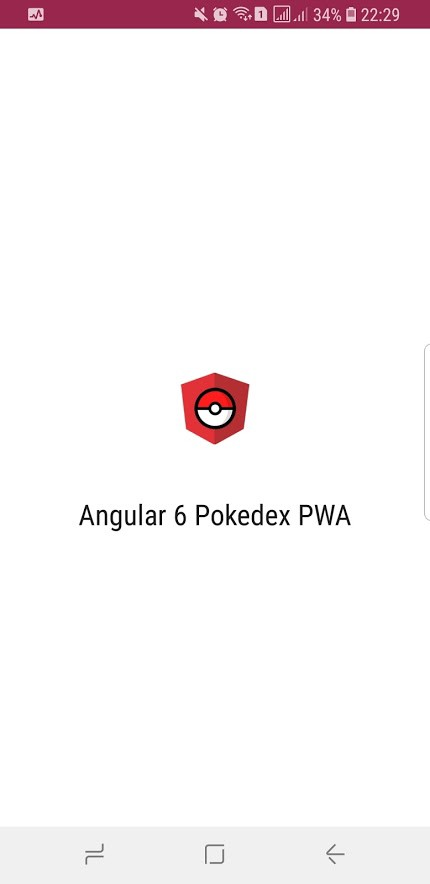

Progressive Web App หรือเรียกสั้นๆว่า PWA ถือว่าเป็นมาตรฐานใหม่ของการทำเว็บให้ออกมาคล้ายกับ Mobile Native App เพื่อเพิ่ม Engagement ให้ User โดย Angular ได้จัดเตรียม Schematics ไว้ให้เราเรียบร้อยแล้ว โดยบทความนี้จะมาแนะนำวิธีการทำ Angular Web App ให้กลายเป็น PWA แบบง่ายๆกันครับ

---

### สารบัญ

-   [ยาวไปไม่อ่าน](#2309)
-   [PWA คืออะไร](#6d32)
-   [ทำไมถึงต้องทำ PWA](#70b7)
-   [พบกับพระเอกตัวจริง Service Worker](#59f9)
-   [Set Up Project ด้วย Angular CLI](#e7ea)
-   [ตั้งค่า Service Worker ด้วย ngsw-config.json](#8a17)
-   [ตั้งค่า App ด้วย manifest.json](#d60a)
-   [ทดสอบการใช้งาน PWA](#1b77)

---

### ยาวไปไม่อ่าน

-   เพิ่มความสามารถ Angular Web App ให้กลายเป็น PWA ด้วยคำสั่ง `ng add @angular/pwa`
-   ตั้งค่า Service Worker ด้วย `ngsw-config.json` และตั้งค่าพื้นฐานและกำหนดไอคอนของ App ด้วยไฟล์ `manifest.json`
-   ดูตัวอย่างที่เสร็จแล้วได้ [**_ที่นี่_**](https://ng-pokedex-f8bf4.firebaseapp.com/)

### PWA คืออะไร

PWA หรือ Progressive Web App อิงจากนิยามใน Wikipedia ดังนี้

> **Progressive Web Apps** (**PWAs**) are [web applications](https://en.wikipedia.org/wiki/Web_application "Web application") that are regular [web pages](https://en.wikipedia.org/wiki/Web_page "Web page") or [websites](https://en.wikipedia.org/wiki/Website "Website"), but can appear to the user like traditional [applications](https://en.wikipedia.org/wiki/Application_software "Application software") or native [mobile applications](https://en.wikipedia.org/wiki/Mobile_app "Mobile app"). The application type attempts to combine features offered by most modern [browsers](https://en.wikipedia.org/wiki/Web_browser "Web browser") with the benefits of a [mobile](https://en.wikipedia.org/wiki/Mobile_device "Mobile device") experience.

อธิบายง่ายๆ Progressive Web App (ต่อไปขอเรียกสั้นๆว่า PWA นะครับ) ก็คือ Web App ธรรมดานี่แหละครับ แต่เพิ่มความสามารถให้คล้ายกับ Mobile Native App โดยเมื่อ User ใช้ PWA แล้วจะได้ความรู้สึกเหมือนใช้ App บนมือถือเลยละครับ ดังนั้นการทำ Web App ธรรมดาให้เป็น PWA จะทำให้เราได้ทั้ง Web ที่ดูบน Web Browser ธรรมดา และยังสามารถทำให้เปิดบนมือถือในสไตล์ของ Mobile Native App อีกด้วย เรียกได้ว่ายิงปืนนัดเดียวได้นกสองตัวเลย

คีย์หลักของ PWA นั้นประกอบด้วย 3 ส่วนคือ **_Reliable, Fast_** และ **_Engaging_**

ตัวแรก **_Reliable_** หรือแปลเป็นไทยก็คือเชื่อถือได้ หมายความว่าสามารถโหลดข้อมูล เพื่อแสดงผลได้ตลอดเวลา ไม่ว่าจะเชื่อมต่อหรือไม่ได้เชื่อมต่ออินเตอร์เน็ตก็ตาม


คีย์หลักตัวที่สองก็คือ **_Fast_** ก็แปลตรงตัวว่าเร็วนั่นเองครับ โดย PWA จะต้องสามารถตอบสนองต่อ User ได้อย่างรวดเร็ว เพื่อให้ User ได้รับประสบการณ์ที่ดีในการใช้ App


และตัวสุดท้ายก็คือ **_Engaging_** แปลง่ายๆก็คือ ต้องทำให้ User ถูกอกถูกใจครับ และกลับมาใช้ App ของเราซ้ำ โดย PWA จะต้องสามารถ Install แล้วไปอยู่บน Home Screen ของ User เหมือน Native App เพื่อที่ครั้งต่อไป User จะสามารถเข้า App ผ่าน Icon บนหน้าจอมือถือได้เลย นอกจากนั้นแล้วยังต้องสามารถแสดงผลเป็น Fullscreen ได้อย่างสวยงาม อีกทั้งยังต้องสามารถส่ง Notifications ไปหา User ได้ด้วย


### ทำไมถึงต้องทำ PWA

การสร้าง Mobile Native App นั้นต้องอาศัยความรู้เฉพาะทางพอสมควรในการที่จะทำ Native App ดีๆขึ้นมา App หนึ่งได้ ดังนั้นถ้าเราสามารถเพิ่มความสามารถของ Wep App ให้ใกล้เคียงกับ Mobile Native App ได้ก็คงจะดีไม่น้อย นอกจากนั้นแล้วแนวโน้มในการลง Mobile Native App ใหม่ของ User [นับวันก็มีแต่จะน้อยลงทุกวัน](https://nuuneoi.com/blog/blog.php?read_id=890) ครั้นจะไปสร้าง Native App ขึ้นมาใหม่ก็อาจจะเป็นการลงทุนที่ไม่คุ้มเสี่ยง PWA จึงเป็นอีกทางเลือกหนึ่งที่ทั้งประหยัดค่าใช้จ่ายและยังสามารถเพิ่ม Engagement ให้ Web App ของเราได้อีกด้วย

โดยในบทความนี้เราจะมาทำ PWA ด้วย Angular กัน ใครอยากรู้เกี่ยวกับ PWA มากขึ้นสามารถอ่านต่อที่บทความด้านล่างได้เลยครับ

[**Progressive web App คือ?**  
_ถ้าให้บอกว่า Progrssive Web App เป็น เครื่องมือหรือเทคโนโลยีใหม่ ก็ อาจจะพูดไม่ได้เต็มปากจริงๆ แต่ Progressive Web App…_medium.com](https://medium.com/@thangman22/progressive-web-app-%E0%B8%84%E0%B8%B7%E0%B8%AD-b6046c0603a8 "https://medium.com/@thangman22/progressive-web-app-%E0%B8%84%E0%B8%B7%E0%B8%AD-b6046c0603a8")[](https://medium.com/@thangman22/progressive-web-app-%E0%B8%84%E0%B8%B7%E0%B8%AD-b6046c0603a8)

[**Progressive Web App คืออะไร และ มาลองกันแบบง่ายๆ วันเดียวเสร็จ**  
_ฮัลโหลๆ สวัสดีครับ ช่วงนี้หายไปนาน แอบไปศึกษา Front-end framework อยู่หลายตัว จนไปเจอกับของเล่นใหม่เรียกว่า Progressive…_medium.com](https://medium.com/@timeff/%E0%B9%82%E0%B8%AD%E0%B9%89%E0%B9%80%E0%B8%A2-progressive-web-app-%E0%B8%A1%E0%B8%B2%E0%B8%A5%E0%B8%AD%E0%B8%87%E0%B9%81%E0%B8%9A%E0%B8%9A%E0%B8%87%E0%B9%88%E0%B8%B2%E0%B8%A2%E0%B9%86-%E0%B8%A7%E0%B8%B1%E0%B8%99%E0%B9%80%E0%B8%94%E0%B8%B5%E0%B8%A2%E0%B8%A7%E0%B9%80%E0%B8%AA%E0%B8%A3%E0%B9%87%E0%B8%88-b7a2be52ae5b "https://medium.com/@timeff/%E0%B9%82%E0%B8%AD%E0%B9%89%E0%B9%80%E0%B8%A2-progressive-web-app-%E0%B8%A1%E0%B8%B2%E0%B8%A5%E0%B8%AD%E0%B8%87%E0%B9%81%E0%B8%9A%E0%B8%9A%E0%B8%87%E0%B9%88%E0%B8%B2%E0%B8%A2%E0%B9%86-%E0%B8%A7%E0%B8%B1%E0%B8%99%E0%B9%80%E0%B8%94%E0%B8%B5%E0%B8%A2%E0%B8%A7%E0%B9%80%E0%B8%AA%E0%B8%A3%E0%B9%87%E0%B8%88-b7a2be52ae5b")[](https://medium.com/@timeff/%E0%B9%82%E0%B8%AD%E0%B9%89%E0%B9%80%E0%B8%A2-progressive-web-app-%E0%B8%A1%E0%B8%B2%E0%B8%A5%E0%B8%AD%E0%B8%87%E0%B9%81%E0%B8%9A%E0%B8%9A%E0%B8%87%E0%B9%88%E0%B8%B2%E0%B8%A2%E0%B9%86-%E0%B8%A7%E0%B8%B1%E0%B8%99%E0%B9%80%E0%B8%94%E0%B8%B5%E0%B8%A2%E0%B8%A7%E0%B9%80%E0%B8%AA%E0%B8%A3%E0%B9%87%E0%B8%88-b7a2be52ae5b)

---

### พบกับพระเอกตัวจริง Service Worker

](./asset-5.jpeg)

ก่อนจะเริ่มทำ PWA เรามาทำความรู้จักกับพระเอกของเรากันก่อน นั่นก็คือ Service Worker นั่นเอง โดย[เว็บของ Google](https://developers.google.com/web/fundamentals/primers/service-workers/) ให้นิยามไว้ดังนี้

> A service worker is a script that your browser runs in the background, separate from a web page, opening the door to features that don’t need a web page or user interaction. Today, they already include features like push notifications and background sync.

จาก [MDN](https://developer.mozilla.org/en-US/docs/Web/API/Service_Worker_API) นิยามดังนี้

> Service workers essentially act as proxy servers that sit between web applications, the browser, and the network (when available). They are intended, among other things, to enable the creation of effective offline experiences, intercept network requests and take appropriate action based on whether the network is available, and update assets residing on the server. They will also allow access to push notifications and background sync APIs.

อธิบายง่ายๆก็คือ Service Worker เป็น Script ธรรมดาตัวหนึ่งที่ทำงานอยู่เบื้องหลัง โดยความสามารถหลักๆของ PWA ได้แก่ การทำงานแบบ Offline โดยอาศัยการ Cache การจัดการเรื่อง Push Notification หรือว่าการทำ Background Sync นั้นเกิดจากการทำงานอยู่เบื้องหลังของ Service Worker นั่นเอง

ต่อไปจะเป็นการอธิบายการทำงานของ Service Worker ในการทำ Caching คร่าวๆนะครับ

ในครั้งแรกสุดเมื่อเราไม่มีข้อมูลใน Cache เลยและ Online อยู่

](./asset-6.png)

จากรูปด้านบนจะเห็นว่าเมื่อมี Network Request (1) Service Worker จะไปดึงข้อมูลจาก Network (2) มาเก็บไว้ที่ Cache และนำข้อมูลที่ได้ไปแสดงผล (3)

ต่อไปจะเป็นการทำงานเมื่อเรามีข้อมูลใน Cache แล้ว

](./asset-7.png)

จากรูปเมื่อมี Network Request (1) Service Worker จะเป็นคนตัดสินใจครับว่าจะไปดึงข้อมูลจาก Cache (2) หรือจะดึงข้อมูลจาก Network (4) เพื่อมาแสดงผลที่ (3) โดยเราสามารถตั้งค่าการ Caching ของ Service Worker ได้ครับ เพื่อทำให้ App สามารถทำงานได้แม้ในยาม Offline นั่นเอง

ก็พอหอมปากหอมคอนะครับสำหรับ Service Worker ต่อไปจะเป็นการ Set Up Project ด้วย Angular CLI ครับ

---

### Set Up Project ด้วย Angular CLI

ใครยังไม่มี Angular CLI สามารถ Install ได้ด้วยคำสั่งนี้ครับ

```
npm install -g @angular/cli
```

จากนั้นเราสามารถสร้างโปรเจคใหม่ได้ด้วยคำสั่งนี้ครับ

```
ng new ng6-pwa
```

โดยคำสั่งด้านบนจะสร้างโปรเจค Angular ใหม่ที่มืชื่อว่า ng6-pwa

จากนั้นให้เพิ่มความสามารถ PWA ให้กับ Angular App ของเราด้วยคำสั่งนี้ครับ

```
ng add @angular/pwa
```

คำสั่งด้านบนจะเพิ่มไฟล์ใหม่ที่สำคัญในการตั้งค่า PWA คือ `ngsw-config.json`  และ `manifest.json` ครับ


### ตั้งค่า Service Worker ด้วย ngsw-config.json


การใช้คำสั่ง `ng add @angular/pwa` Angular CLI จะตั้งค่าให้เรามาระดับนึงแล้ว มีบางอย่างที่เราต้องตั้งค่าเพิ่มเติมครับ อยากให้สังเกตไฟล์ที่ชื่อว่า `ngsw-config.json`ครับ ไฟล์นี่เป็นไฟล์ Config Service Worker ของ Angular ครับ หน้าตาก็จะประมาณนี้

มาไล่เรียงดูแต่ละหัวข้อของ `ngsw-config.json` ไฟล์กันนะครับ

`index`  ไว้ใช้บอกว่า Index File ของเราอยู่ที่ไหน

`assetGroups` เป็น Array ของกลุ่ม Resource ที่เรารู้อยู่แล้วตอน Build ครับ ว่าจะมีอะไรบ้าง โดยจะมีอยู่ 2 กลุ่มคือ

1.  กลุ่มที่ชื่อว่า `app` Default ที่ Angular CLI สร้างมาให้เราก็จะมีพวก `index.html` , `favicon.ico`และพวกไฟล์พวกที่ได้จากการ Build ครับ เช่นไฟล์พวกที่ลงท้ายด้วย `.css` , `.js` ให้สังเกตตรง `installMode` นะครับ จะเห็นคำว่า `prefetch` อยู่แสดงว่าเราจะให้โหลด Resource พวกนี้มาเตรียมไว้ก่อน เพื่อที่เวลาได้รับ Request จะได้มี Resource ไว้ใช้งานได้ทันท่วงที
2.  กลุ่มที่ชื่อว่า `assets` อันนี้ก็หมายถึงไฟล์ที่อยู่ใน Folder assets ของเราครับ ไม่ว่าจะเป็นพวกไฟล์รูปต่างๆ สังเกตตรง `installMode` จะเป็น `lazy` หมายความว่าไฟล์เหล่านี้จะถูกโหลดมาเมื่อต้องการใช้ หรือมี Request เท่านั้น จะไม่ถูกโหลดมาก่อนเหมือน Mode `prefetch` ครับ นอกจากนั้นแล้วยังมี `updateMode` ซึ่งไว้ใช้ตัดสินว่าจะโหลด Asset เมื่อมี Version ใหม่กว่ายังไง ถ้าเป็น `updateMode: prefetch` จะโหลด Asset ใหม่ทันทีเมื่อมี Version ที่ใหม่กว่า แต่ถ้าเป็น `updateMode: lazy` จะโหลด Asset ใหม่เมื่อมี Request เท่านั้น

นอกจาก `assetGroups` แล้วยังมี Property อีกตัวที่ใช้ตั้งค่าการ Cache ไฟล์เมื่อมี Network Request ซึ่งก็คือ `dataGroups` นั่นเอง เมื่อเอา `dataGroups` มาใส่ใน `ngsw-config.json` ก็จะได้หน้าตาประมาณนี้

เรามาไล่ดูแต่ละหัวข้อกันเลย

`name` — อันนี้แล้วแต่เราตั้งชื่อครับ โดยในที่นี้จะตั้งชื่อเป็น api-freshness กับ api-performance แยกตาม Cache Strategy ครับ

`urls` — เป็นกลุ่มของ url ของ Network Request ครับ

`cacheConfig`— เป็นการตั้งค่า Cache ครับ เราจะแบ่งได้เป็น 2 หัวข้อตาม Cache Strategy ก็คือ

1.  `“strategy”: “freshness”` ในกลุ่มนี้เราจะเน้นความสดใหม่ของข้อมูล (Network-First) พูดง่ายๆก็คือ ถ้า Online อยู่เราจะยิง Network Request ไปยัง Network โดยตรง ยกเว้นกรณี Offline ถึงจะไปเรียกข้อมูลมาจาก Cache ซึ่งเราจะใช้กับข้อมูลที่เปลี่ยนแปลงบ่อยๆ
2.  `“strategy”: “performance”` ในกลุ่มนี้เราจะเน้นความเร็ว โดยจะดึงข้อมูลมาจาก Cache ก่อน (Cache-First) ซึ่งเราจะใช้กับข้อมูลที่ไม่ค่อยเปลี่ยนแปลงบ่อย

นอกจาก `strategy` ยังมีหัวข้อให้เราตั้งค่า Cache ได้อีกคือ

-   `maxSize`— จำนวน Cache ที่เก็บได้มากที่สุดต่อ Group
-   `maxAge` — อายุของ Cache ที่ใช้งานได้ สามารถกำหนดหน่วยเป็น d (วัน) , h(ชั่วโมง), m(นาที), s(วินาที), u(มิลลิวินาที)
-   `timeout`— สำหรับ `“strategy”: “freshness”` คือช่วงเวลาที่ใช้รอ Network Request ก่อนจะไปเอาข้อมูลจาก Cache ครับ ใช้หน่วยเดียวกับ `maxAge`

การตั้งค่า`ngsw-config.json`  ก็จะจบลงเพียงเท่านี้ครับ

### **ตั้งค่า App ด้วย manifest.json**

ไฟล์ `manifest.json` เป็นไฟล์ที่ใช้ตั้งค่า Web เราให้เหมือน Mobile Native App มากยิ่งขึ้น โดยเราสามารถตั้งค่าชื่อ App ของเรา , ธีมสี, สีพื้นหลัง, Orientation ไปจนถึง ไอคอนของ App เราครับ

หลังจากใช้คำสั่ง `ng add @angular/pwa` แล้วใน Folder `src` จะเป็นแบบนี้


จะเห็นได้ว่า Angular CLI ได้สร้างไฟล์ `manifest.json` มาให้เราเรียบร้อยแล้ว :)

หน้าตาไฟล์ `manifest.json` ก็จะเป็นประมาณนี้ครับ

มาไล่แต่ละหัวข้อใน `manifest.json` กันเลย

-   `short_name`— เป็นชื่อสั้นๆ ของ App เราครับ ไว้โชว์ที่หน้า Home Screen
-   `name` — ชื่อเต็มๆของแอพเราครับ ไว้โชว์หน้า Splash Screen
-   `theme_color` — ธีมสีหลักของแอพเราครับ สีนี้จะไปแสดงผลตรง Address bar กับ Browser ที่ Support ครับ
-   `background_color`— สี Background ของ App จะโชว์ตรง Splash Screen
-   `display` — โหมดการแสดงผลของ App ตั้งค่าได้หลายแบบเช่น ถ้าเรากำหนดเป็น `fullscreen` App จะแสดงผลเต็มจอครับ แต่ถ้าเรากำหนดเป็น `standalone` เวลาเปิด App จะให้ความรู้สึกเหมือน Native App ครับ
-   `scope` — เอาไว้บอก Scope ของ App ว่าอยากให้ส่วนไหนเป็น PWA บ้าง ถ้าเรา Access Path ที่นอกจาก Scope ที่ระบุไว้ จะทำให้เปิด Browser ธรรมดาแทนครับ
-   `start_url`— Path เริ่มต้นของ App ครับ ต้องอยู่ใน `scope` ด้วยครับ
-   `icon` — ไว้ใส่รูป Icon ของ App ครับ


สำหรับการ setting ไฟล์ `manifest.json` ง่ายๆ ก็จะมีประมาณนี้ครับ สำหรับใครอยากศึกษาการตั้งค่าไฟล์ `manifest.json` อ่านรายละเอียดจากลิ้งค์ด้านล่างนี้ได้เลยครับ

[**The Web App Manifest | Web Fundamentals | Google Developers**  
_The web app manifest is a JSON file that gives you the ability to control how your web app or site appears to the user…_developers.google.com](https://developers.google.com/web/fundamentals/web-app-manifest/ "https://developers.google.com/web/fundamentals/web-app-manifest/")[](https://developers.google.com/web/fundamentals/web-app-manifest/)

---

### ทดสอบการใช้งาน PWA

สำหรับการ Implement Web ของเรา ผมจะอิงจาก pokedex.org นะครับ ส่วนรายละเอียดของการ Implement ผมจะไม่ขอเขียนถึง เพราะอยากจะเน้นที่ PWA อย่างเดียว ส่วนใครอยากรู้ผมจะแนบ Source Code ไว้ที่ท้ายบทความนะครับ


สมมุติว่าเราสร้าง Web เสร็จแล้วนะครับ ขั้นตอนถัดไปให้เรา Build ด้วยคำสั่ง

```
ng build --prod
```

รอซักพักก็จะ Build เสร็จครับ ไฟล์ที่ได้ก็จะไปอยู่ในโฟลเดอร์ `dist` ครับ เราสามารถอัพไฟล์จากในโฟลเดอร์นี้ขึ้นเว็บ Hosting อย่าง Firebase Hosting หรือ Github Page ได้เลย

#### ทดสอบเว็บด้วย http-server

ในกรณีที่อยากทดสอบบนเครื่องโดยไม่ต้องอัพขึ้น Hosting เราก็มีตัวช่วยที่ชื่อว่า http-server ครับ ถ้าใครยังไม่ได้ลงสามารถลงได้ด้วยคำสั่งนี้

```
npm install http-server -g
```

จากนั้นเราก็สามารถจำลองการรันบน server ได้ด้วยคำสั่ง

```
http-server dist/ng6-pwa -o
```

แค่นี้ก็จะเห็นเว็บเราขึ้นมาแล้วละครับ :)

#### มาเช็คการ Cache ของ Service Worker กัน

เมื่อโหลดเว็บครั้งแรก Service Worker จะดึงข้อมูลจาก Network ตามปกติ


ครั้งต่อไป ถ้าเราตั้งค่าให้ไปเอาค่าจาก Cache ก่อน (Cache-First) Service Worker ก็จะไปนำข้อมูลจาก Cache แทนที่จะเรียกข้อมูลจาก Network โดยตรง


จากในรูปจะเห็นว่าทั้งการเรียกข้อมูลจาก API และรูปภาพจะถูกจัดการโดย Service Worker (ด้านขวาของภาพ) เพื่อไปดึงข้อมูลจาก Cache แทน ทำให้เมื่อเราไม่ได้ต่อเน็ตก็ยังสามารถใช้ Web ได้อย่างปกติอยู่ครับ

#### ทดสอบการใช้งาน PWA บนมือถือ (Android)

เมื่อเปิดด้วย Chrome บน Android จะได้หน้าจอประมาณนี้


ให้สังเกตที่แถบด้านล่างครับ จะมีแถบให้กดเพิ่มไปยังหน้าจอหลักได้ พอกดเสร็จแล้วก็จะขึ้นหน้าจอแบบนี้ครับ


ให้เรากดเพิ่ม จะได้ Icon App มาอยู่บน Home Screen ประมาณนี้


เมื่อกดเปิด App เราจะได้ Splash Screen สวยๆ แบบนี้



เมื่อ App โหลดเสร็จจะได้หน้าตาเหมือน Mobile Native App โดยจะไม่มี Address Bar เหมือนเวลาเปิดด้วย Browser ครับ


และถ้าเราตั้งค่า Caching ไว้ App เราจะสามารถใช้งาน Offline ได้ครับ :)

#### ทดสอบกับ Lighthouse

เมื่อลองทดสอบ PWA กับ Lighthouse ได้ผลดังนี้


อยากให้สังเกตตรง Progressive Web App ครับ จะเห็นได้ว่าได้ 100 คะแนนเต็มเลย แสดงว่าภารกิจของเราเสร็จเรียบร้อยแล้วครับ :)

---

จบไปแล้วนะครับกับการสร้าง PWA ด้วย Angular CLI สำหรับ Source Code ผมอัพไว้ที่ Github แล้วครับ

[**devlorz/ng6-pokedex**  
_Simple Pokedex built by Angular 6 . Contribute to devlorz/ng6-pokedex development by creating an account on GitHub._github.com](https://github.com/devlorz/ng6-pokedex "https://github.com/devlorz/ng6-pokedex")[](https://github.com/devlorz/ng6-pokedex)

สำหรับใครอยากดู Demo เข้าที่ Link ด้านล่างเลยครับ

[**NG6-PWA**  
_Edit description_ng-pokedex-f8bf4.firebaseapp.com](https://ng-pokedex-f8bf4.firebaseapp.com/ "https://ng-pokedex-f8bf4.firebaseapp.com/")[](https://ng-pokedex-f8bf4.firebaseapp.com/)

ขอบคุณทุกคนที่อ่านมาจนจบบทความนะครับ มีอะไรสามารถติชมได้นะครับ ถ้าชอบก็ _กด clap กด share_ ได้นะครับ

สำหรับใครที่อยากอัพเดทบทความหรือข่าวสารใหม่ๆก่อนใครกดไลค์เพจตามลิ้งค์ด้านล่างนี้ได้เลย

[**DevNote**  
_DevNote. 539 likes · 139 talking about this. Brief stories for developers_www.facebook.com](https://www.facebook.com/devnoteio/ "https://www.facebook.com/devnoteio/")[](https://www.facebook.com/devnoteio/)

ไว้เจอกันใหม่บทความ สำหรับวันนี้ สวัสดีครับ \_/|\\\_

---

### อ้างอิง

[**Progressive Web Apps | Web | Google Developers**  
_Lighthouse, an open-source, automated tool for improving the quality of your Progressive Web Apps, eliminates much of…_developers.google.com](https://developers.google.com/web/progressive-web-apps/ "https://developers.google.com/web/progressive-web-apps/")[](https://developers.google.com/web/progressive-web-apps/)

[**Angular Docs**  
_Edit description_angular.io](https://angular.io/guide/service-worker-intro "https://angular.io/guide/service-worker-intro")[](https://angular.io/guide/service-worker-intro)

[**Building A PWA Using Angular 6**  
_Throughout this tutorial, we'll be using Angular 6 to build a Progressive Web Application, step by step, implementing…_www.smashingmagazine.com](https://www.smashingmagazine.com/2018/09/pwa-angular-6/ "https://www.smashingmagazine.com/2018/09/pwa-angular-6/")[](https://www.smashingmagazine.com/2018/09/pwa-angular-6/)

[**A new Angular Service Worker — creating automatic progressive web apps. Part 1: theory**  
_Announcement: There is “Part 2: practice” of this article is available._medium.com](https://medium.com/progressive-web-apps/a-new-angular-service-worker-creating-automatic-progressive-web-apps-part-1-theory-37d7d7647cc7 "https://medium.com/progressive-web-apps/a-new-angular-service-worker-creating-automatic-progressive-web-apps-part-1-theory-37d7d7647cc7")[](https://medium.com/progressive-web-apps/a-new-angular-service-worker-creating-automatic-progressive-web-apps-part-1-theory-37d7d7647cc7)

[**A new Angular Service Worker — creating automatic progressive web apps. Part 2: practice**  
_Announcement: I present about Angular Service Worker this Tuesday, November 7 at AngularConnect conference in London…_medium.com](https://medium.com/google-developer-experts/a-new-angular-service-worker-creating-automatic-progressive-web-apps-part-2-practice-3221471269a1 "https://medium.com/google-developer-experts/a-new-angular-service-worker-creating-automatic-progressive-web-apps-part-2-practice-3221471269a1")[](https://medium.com/google-developer-experts/a-new-angular-service-worker-creating-automatic-progressive-web-apps-part-2-practice-3221471269a1)

[**Angular 5 Service Worker**  
_This post has been published first on CodingTheSmartWay.com._medium.com](https://medium.com/codingthesmartway-com-blog/angular-5-service-worker-b722e571e306 "https://medium.com/codingthesmartway-com-blog/angular-5-service-worker-b722e571e306")[](https://medium.com/codingthesmartway-com-blog/angular-5-service-worker-b722e571e306)

[**Angular 5 Service Worker - Hacker News PWA Tutorial**  
_Learn how to build a realtime Hacker News PWA from scratch with an Angular 5 Service Worker._angularfirebase.com](https://angularfirebase.com/lessons/hnpwa-angular-5-progressive-web-app-service-worker-tutorial/ "https://angularfirebase.com/lessons/hnpwa-angular-5-progressive-web-app-service-worker-tutorial/")[](https://angularfirebase.com/lessons/hnpwa-angular-5-progressive-web-app-service-worker-tutorial/)
