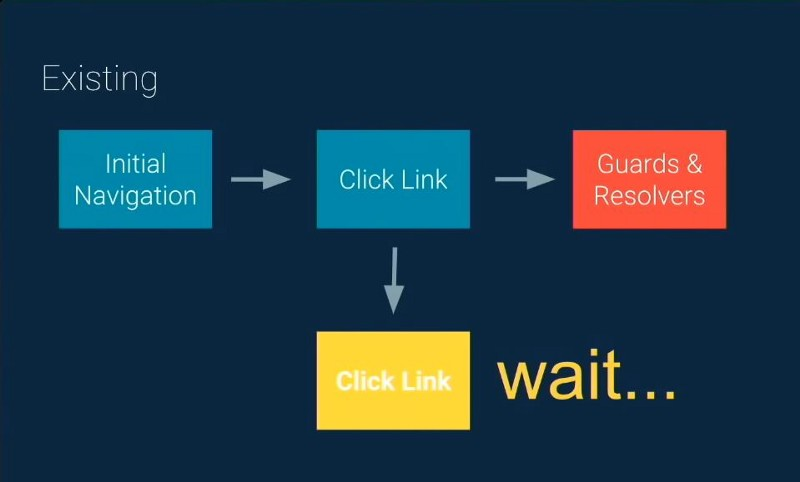
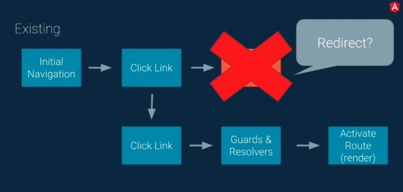
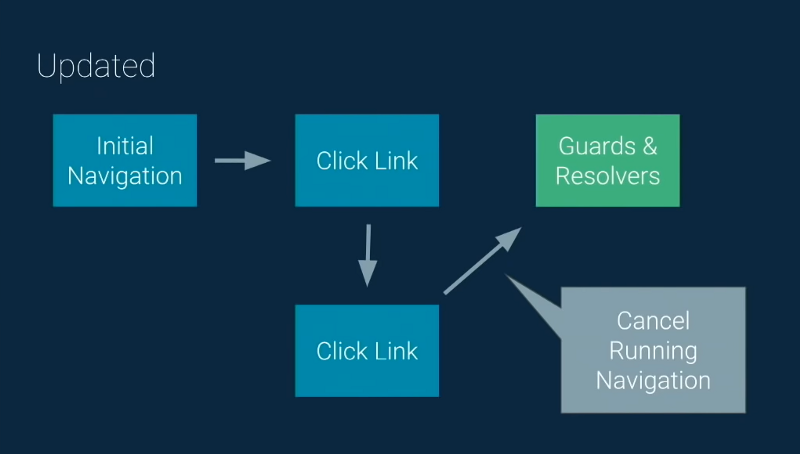
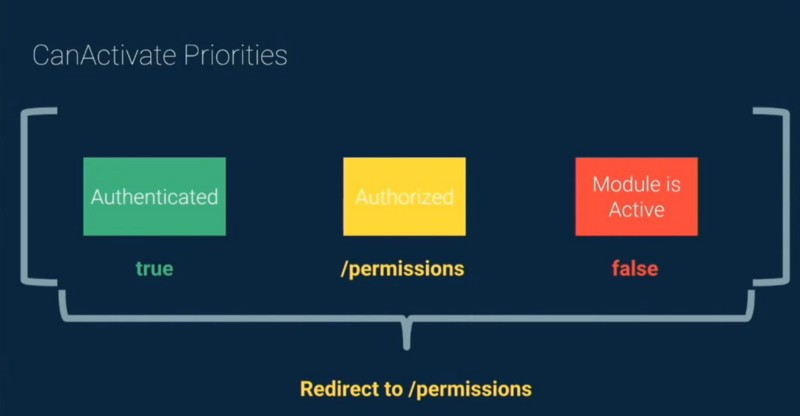
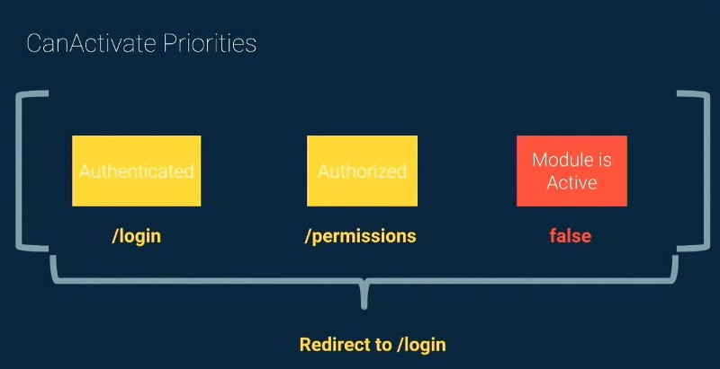
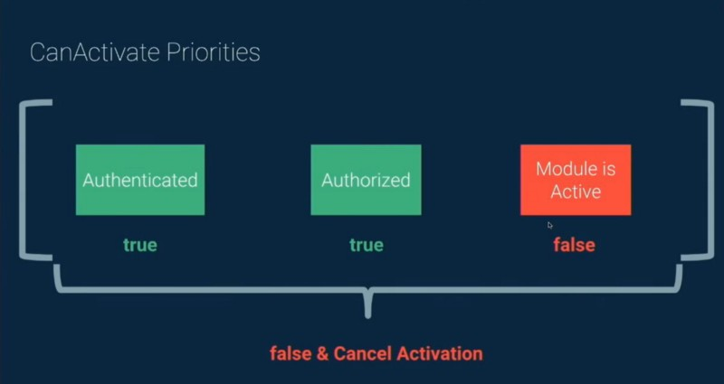

 on [Unsplash](https://unsplash.com/search/photos/route-train?utm_source=unsplash&utm_medium=referral&utm_content=creditCopyText)](./asset-1.jpeg)

Router ถือว่าเป็นส่วนหนึ่งของ Angular Framework ซึ่งเป็นส่วนสำคัญในการทำ Single Page Application โดยตั้งแต่ Angular 7 เป็นต้นมาได้มีการเพิ่มความสามารถที่น่าสนใจให้กับ Router ดังนี้

-   ทุก Navigation ถูกรวมเป็นหนึ่ง Stream และมีเพียงหนึ่ง Active Navigation เท่านั้น (Angular 7)
-   Router Guard สามารถ return เป็น `UrlTree` ได้แล้ว และยังมี Guard Priority เพื่อช่วยจัดลำดับความสำคัญของ Guard (Angular 7.1)
-   Configuration Option ใหม่ของ `runGuardsAndResolvers` ที่มีชื่อว่า `pathParamsChange` (Angular 7.1 ) และ `pathParamsOrQueryParamsChange` (Angular 7.2)
-   นอกจาก Option ใหม่แล้วเรายังสามารถใส่ Predicate Function เพื่อจะบอก Guard หรือ Resolver ว่าควรจะรันหรือไม่ได้ด้วย (Angular 7.2)
-   สามารถส่ง State ระหว่าง Route ง่ายๆ ผ่าน Router ได้แล้ว (Angular 7.2)

---

### Active Navigation เพียงหนึ่งเดียว

ก่อน Angular 7 ถ้าเกิด Navigation หลายๆอันในเวลาเดียวกัน จะทำให้เกิดความซ้ำซ้อน และยากที่จะคาดเดาได้ว่า Navigation ไหนจะถูกเรียกใช้ ลองดูตัวอย่างจากภาพด้านล่างครับ



จากรูปจะเห็นว่า User คลิกที่ Link ใด Link นึง และ Link นั้นถูก Route ไปยัง Guard หรือ Resolver ที่ต้องกินระยะเวลาในการรัน แต่ถ้าเกิดว่าในขณะที่รอนั้น User ได้ทำการคลิกอีก Link นึง แต่ว่า Guard หรือ Resolver ของ Route เดิมยังทำการรันอยู่ ทำให้ต้องรอจนกว่า Guard หรือ Resolver รันเสร็จก่อนถึงจะทำให้เกิด Navigation ต่อไปได้ (ถึงแม้ว่าจะไม่จำเป็นต้องรัน Guard หรือ Resolver นั้นๆแล้วก็ตาม)



ยิ่งไปกว่านั้นถ้า Navigation อันเก่าเมื่อรัน Guard หรือ Resolver เสร็จแล้วเกิดมี Redirect ขึ้นมา ทำให้ถึงแม้เราจะทำการกด Link ใหม่เพื่อที่จะไป Navigation ใหม่แล้วก็ตาม อาจจะทำให้เกิด Redirect ที่เราไม่ต้องการขึ้น (Redirect ไปยัง Navigation เก่า)



ตั้งแต่ Angular 7 Navigation ทั้งหลายจะถูกรวมเป็น Observable Stream อันเดียว และทุกๆ Navigation จะผ่าน `switchMap` Operator ซึ่งจะช่วยรับประกันว่าจะมี Active Navigation เพียงหนึ่งเดียวเท่านั้น ณ เวลานั้นๆ (`switchMap` จะยกเลิก Navigation ก่อนหน้าและทำให้มีเพียง Navigation ล่าสุดเพียงอันเดียว) จากรูปด้านบนจะเห็นว่าเมื่อมีการคลิก Link ใหม่ จะทำให้เกิดการยกเลิก Navigation อันเก่าก่อนที่จะไป Navigation อันใหม่ การทำแบบนี้ทำให้ไม่ต้องเสียเวลารอ Guard หรือ Resolver ของ Navigation เก่า (เพราะถูกยกเลิกไปแล้ว) อีกทั้งยังทำให้มี Memory Leak น้อยลง นอกจากนี้ยังเป็นการรับประกันว่าเฉพาะ Navigation ล่าสุดเท่านั้นที่จะเกิดขึ้น ทำให้เราสามารถคาดการณ์พฤติกรรมของ Router ได้ดีขึ้นครับ

### Router Guards สามารถ return เป็น UrlTree ได้แล้ว

ก่อนหน้านี้ Router Guards return ได้แค่ `boolean`, `Promise<boolean>` หรือ `Observable<boolean>` เท่านั้น ทำให้เวลาเราอยากทำ Redirectionใน Guard จะต้องทำเองแบบนี้

ตั้งแต่ Angular 7.1 เราจะสามารถ return เป็น type `UrlTree` ได้ด้วย ทำให้ไม่ต้องทำ Redirection เองแล้ว (เช่น เรียก Router แล้วใช้ `navigateByUrl`) เพียงแค่ return เป็น `UrlTree` ก็จะทำให้เกิด Navigation ได้แล้วแบบนี้

นอกจากนี้แล้วยังมีเรื่องของ Guard Priority ซึ่งเป็นการจัดลำดับความสำคัญของ Guard โดย Angular จะวัด Priority จาก 2 วิธีคือ

1.  ใน Array ของ `canActivate` Guard ที่อยู่ Index ที่ 0 จะมี Priority สูงสุด
2.  Guard ที่อยู่ใกล้ Root จะมี Priority สูงกว่าเสมอ

ลองมาดูตัวอย่างกันดีกว่าครับ



จากรูปด้านบน ถึงแม้ว่า Authorized Guard และ Module is Active Guard จะรันเสร็จแล้ว ก็ต้องรอจนกว่า Guard อันแรก (Authenticated) ซึ่งมี Priority สูงสุด รันเสร็จก่อนถึงจะทำต่อไปได้ (จากในรูป Authenticated Guard ผลลัพธ์เป็น true จึงเกิด Redirection ไปยัง `/permissions`)



แต่ถ้า Guard อันแรก return `/login` ก็จะเกิด Redirection ไปยัง `/login` แทนที่จะเป็น `/permissions` (เพราะ Guard อันแรกมี Priority สูงกว่า)



แต่ถ้า Guard สองอันแรก return เป็น `true` แต่ Guard อันสุดท้ายที่แม้จะว่าจะมี Priority ต่ำสุด แต่ถ้า return `false` ก็จะยกเลิก Navigation ไปยัง Route นั้นๆ

### Option ใหม่ของ runGuardsAndResolvers

ปกติ `runGuardsAndResolvers` จะมีอยู่ 3 Option คือ `always`, `paramsOrQueryParamsChange` และ `paramsChange` โดยเราสามารถใส่ Option ของ `runGuardsAndResolvers` ได้ใน Router แบบนี้

โดยปกติถ้าเราไม่ใส่ Option `runGuardsAndResolvers` จะถูกเซตเป็น `paramsChange` ซึ่งจะทำให้เกิดการรีรัน Guard และ Resolver เฉพาะเมื่อ Path หรือ Path Param มีการเปลี่ยนแปลงยกตัวอย่างเช่น

-   `/app/1` => `/app/2`
-   `/app/1` => `/app/1;param=2`
-   `/app/1;param=1` => `/app/1;param=2`

ส่วน `paramsOrQueryParamsChange` จะเกิดการรีรันเฉพาะเมื่อมีการเปลี่ยนแปลงของ Param, Path Param หรือ Query Param เช่น

-   `/app/1` => `/app/2`
-   `/app/1` => `/app/1;param=2`
-   `/app/1;param=1` => `/app/1;param=2`
-   `/app/1?queryParam=1` => `/app/1?queryParam=2`

ตั้งแต่ Angular 7.1 และ Angular 7.2 ได้มีการเพิ่ม Option ของ `runGuardsAndResolvers` ได้แก่

1.  `pathParamsChange`
2.  `pathParamsOrQueryParamsChange`

โดยถ้าเป็น Option `pathParamsChange` จะเกิดการรีรันเฉพาะเมื่อมีการเปลี่ยนแปลงของ Path Param เช่น `/app/1` => `/app/2` ส่วน `pathParamsOrQueryParamsChange` จะมีการรีรันเฉพาะเมื่อมีการเปลี่ยนแปลง Path Param หรือ Query Param เช่น `/app/1` => `/app/2` , `/app/1?queryParam=1` => `/app/1?queryParam=2`

นอกจากนั้นแล้ว ถ้า Option ทั้งหลายของ `runGuardsAndResolvers` ยังไม่ตอบโจทย์หรือเราอยากจัดการ `runGuardsAndResolvers` มากกว่านี้ เรายังสามารถใส่ Function เพื่อแก้ไขให้ Guard หรือ Resolver สามารถรันตามใจเราต้องการแบบนี้

### ส่ง State ระหว่าง Route ง่ายๆ

เมื่อก่อนเวลาเราอยากส่ง State ที่เป็น `object` ข้าม Route วิธีที่ง่ายที่สุดก็คือการสร้าง Service ขึ้นมาอันนึงเพื่อใช้ในการแชร์ State ระหว่าง Route หรือถ่าซับซ้อนขึ้นมาหน่อยอาจจะใช้ State Management อย่างพวก NgRX มาเพื่อช่วยในการจัดการ State

ตั้งแต่ Angular 7.2 เราสามารถส่ง State ระหว่าง Route ได้ง่ายๆ โดยใช้ Property `state` ใน `NavigationExtras` ซึ่งเป็น Option ของ Method อย่าง `navigateByUrl` แบบนี้

```
this.router.navigateByUrl('/list', { state: { userId: 1234 } });
```

หรือใช้ใน Method `navigate` แบบนี้

```
this.router.navigate(['/list'], { state: { userId: 1234 } });
```

เรายังสามารถใช้ใน Template ได้ด้วยโดยใช้กับ Directive `routerLink` และ`state` Property แบบนี้

```
<a routerLink="/list" [state]="{ userId: 1234 }">Lists</a>
```

ส่วนฝั่งที่รับ `state` สามารถนำ `state` มาใช้ได้แบบนี้

```
const navigation = this.router.getCurrentNavigation();
this.userId = navigation.extras.state ? navigation.extras.state.userId : 0;
```

**_\*การดึงค่า state มาใช้งานนั้น ณ ตอนนี้ต้องทำใน Constructor เท่านั้น (ทำใน ngOnInit ค่าจะไม่มา) นอกจากนั้นแล้ว State จะหายเมื่อเรากดปุ่ม Back หรือ Forward ของ Browser ครับ (ตอนที่เขียนบทความทดสอบกับ Angular 7.2.3)_**

---

### สรุป

-   Navigation ทั้งหลายโดย Angular Router จะถูกรวมเป็นหนึ่ง Observable Stream โดยที่จะมี Active Navigation เพียงหนึ่งเดียวเท่านั้น ทำให้พฤติกรรมของ Router คาดเดาได้ง่ายขึ้น
-   Router Guard สามารถ return เป็น `UrlTree` ได้แล้วทำให้ไม่ต้องเขียน Redirection เองใน Guard และยังมีเรื่อง Guard Priority ที่ใช้จัดลำดับความสำคัญของ Guard
-   มี Configuration Option ใหม่ของ `runGuardsAndResolvers` ที่มีชื่อว่า `pathParamsChange` และ `pathParamsOrQueryParamsChange` นอกจากนั้นแล้วเรายังสามารถใส่ Predicate Function ในกรณีที่ Option ทั้งหลายของ `runGuardsAndResolvers` ไม่ตอบโจทย์
-   สามารถส่ง State ระหว่าง Route ได้ง่ายๆแล้วโดยผ่าน `state` Property ใน `NavigationExtras` หรือผ่าน `state` input ของ `routerLink` Directive

---

**_\*ขอบคุณ_** [**_Siwat Kaolueng_**](https://medium.com/u/6bc0d1386272) **_และ_** [**_Watcharapong Tubjeen_**](https://medium.com/u/a0fbab8e89b8) **_ที่ช่วยตรวจทานครับ_**

### References

[**New in Angular 7: Better Navigations**  
_In Angular 7, there can be only one active navigation. Learn how this is implemented internally, and how you can…_blog.angularindepth.com](https://blog.angularindepth.com/new-in-angular-7-better-navigations-79267db452c0 "https://blog.angularindepth.com/new-in-angular-7-better-navigations-79267db452c0")[](https://blog.angularindepth.com/new-in-angular-7-better-navigations-79267db452c0)

[**New in Angular v7.1: Updates to the Router**  
_Stay up to date with the latest changes to the Angular Router_blog.angularindepth.com](https://blog.angularindepth.com/new-in-angular-v7-1-updates-to-the-router-fd67d526ad05 "https://blog.angularindepth.com/new-in-angular-v7-1-updates-to-the-router-fd67d526ad05")[](https://blog.angularindepth.com/new-in-angular-v7-1-updates-to-the-router-fd67d526ad05)

[**What's new in Angular 7.2?**  
_Angular 7.2.0 is here! Not a lot of new features in this release: the Angular team is still mainly focused on the Ivy…_blog.ninja-squad.com](https://blog.ninja-squad.com/2019/01/07/what-is-new-angular-7.2/ "https://blog.ninja-squad.com/2019/01/07/what-is-new-angular-7.2/")[](https://blog.ninja-squad.com/2019/01/07/what-is-new-angular-7.2/)

[**Explore Angular Router's runGuardsAndResolvers**  
_Learn how we can use new options introduced for the runGuardsAndResolvers setting for the Angular Router configuration…_juristr.com](https://juristr.com/blog/2019/01/Explore-Angular-Routers-runGuardsAndResolvers/?utm_campaign=Angular%2BWeekly&utm_medium=email&utm_source=Angular_Weekly_28 "https://juristr.com/blog/2019/01/Explore-Angular-Routers-runGuardsAndResolvers/?utm_campaign=Angular%2BWeekly&utm_medium=email&utm_source=Angular_Weekly_28")[](https://juristr.com/blog/2019/01/Explore-Angular-Routers-runGuardsAndResolvers/?utm_campaign=Angular%2BWeekly&utm_medium=email&utm_source=Angular_Weekly_28)

[**Better Redirects in Angular Route Guards**  
_Angular version 7.1 not only comes with bugfixes but includes also a bunch of new features. In this post I'd like to…_juristr.com](https://juristr.com/blog/2018/11/better-route-guard-redirects/ "https://juristr.com/blog/2018/11/better-route-guard-redirects/")[](https://juristr.com/blog/2018/11/better-route-guard-redirects/)
