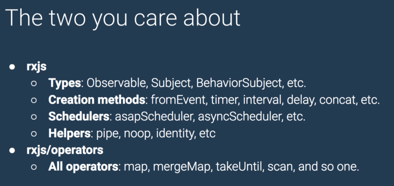
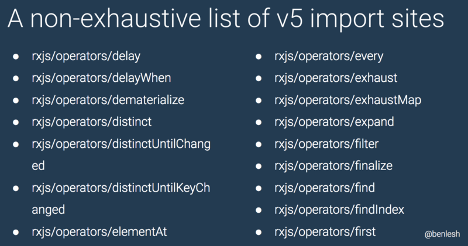

RxJS หรือ Reactive Extension Library สำหรับ JavaScript ได้เดินทางมาสู่เวอร์ชั่นที่ 6 แล้ว โดยในงาน NgConf 2018 ศาสดา Ben Lesh (เข้าร่วมทีม Angular แล้วฮะ)ได้มาแนะนำ RxJS 6 ให้ชาวเราได้ทราบโดยทั่วหน้ากัน โดยจะมีอะไรใหม่บ้างไปดูกันเลยดีกว่า

### สารบัญ

-   [RxJS 5.5](#62d5)
-   [ทำไมต้อง Pipeable Operator ?](#8a18)
-   [ของใหม่ใน RxJS 6](#c770)
-   [Unhandle Error Behavior แบบใหม่](#4d8c)
-   [วิธี Import แบบใหม่](#fbcc)
-   [สิ่งที่ Deprecate และถูกเอาออก](#e283)
-   [Operator ใหม่ throwIfEmpty](#41b0)
-   [ว่าด้วยเรื่อง Migrate](#2f30)
-   [สรุป](#d287)

### RxJS 5.5

ก่อนจะพูดถึง RxJS 6 เรามาทวนความจำกันก่อนครับ การ Import ใน RxJS 5.4 และก่อนหน้า จะเป็นแบบนี้

เวอร์ชั่น 5.4 และก่อนหน้า

ส่วนตั้งแต่ RxJS 5.5 เราเปลี่ยนเป็นแบบนี้

เวอร์ชั่น 5.5 ขึ้นไป

จะเห็นจากตัวอย่างข้างบนว่ามีการเปลี่ยนวิธีการ Import แบบใหม่ และเปลี่ยนไปใช้ Pipeable Operator แทนการ Chaining หรือ Patching ว่าแต่ทำไมถึงควรใช้ Pipeable Operator นั้นมีเหตุผลด้านล่างครับ

### ทำไมถึงต้องใช้ Pipeable Operator ?

-   วิธี Patching มีปัญหาหลายอย่างเช่น Import แล้วจะเป็น Global Object ทำให้ทำ Tree Shaking ไม่ได้ , นอกจากนั้นแล้วเวลาทำ Custom Operator ของตัวเอง ถ้าไม่ระวังอาจส่งผลต่อ Custom Operator ของคนอื่นได้
-   Pipeable Operator ทำ Custom Operator ได้ง่ายกว่า
-   เป็นมิตรกับ Compiler และ Linter

#### ตัวอย่างการทำ Custom Operator ด้วย Pipeable operator

ส่วนการทำ Custom Operator แบบเก่า (ด้วยวิธี Patching) โดยไม่ให้เกิด Effect กับ Custom Operator อื่นๆ จะยุ่งยากกว่ามาก ให้ภาพด้านล่างอธิบายละกัน


ก็จบไปแล้วนะครับสำหรับ RxJS 5.5 โดยสิ่งที่ Ben ต้องการจะเน้นก็คือ มาใช้ Pipeable Operator กันเถอะ ต่อไปมาดูสิ่งใหม่ๆใน RxJS 6 กันดีกว่า

### ของใหม่ใน RxJS 6

-   Unhandled Error Behavior แบบใหม่
-   เปลี่ยนวิธี Import ให้ง่ายขึ้น
-   Deprecate และเอาบางอย่างออก
-   Operator ใหม่ throwIfEmpty

### Unhandled Error Behavior แบบใหม่

ถ้าเราไม่ได้ทำการ Handle Error ไว้

-   RxJS เวอร์ชั่นเก่าจะ Throw Error แบบ Synchronous
-   ตั้งแต่ RxJS 6 จะ Throw Error แบบ Asynchronous

มาดูตัวอย่างกันดีกว่า สมมุติว่าเรา Subscribe โดยไม่ได้ทำการ Handle Error ไว้แบบนี้

ใน RxJS 5 และก่อนหน้านั้น ถ้า badSource$ เป็น Synchronous เราสามารถดัก Error ได้ด้วย Try Catch ดังนี้

แต่ถ้าบังเอิญมีคนไปแก้ badSource$ ของเราให้เป็น Asynchronous จะทำให้ Try Catch ไม่สามารถดัก Error ได้

ใน RxJS 6 ได้แก้ให้ Error โดน Throw แบบ Asynchronous ดังนั้น เราสามารถ Refactor Code ด้านบน เพื่อให้สามารถดัก Error แบบ Asynchronous ได้โดยการย้าย Function handleError ไปใส่ใน Parameter ตัวที่ 2 ของ subscribe ดังนี้

เช่นกันใน Test ถ้าเราคาดหวังให้เกิด Error แบบด้านล่างนี้ ใน RxJS 6 จะไม่ทำงาน

เราสามารถ Refactor ใหม่เพื่อให้ Test Code ยังทำงานได้อยู่โดยย้ายไป Test ใน Error Block ใน subscribe แบบด้านล่างนี้

#### ทำไม Error แบบ Synchronous ถึงอันตราย

Ben ใช้คำว่า Producer Interference ทำให้หาบัคยาก ลองมาดูตัวอย่าง Producer Interference กันดีกว่า

ยกตัวอย่างถ้าเรามี JeffCrossService ดังนี้

สมมุติว่าเรามี LadyLeetComponent ซึ่งเรียกใช้ JeffCrossService ดังนี้

นอกจากนั้นแล้วเรายังมี ShaiComponent ซึ่งเรียกใช้ JeffCrossService เช่นเดียวกัน

แล้วเรายังมี MiskoComponent ซึ่งก็เรียกใช้ JeffCrossService เช่นเดียวกัน

แล้วเราก็ได้รับรายงานบัคดังข้างล่างนี้


คำถามคือทำไมถึงเกิดบัคทั้งๆที่เรามี test coverage 100% และยังผ่าน integration test แล้ว

ลองย้อนกลับไปดูที่ ShaiComponent จะเห็นได้ว่า เรา throw error แบบ synchronous ซึ่งถ้าเราไม่ได้ handle error จะทำให้ method getAmazingStuff() ใน JeffCrossService หยุดทำงาน จึงทำให้ MiskoComponent ไม่ได้รับค่าใหม่

ใน RxJS 6 ได้แก้โดยเปลี่ยนเป็น throw error แบบ asynchronous เพื่อที่จะทำให้ function ที่เป็น RxJS ยังคงทำงานต่อได้นั่นเอง

### เปลี่ยนวิธี import ให้ง่ายขึ้น

วิธี Import ใน RxJS 5 เป็นดังนี้

ส่วนวิธี Import ใน RxJS 5.5 เป็นดังนี้

สำหรับใน RxJS 6 นั้น เรายุบ Import ด้านบนเหลือเพียงสองบรรทัดเท่านั้นครับ ถ้าเป็นพวก Type Helper Scheduler จะ Import จาก `rxjs` ส่วนพวก Operator เราจะ Import จาก `rxjs/operators`



พอ Refactor Import เป็นแบบ RxJS 6 จะได้แบบด้านล่างนี้

import แบบ RxJS 6 เหลือเพียงสองบรรทัดเท่านั้น

จาก List Import ใน RxJS เวอร์ชั่นก่อนๆ ที่มีขนาดนี้



ใน RxJS 6 จะเหลือเพียงแค่นี้ครับ


### สิ่งที่ Deprecate และถูกเอาออก

สาเหตุที่ต้อง Deprecate หรือเอาออกก็เพราะมีบางส่วนที่เปิดเผยรายละเอียดการ Implement, ลดขนาดของ Library, ลด API ลงเพื่อให้ใช้งานได้ง่ายขึ้น


จากรูปด้านบนจะเห็นว่ามีวิธีการหลายอย่างในการทำสิ่งเดียวกัน เช่น `Observable.of('foo')` และ `of('foo')` เพื่อเป็นการลดความสับสนและความซ้ำซ้อน ใน RxJS 6 เลยลดให้เหลือเพียงอย่างเดียวดังนี้

#### สิ่งที่ถูกเอาออก

ส่วนใหญ่เป็นส่วนที่มีการเปิดเผยรายละเอียดการ Implement เช่น EmptyObservable ErrorObservable NeverObservable


#### สิ่งที่ถูก Deprecate

สิ่งแรกที่ถูก Deprecate คือ Result Selectors ครับ หลายคนอาจจะงงว่าคืออะไร ยกตัวอย่างใน mergeMap concatMap switchMap จะรับ Parameter ตัวที่สอง ซึ่งจะสามารถ map ค่าผลลัพท์ได้ ดูภาพด้านล่างน่าจะพอเข้าใจครับ


ซึ่งเราสามารถเปลี่ยนมาใช้ map แทนดังนี้


สิ่งที่ถูก Deprecate ต่อมาคือ Concat Merge Zip CombineLastest Operator


โดยเราสามารถเปลี่ยนมาใช้ Static Method แทนดังนี้


ที่ต้องเปลี่ยนไปใช้ Static Method ก็เพราะป้องกันความสับสนระหว่าง Static Method และ Operator Function นอกจากนั้นยังอ่านง่ายกว่า และยังคงทำ Custom Operator ได้เหมือนเดิม

### Operator ใหม่ throwIfEmpty

การทำงานของ throwIfEmpty ก็ตามชื่อเลยครับ จะ Throw Error เมื่อ Observable ไม่ได้ Emit ค่าใดๆออกมาแล้ว Complete แต่ถ้า Emit ออกมาอย่างน้อยค่านึงก็จะไม่ Throw Error ใดๆออกมา

### ว่าด้วยเรื่อง Migrate

#### Migrate ง่ายๆด้วย rxjs-compat

`rxjs-compat` เป็นเหมือนตัวเชื่อมระหว่าง RxJS 5.5 และ RxJS 6 โดยการเพิ่ม `rxjs-compat` เข้ามาจะทำให้เราใช้ RxJS 6 ใน project เก่าได้โดยไม่ต้องแก้ code ใดๆ

วิธีลงง่ายๆก็คือ อัพเกรด RxJS เป็นเวอร์ชั่นล่าสุดก่อน จากนั้นก็เพิ่ม `rxjs-compat` เข้ามาใน Project ด้วยคำสั่งด้านล่างนี้

```
yarn add rxjs
yarn add rxjs-compat
```

แต่ถ้าเป็นโปรเจคที่ใช้ angular cli version 6 ขึ้นไป ก็จะใช้แค่คำสั่ง

```
ng update rxjs
```

หลังจากนั้นเราก็ต้องมาทำการแก้โค้ดของเราให้ถูกต้องตามแบบวิถีทางของ RxJS 6 เช่นการแก้ Import เป็นต้น ถ้าทำเสร็จแล้วเราก็สามารถเอาตัวช่วยอย่าง `rxjs-compat` ออกจาก Project ได้

แต่ถ้าจะให้แก้เองทั้งหมดเลยก็คงจะลำบาก ทางทีม RxJS เลยออกตัวช่วยมาให้คือ `rxjs-tslint` ซึ่งจะเป็น Linter ที่มาช่วยตรวจสอบให้เราแก้ได้ง่ายขึ้นครับ วิธีการติดตั้งก็ง่ายๆ ครับเพียงแค่

```
yarn add rxjs-tslint
```

จากนั้นให้สร้างไฟล์ที่ชื่อ migrate.tslint.json โดยเพิ่ม rule เข้าไปดังนี้

เสร็จแล้วเราสามารถ run คำสั่งด้านล่างนี้ เพื่อแก้ code ให้เป็นแบบ RxJS 6 (อาจจะต้อง run หลายครั้ง)

```
./node_modules/.bin/tslint -c migrate.tslint.json --project src/tsconfig.app.json --fix
```

เมื่อเราแก้โค้ดให้เป็นแบบ RxJS 6 หมดแล้ว ก็สามารถลบ `rxjs-compat` ออกจาก Project ได้เลยครับ

ทาง Google เองก็ Migrate ไปเป็น RxJS 6 โดยใช้ tslint rules เหมือนกัน เพราะฉะนั้นแล้วไม่ต้องกลัวว่าจะมีปัญหานะครับ :)

---

### สรุป

-   ตั้งแต่ RxJS 5.5 ได้แนะนำให้ใช้ Pipeable Operators เพราะทำ Tree Shaking ได้ แก้ปัญหาที่มีในวิธีการ Patching และยังทำ Custom Operator ได้ง่ายกว่า
-   ใน RxJS 6 มี Unhandle Error Behavior แบบใหม่, เปลี่ยนวิธีการ Import ให้ง่ายขึ้น ตัดสิ่งที่ซ้ำซ้อนออก, มีการ Deprecate และเอา API บางส่วนออก
-   วิธี Migrate ง่ายๆคือ อัพเดทเป็น RxJS 5.5 ก่อนแล้วค่อยอัพเดทเป็น RxJS 6 จากนั้นก็เพิ่ม `rxjs-compat` เข้ามา แล้วทำการแก้โค้ดเป็นแบบ RxJS 6 โดยใช้ `rxjs-tslint` ช่วย พอทำเสร็จเรียบร้อยแล้วก็สามารถลบ `rxjs-compat` ออกได้ครับ

---

ก็จบไปแล้วนะครับสำหรับบทความแนะนำ RxJS 6 สำหรับใครที่มีคำแนะนำ หรือคำติชมสามารถส่งเข้ามาได้เลยครับ แล้วเจอกันใหม่บทความหน้า สวัสดีครับ -/|\\-

---

### ช่วงขายของ

ใครอยากอัพเดทไว กดไลค์ กดติดตามเพจด้านล่างได้เลยจ้า

[**DevNote**  
_DevNote. 70 likes · 13 talking about this. Blogger_www.facebook.com](https://www.facebook.com/DevNote-158479824842502/ "https://www.facebook.com/DevNote-158479824842502/")[](https://www.facebook.com/DevNote-158479824842502/)

---

### อ้างอิง

[**RxJS 6: What's new and what has changed?**  
_RxJs 6 is out and with it new exciting additions and changes! The motivation behind this release is to provide…_auth0.com](https://auth0.com/blog/whats-new-in-rxjs-6/ "https://auth0.com/blog/whats-new-in-rxjs-6/")[](https://auth0.com/blog/whats-new-in-rxjs-6/)

[**Introducing RxJS 6 - ngconf 2018**  
_Introducing RxJS 6 ngconf 2018 Ben Lesh @benlesh_docs.google.com](https://docs.google.com/presentation/d/1h-h4IUgh8mRqItF2F2Ih8g-H9gYjb8MCwHnoIVm-hiU/edit#slide=id.g389cbad6b8_1_302 "https://docs.google.com/presentation/d/1h-h4IUgh8mRqItF2F2Ih8g-H9gYjb8MCwHnoIVm-hiU/edit#slide=id.g389cbad6b8_1_302")[](https://docs.google.com/presentation/d/1h-h4IUgh8mRqItF2F2Ih8g-H9gYjb8MCwHnoIVm-hiU/edit#slide=id.g389cbad6b8_1_302)
