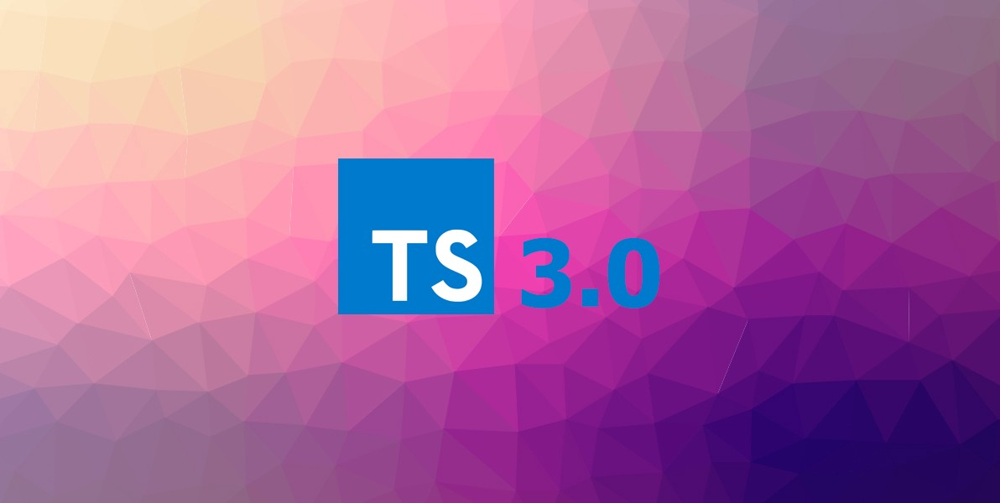
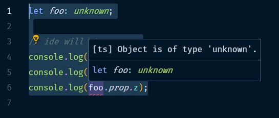

TypeScript ภาษาที่ได้ชื่อว่าเป็น Super Set ของ JavaScript ปัจจุบันได้เดินทางมาถึงเวอร์ชั่นที่ 3 แล้ว (ตอนเขียนบทความนี้ออกเวอร์ชั่น [3.1 RC](https://blogs.msdn.microsoft.com/typescript/2018/09/13/announcing-typescript-3-1-rc/) มาแล้ว ไวจริงๆ) เรามาดูกันดีกว่าว่า TypeScript 3.0 มีความสามารถอะไรที่น่าสนใจกันบ้าง

---

### สารบัญ

-   [เพิ่มความสามารถให้กับ Tuple](#4ea1)
-   [เพิ่ม Type ใหม่ที่ชื่อว่า unknown](#568b)
-   [สนับสนุน defaultProps ใน JSX แล้ว](#e03e)
-   [สรุป](#4325)

---

### เพิ่มความสามารถให้กับ Tuple

ใน TypeScript 3.0 Tuple ได้ถูกเพิ่มความสามารถหลายอย่างเข้ามา แต่ก่อนจะไปดูว่าความสามารถที่เพิ่มเข้ามามีอะไรบ้าง ไปทบทวนกันก่อนว่า Tuple คืออะไรกันครับ

#### Tuple คืออะไร

Tuple เป็น Data Structure แบบหนึ่งที่เป็น Array แบบ Fixed Size โดยที่ Data ที่อยู่ภายใน Tuple ไม่จำเป็นต้องเป็น Type ชนิดเดียวกัน

ตัวอย่าง Tuple

จากตัวอย่างข้างบนจะเห็นว่าเราประกาศ Tuple โดยให้มี Type String , Boolean และ Number เป็น Element ภายใน Tuple ตามลำดับ โดยลำดับ Type ของ Element ใน Tuple ต้องเรียงตามที่ประกาศเท่านั้นนะครับ จะสลับตำแหน่งกันไม่ได้

พอจะเข้าใจ Tuple กันคร่าวๆแล้วนะครับ คราวนี้ไปดูกันเลยว่าความสามารถของ Tuple ที่เพิ่มเข้ามาใน TypeScript 3.0 มีอะไรบ้าง

#### ประกาศ Type ของ Rest Parameter ด้วย Tuple

ปกติภาษา JavaScript เราสามารถประกาศ Rest Parameter ได้ดังนี้

จากโค้ดด้านบน `...args` จะเป็น Array ที่ไม่ระบุจำนวนครับ แต่ถ้าเราอยากให้ Rest Parameter มีจำนวนที่แน่นอน และเป็น Type ที่เราต้องการล่ะ ? Tuple ช่วยคุณได้ครับ

ใน TypeScript 3.0 เราสามารถประกาศ Type ของ Rest Parameter ด้วย Tuple ได้แล้วดังนี้

#### ใช้ Spread Expression ด้วย Tuple

นอกจาก Rest Parameter แล้ว เรายังสามารถใช้ Spread Expression กับ Tuple ได้ด้วยดังนี้

บรรทัดล่างสุดเป็นการใช้ Spread Expression กับ Tuple ครับ

#### Optional Tuple Elements

ใน TypeScript 3.0 เราสามารถประกาศให้ Element ใน Tuple ให้เป็น Optional ได้แล้วโดยใช้เครื่องหมาย `?` ดังนี้

เวลาเราเรียก `.length` บน Tuple ก็จะได้เท่ากับจำนวน Element เท่าที่ Tuple มีอยู่

#### ใช้ Rest Element ใน Tuple

ใน TypeScript 3.0 เราสามารถประกาศ Element ตัวสุดท้ายใน Tuple ให้เป็น Rest Element ได้แล้ว โดยมีข้อแม้ว่า Rest Element จะต้องเป็น Type Array เท่านั้น ดังตัวอย่างด้านล่างนี้ครับ

---

### เพิ่ม Type ใหม่ที่ชื่อว่า unknown

TypeScript 3.0 ได้เพิ่ม Type ใหม่ที่ชื่อว่า `unknown` ถ้าให้อธิบายง่ายๆก็คือ `unknown` เป็นเวอร์ชัน Type Safe ของ Type `any` ครับ โดยก่อนที่เราจะทำการใช้ Property ใดๆก็ตามใน Type `unknown` เราต้องทำการเช็ค Type ก่อน ถึงจะใช้งาน Property นั้นๆได้ ไปดูตัวอย่างการใช้งานกันเลยครับ

ปกติเวลาเราประกาศตัวแปรเป็น Type `any` เราจะสามารถเรียกใช้ Property ได้อย่างอิสระ โดย IDE จะไม่แจ้ง Error ให้เรา (ค่อยไปลุ้นตอน Runtime) ดังนี้

แต่ถ้าเราประกาศเป็น Type `unknown` แล้วเรียกใช้งาน Property ใน Type นั้นโดยไม่ได้ทำการเช็ค Type ก่อน IDE ที่สนับสนุน TypeScript อย่างเช่น VSCode จะโชว์ Error ให้เราเห็นดังนี้

เราสามารถทำการเช็ค Type เพื่อให้สามารถเรียกใช้ Property ใน `unknown` ได้ดังนี้

จากโค้ดด้านบนให้สังเกตตรง `item is { prop: { x: any; y: any; z: any } }` จะเป็นการบอกให้ TypeScript รู้ว่า ตัวแปร `item` มี property แบบนี้`prop: { x: any; y: any; z: any }` ทำให้เมื่อเราเรียกใช้ Function `itemCheck()` แล้ว ตัว TypeScript ถึงยอมให้เรียกใช้ `foo.prop.x` แบบนี้ได้ครับ ส่วนโค้ดใน Function `itemCheck()` เป็นการเช็คเพื่อให้แน่ใจว่ามี Property นั้นจริงๆ

การใช้ Type `unknown` นั้นมีข้อดีกว่าการใช้ Type `any` ตรงที่เราสามารถแน่ใจได้ว่าตัวแปรนั้นจะมี Property ที่เราต้องการใช้งานจริงๆ เพราะเราจะมีการเช็ค Type ก่อนใช้งาน ดังนั้นการใช้งาน Type `unknown` จึงเหมาะกับการใช้กับค่าที่ได้จาก API Response มาครับ เพื่อที่เราจะได้ใช้งานค่านั้นได้อย่างปลอดภัยไร้กังวล :)

---

### สนับสนุน defaultProps ใน JSX แล้ว

ใน TypeScript เวอร์ชั่นก่อน 3.0 เวลาเราจะใช้ `defaultProps` ใน JSX เราต้องประกาศ Property ตัวนั้นเป็น Optional (ใช้ `?`) และต้องใช้ Non-null Assertion `!` ในฟังก์ชั่น `render()` แบบนี้

แต่ใน TypeScript 3.0 ซัพพอร์ต `defaultProps` อย่างเป็นทางการแล้วเราจึงสามารถใช้ `defaultProps` ตรงๆได้เลย โดยไม่ต้องประกาศ Property เป็น Optional และ ใช้ Non-null Assertion แบบนี้

นอกจากนี้เรายังสามารถประกาศแบบ Stateless Functional Component โดยใช้ Default Initializer ของ ES2015 ได้แบบนี้

---

### สรุป

TypeScript 3.0 ได้เพิ่มความสามารถหลายอย่างดังนี้

-   เพิ่มความสามารถให้กับ Tuple เช่น ประกาศ Type ของ Rest Parameter ด้วย Tuple ได้แล้ว, สามารถใช้ Spread Expression ด้วย Tuple, สามารถประกาศ Element ใน Tuple ให้เป็น Optional ได้และใช้ Rest Element ใน Tuple ได้แล้ว
-   เพิ่ม Type `unknown` ซึ่งเอามาเป็นตัวเลือกแทนการใช้ `any` เหมาะสำหรับการใช้กับค่าที่ได้มาจาก API เพราะมีการเช็ค Type ก่อนใช้งาน
-   สนับสนุน `defaultProps` ใน JSX แล้ว

---

ก็จบไปแล้วนะครับสำหรับบทความแนะนำ TypeScript 3.0 ใครอยากให้กำลังใจสามารถกด clap หรือแชร์บทความได้นะครับ ขอบคุณครับ \_/|\\\_  
ส่วนใครอยากติดตามหรืออัพเดทไวก่อนใคร สามารถกดไลค์เพจด้านล่างนี้ได้เลยครับ

[**DevNote**  
_DevNote. 466 likes · 401 talking about this. Blogger_www.facebook.com](https://www.facebook.com/devnoteio/ "https://www.facebook.com/devnoteio/")

---

### อ้างอิง

[**TypeScript 3.0 · TypeScript**  
_TypeScript 3.0 introduces a new top type unknown. unknown is the type-safe counterpart of any. Anything is assignable…_www.typescriptlang.org](https://www.typescriptlang.org/docs/handbook/release-notes/typescript-3-0.html "https://www.typescriptlang.org/docs/handbook/release-notes/typescript-3-0.html")

[**What&#039;s New in Typescript 3.0**  
_Typescript 3 is out! The team added some cool new features which include: Tuples in rest parameters and spread…_scotch.io](https://scotch.io/bar-talk/whats-new-in-typescript-30 "https://scotch.io/bar-talk/whats-new-in-typescript-30")

[**TypeScript 3.0: Exploring Tuples and the Unknown Type**  
_Learn how TypeScript 3.0, a typed superset of JavaScript, improves tuples type and introduces a new 'unknown' top type!_auth0.com](https://auth0.com/blog/typescript-3-exploring-tuples-the-unknown-type/ "https://auth0.com/blog/typescript-3-exploring-tuples-the-unknown-type/")

[**Announcing TypeScript 3.0**  
_Edit description_blogs.msdn.microsoft.com](https://blogs.msdn.microsoft.com/typescript/2018/07/30/announcing-typescript-3-0/ "https://blogs.msdn.microsoft.com/typescript/2018/07/30/announcing-typescript-3-0/")
